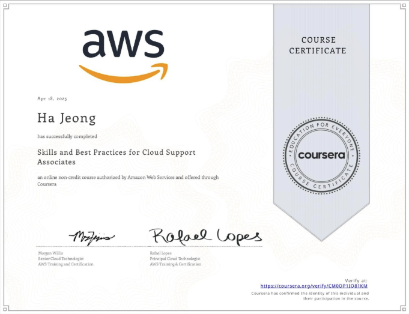
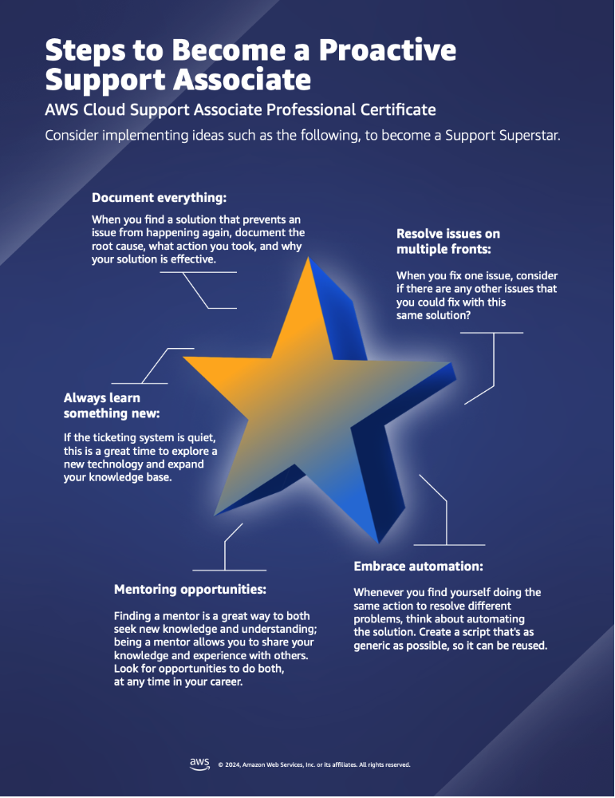
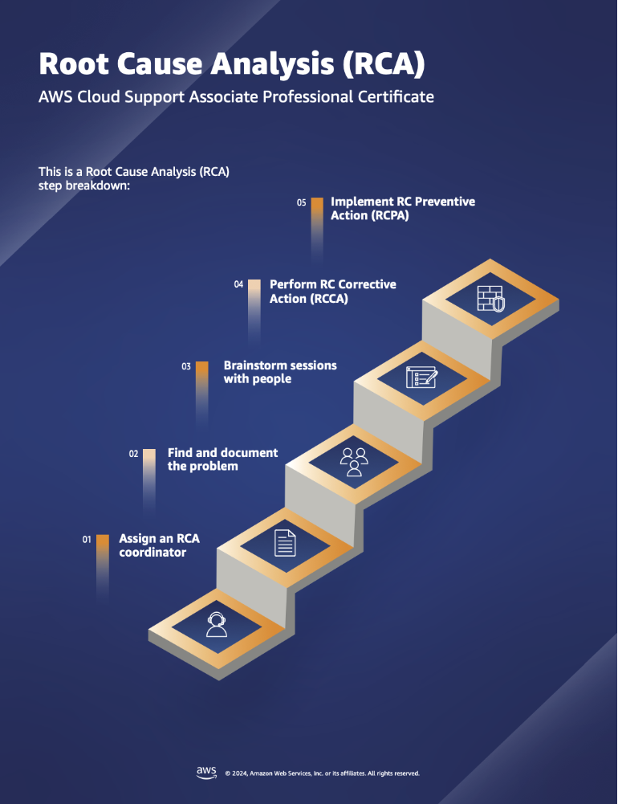

# Skills and Best Practices for Cloud Support Associates

# Module 1: Understanding the Cloud Support Associate Role
## Improving Communication Skills
Throughout this course we have emphasized how written and verbal communication skills are extremely important to be successful as a cloud support associate.  Where technical skills meets human interaction, communication is the bridge that connects your customers to the solutions to their problems. Whether it's troubleshooting a server issue or guiding a client through a software update, effective communication skills are essential for success. 

Below you can find practical advice and exercises on how to improve both your written and verbal communication skills.

### Written Communication
**Clarity is Key**

When drafting emails, tickets, or documentation, prioritize clarity above all else. Use concise language, avoid jargon, and break down complex concepts into digestible chunks. Remember, your goal is to provide solutions, not confuse your audience.

**Active Listening**

Even in written communication, active listening plays a crucial role. Pay attention to the client's concerns and address them directly. Reflect back their queries to ensure you've understood their needs accurately before offering solutions.

**Tailor Your Tone**

Adapt your tone to match the client's level of technical expertise and emotional state. Be empathetic, patient, and reassuring, especially when dealing with frustrated users. A friendly and approachable tone can go a long way in building trust and rapport.

**Proofreading and Editing**

Before hitting send, take the time to proofread your messages. Correct any spelling or grammatical errors, ensure consistency in formatting, and double-check technical details. A polished message reflects professionalism and attention to detail.

**Technical blogging**

Set aside time each day or week to write a technical blog. Practice expressing your thoughts, experiences, and ideas clearly and succinctly. Focus on organizing your thoughts logically and refining your writing style.

**Email Role-Playing**

Simulate real-world scenarios by role-playing email exchanges with a friend or colleague. Practice responding to different types of inquiries, addressing concerns, and providing solutions while maintaining a professional tone.

**Summarization Practice** Choose an article or blog post on a technical topic related to cloud computing or another technical topic. Practice summarizing the key points in your own words, focusing on clarity. This exercise helps improve your ability to distill complex information into concise summaries which you will need to do a lot in a support role.

### Verbal Communication
**Active Listening**

Just as in written communication, active listening is paramount in verbal exchanges. Give your full attention to the speaker, ask clarifying questions, and paraphrase their concerns to demonstrate understanding.

**Speak Clearly and Confidently**

Speak your words clearly and speak at a moderate pace. Avoid using technical jargon unless necessary, and be prepared to explain complex concepts in simple terms. Confidence in your speech instills confidence in your clients.

**Empathy and Understanding**

Empathize with the client's frustrations and validate their experiences. Acknowledge their concerns sincerely and assure them that you're committed to finding a resolution. Customers are often not happy when reaching out for support, becaues they may be frustrated with issues they are experiencing. A compassionate and human approach to support interactions can help customers feel understood and relieve their frustrations.

**Practice Active Problem-Solving**

Engage the client in the troubleshooting process by asking open-ended questions and involving them in the decision-making. Encourage collaboration rather than dictating solutions, fostering a sense of partnership and empowerment.

**Mock Customer Calls**

Role-play customer support scenarios with a partner or friend. Practice active listening, asking probing questions, and providing clear and concise explanations. Focus on maintaining a calm and reassuring demeanor, even in challenging situations.

**Toastmasters or Public Speaking Groups**

Join a local Toastmasters club or public speaking group to improve your verbal communication skills in a supportive environment. Participate in impromptu speaking exercises, prepared speeches, and constructive feedback sessions to build confidence and fluency.

**Storytelling Workshops**

Attend storytelling workshops or online courses to enhance your storytelling abilities. Practice structuring narratives, captivating your audience's attention, and delivering memorable presentations. Storytelling skills are invaluable for engaging and persuading others in professional settings.

**Active Listening Practice**

Engage in active listening exercises with friends or colleagues. Practice paraphrasing and summarizing their statements to demonstrate understanding. Focus on maintaining eye contact, nodding affirmatively, and providing verbal cues to signal attentiveness.

**Debating or Discussion Groups**

Join debating clubs or discussion groups to sharpen your critical thinking and communication skills. Participate in debates on various topics related to technology, cloud computing, or current events. This exercise helps improve your ability to articulate your thoughts persuasively and think on your feet.

## Cloud Support Basics
You just learned about a basic cloud support workflow that you might encounter on the job. Below you can read more information about this workflow.

Customer Issue Identification

- Receive customer ticket or inquiry describing issue.

**Information Gathering**

- Actively listen to the customer's description of the problem.

- Ask clarifying/probing questions to gather additional details.

- Document the issue accurately, including any error messages or relevant context provided by the customer.

- Collect relevant information about the customer's environment, such as their cloud architectures, operating systems, software versions, and network configurations.

**Investigation and Research**

- Analyze the gathered information to identify potential causes of the issue.

- Conduct thorough research using trusted sources, forums, and documentation to explore possible solutions.

- Collaborate with colleagues or subject matter experts to brainstorm ideas and troubleshoot complex issues.

- Review any previous interactions or tickets related to similar issues for context.

- Utilize internal knowledge bases, documentation, and online resources to gather additional information about the problem domain.

- Search internal documents and the internet to review if a similar problem has been solved for another customer in the past.

**Experimentation**

- Develop a hypothesis based on the gathered information and research findings.

- Design and execute experiments to validate the hypothesis and narrow down potential solutions.

- Keep detailed records of the experiments performed, including observations and outcomes.

**Solution Implementation**

- Select the most viable solution based on the results of the experimentation phase.

- Communicate the proposed solution to the customer clearly and concisely, outlining the steps involved and any potential impacts.

- Provide guidance and support to the customer during the implementation process, addressing any questions or concerns that arise.

**Documenting the Solution**

- Document the solution in a clear and comprehensive manner, including step-by-step instructions, troubleshooting tips, and any relevant screenshots or code snippets.

- Ensure that the documentation is accessible to both internal teams and customers, either through knowledge base articles, FAQs, or ticketing systems.

- Encourage feedback from customers and colleagues to continuously improve the documentation and capture lessons learned.

# Module 3: Customer Support Basics
## Becoming a Pro-Active Support Superstar
In the world of cloud support, proactive problem-solving is the key to success. Sometimes, the right thing to do isn't just a quick fix; it's about preventing it from happening again in the future. Investigating the root causes of problems elevates you to a proactive support staff, capable of anticipating and preventing issues before they arise.

Being proactive doesn't just mean solving problems when they appear, it's about documenting and sharing your solutions. By documenting your proactive improvements and sharing them with your team, you're not just working smarter, you're also fostering trust and collaboration. But beware the pitfalls of efficiency. In a world where ticket count often measures success, preventing problems can sometimes feel like a double-edged sword. That's why communication skills are crucial, so learning to communicate your proactive initiatives effectively, and be prepared to back them up with data showing their effectiveness in reducing recurring issues due to your actions.

One of the most valuable skills of a proactive support superstar is the ability to turn ideas into action. If you want to suggest improvements, be ready to roll up your sleeves and implement them; but it’s not just about having ideas! It is about always being ready to work on them.

And remember, proactive work doesn't just benefit you, it benefits the whole team. So, don't forget to share your successes and lessons learned by sharing knowledge with your team mates. By doing so, you not only become a top-tier employee but also contribute to a culture of proactive problem-solving and continuous improvement!

To summarize, here is a list that I personally like calling it “The DREAM”:

- Document everything

- Resolve issues on multiple fronts

- Embrace automation when a process is repeatable

- Always learn something new

- Mentor and be mentored

## Automation and Support
Automation refers to the use of technology to perform tasks or processes with minimal human intervention. In the context of cloud support, automation includes a wide range of activities, including provisioning resources, monitoring performance, troubleshooting steps, and resolving common issues.

### Benefits of automation
#### Increased Efficiency

Automation reduces manual effort and accelerates repetitive tasks, allowing support teams to focus their time and energy on more complex issues and strategic initiatives.

#### Consistency and Reliability

Automated processes follow predefined workflows consistently, minimizing the risk of human error and ensuring reliability in service delivery.

#### Scalability

Automation scales seamlessly to accommodate fluctuating workloads and growing customer demands, enabling support teams to adapt to changing circumstances with ease.

#### Faster Response Times

Automated monitoring and alerting systems detect and respond to issues in real-time, minimizing downtime and enhancing responsiveness to customer needs.

### Common use cases for automation in cloud support
#### Diagnostic Scripts

Develop diagnostic scripts that analyze system logs, configuration files, and performance metrics to identify potential issues proactively.Automate the execution of diagnostic tests and checks to verify the health and integrity of critical components such as networking, storage, and application services.

#### Alert-Based Troubleshooting

Configure automated alerting mechanisms to trigger predefined troubleshooting workflows in response to specific events or anomalies detected in the environment.Implement scripts that correlate and analyze alert data from monitoring tools to determine the root cause of incidents and initiate appropriate remediation actions.

#### Runbook Automation

Create runbooks or playbooks that document step-by-step troubleshooting procedures for common issues and scenarios encountered in cloud environments.Automate the execution of runbook tasks using scripting or orchestration tools to expedite incident response and resolution.

#### Integration with Monitoring Tools

Integrate troubleshooting scripts with monitoring and alerting tools to streamline incident management workflows.Automatically gather additional diagnostic information or perform corrective actions based on the severity and nature of alerts generated by monitoring systems.

#### Incident Management

Utilize automation to triage and categorize incoming incidents, route them to the appropriate teams, and kickoff predefined response actions based on severity levels.

#### Security and Compliance

Writing scripts to enforce security policies, access controls, and compliance standards across cloud environments, including encryption, network segmentation, and identity management. Automation scripts toAutomating security audits, vulnerability scans, and remediation actions to proactively identify and mitigate security threats.

#### Cost Optimization and Resource Management

Developing scripts to analyze cloud usage and cost patterns, identify cost optimization opportunities, and implement cost-saving measures such as rightsizing instances or scheduling resources.

Automating resource lifecycle management tasks such as resizing, decommissioning, or scaling resources based on utilization metrics and business requirements.

# Module 4: Customer Support Techniques 
## Troubleshooting Methodologies
In the previous video, you learned about the 50/50 troubleshooting method. Below you can find information about other troubleshooting methods. This is not a complete list, but instead should give you some ideas on how to structure your thoughts and process when troubleshooting issues with customers.

### The Divide and Conquer Method
The divide and conquer method is very similar to the 50/50 method. This approach involves breaking down the problem into smaller, more manageable parts and isolating each part for analysis. If you are troubleshooting a large and complex system you may be working with a team. Support teams tackle each component independently, identifying any issues and ruling out potential causes iteratively until the root cause is identified.  Let’s run through an example.

**Problem:** The web application is experiencing intermittent downtime.

**Divide the problem space**

First, you would divide the problem into two main areas: server-side issues and client-side issues.

**Investigate server-side issues**

  - **Server Infrastructure:** You start by investigating the server infrastructure to determine if there are any hardware or network issues causing downtime.

  - **Application Code:** You review the application code and server-side configurations to identify any bugs, memory leaks, or performance issues.

  - **Database:** You look into the database server to ensure it is properly configured and able to handle the incoming requests  efficiently.

**Investigate client-side issues**

  - **Network Connectivity:** You check for any network connectivity issues on the client side that may be causing intermittent connection failures.

  - **Browser Compatibility:** You then verify if the web application is compatible with different browsers and devices, making sure that users aren't experiencing issues due to browser-specific issues.

  - **Cache and Cookies:** You inspect the client-side cache and cookies to determine if there is any cached content that is causing the issues. It’s common to clear browser cookies and cache when troubleshooting the client-side.

**Narrow down potential causes**

After investigating both server-side and client-side issues, you should analyze the data to narrow down potential causes of the intermittent downtime.

### The Five Whys
The Five Whys troubleshooting method really encourages you to dive deeper until you find the root cause of the issue. This method involves you repeatedly asking why until you reach the root cause of the issue. This can help guide your troubleshooting efforts as you think through what could be causing the issue. Let’s run through an example.

**Problem:** a web application is running slow. 

1. **Why** is the web application running slow? Because the response time for the page loads is unusually high.

2. **Why** is the response time for page loads unusually high?Because the server is taking longer than usual to process requests.

3. **Why** is the server taking longer than usual to respond to requests?Because the database queries run by the application are inefficient and result in slow data retrieval.

4. **Why** are the database queries inefficient?Because the database schema is not optimized, leading to inefficient query execution.

5. **Why** is the database schema not optimized?Because the application was initially designed for a smaller scale and didn't account for the growing volume of data and user traffic, resulting in suboptimal database indexing and query performance.

By asking **why** repeatedly, we've identified a deeper issue. The application's database schema was not designed to handle the increased data volume and user traffic, leading to inefficient query performance. To address the slow performance of the web application, it's essential to optimize the database schema, improve query efficiency, and possibly scale up the infrastructure to accommodate the growing demand.

### The Bottom-Up Method
In t  - his approach, troubleshooting starts at the lowest level components of the system and moves upwards towards the higher-level components. For example, when troubleshooting an application issue, you might start by checking the underlying infrastructure, such as server resources and network connectivity, before examining the application itself. Let’s run through an example. 

**Problem:** A cloud-based file-sharing application is experiencing slow upload speeds.

**Start at the lowest level**

You begin by examining the network infrastructure closest to the user, such as their local network setup and internet connection.

**Investigate network connectivity**

  - **Local Network:** You check if there are any issues with the customers local network, like network slow downs, network rule configuration problems, or hardware issues.

  - **Internet Service Provider**: You verify the user's internet connection to ensure it meets the expected upload speed requirements and troubleshoot any issues with the ISP if necessary. This should eliminate the possibility that the slow upload speed is on the customer side.

**Examine device-specific factors**

  - **User Device Issues:** Everyone is using a device to connect to the file sharing application. So, you investigate if the user's device ( computer, smartphone) has any hardware or software limitations that could affect upload performance, such as outdated network drivers, insufficient processing power, or background processes consuming bandwidth.

  - **Browser Compatibility:** You also assess if the web browser being used by the user is optimized for file uploads and if any browser extensions or plugins are interfering with the upload process. You can usually inspect network traffic directly in the browser by using right click - inspect. You can also see if the browser is throwing any errors in the console.

**Analyze application-level factors**

  - **File-sharing Application:** You examine the cloud-based file-sharing application's server infrastructure, including server load, storage capacity, and network bandwidth availability.

  - **Application Code:** You review the application code to identify any inefficiencies or bottlenecks in the upload process, such as excessive data validation, or inefficient file chunking.

**Narrow down potential causes**

After investigating network connectivity, device-specific factors, and application-level factors, you analyze the collected data to narrow down potential causes of the slow upload speeds.

### The Top-Down Method
This one is like the opposite of the bottom-up method. The top-down method begins at the highest level of the system components and drills down to lower-level components. You start by assessing the overall system behavior or user-reported symptoms and then narrow down the potential causes by analyzing system components.

**Problem:** The cloud-based email service is experiencing intermittent delivery delays.

**Start with the highest level**

You begin by assessing the overall behavior of the email service and the reported symptoms of intermittent delivery delays.

**Check service-level factors**

  - **Email Service Status:** Check the status of the email service to determine if there are any widespread outages or service disruptions affecting delivery performance.

  - **Server Load:** Evaluate the server infrastructure's overall load and performance metrics to identify any spikes in activity or resource bottlenecks that may be contributing to delays.

  - **Service Logs:** Review service logs and monitoring data to identify patterns or anomalies in email delivery times and pinpoint periods of slow performance.

**Investigate application-level factors**

  - **Email Routing:** Analyze the email routing process within the application to identify potential bottlenecks or misconfigurations that could delay message delivery. Check delivery logs if they exist.

  - **Email Filters:** Assess the performance of spam filters and virus scanners integrated into the email service to ensure they are not causing delays due to excessive processing times or false positives.

**Analyze user-specific factors**

  - **User Settings and Preferences:** Investigate if individual user settings or preferences, such as email forwarding rules are impacting message delivery times.

  - **Recipient Mail Servers:** Check the performance and responsiveness of recipient mail servers to determine if delays are occurring on the recipient's end rather than within the email service itself.

  - **Network Latency:** Assess network latency and connectivity issues between the email service and recipient mail servers that may be causing delays in message transmission.

**Narrow down potential causes**

After analyzing service-level factors, application-level factors, and user-specific factors, narrow down potential causes of the intermittent delivery delays.

## Root Cause Analysis

