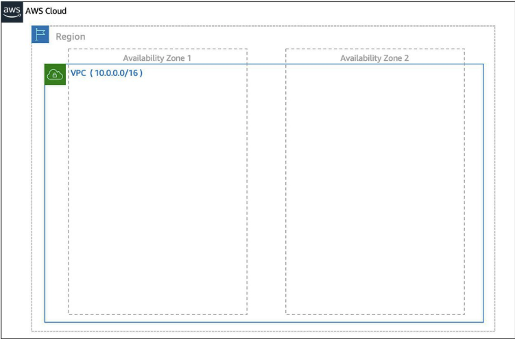
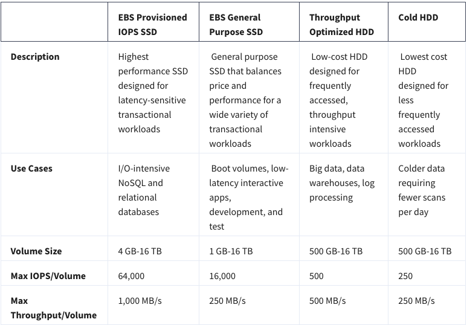
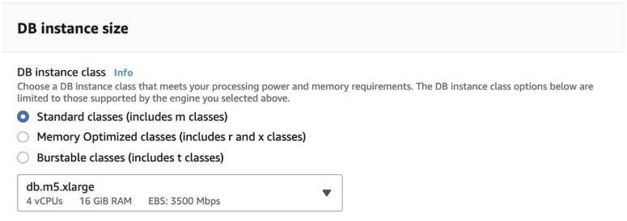
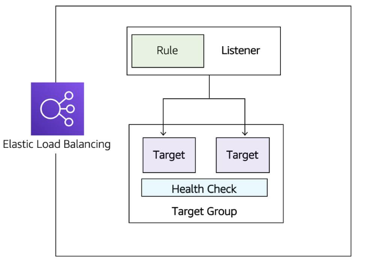

# Module 1: AWS Overview and Security
## What is AWS?

### What is the Cloud? 
In the past, companies and organizations hosted and maintained hardware such as compute, storage, and networking equipment in their own data centers. They needed to allocate entire infrastructure departments to take care of them, resulting in a costly operation that made some workloads and experimentation impossible.

As internet usage became more widespread, the demand for compute, storage, and networking equipment increased. For some companies and organizations, the cost of maintaining a large physical presence was unsustainable. To solve this problem, cloud computing was created.

Cloud computing is the on-demand delivery of IT resources over the internet with pay-as-you-go pricing. You no longer have to manage and maintain your own hardware in your own data centers. Companies like AWS own and maintain these data centers and provide virtualized data center technologies and services to users over the internet.

To help differentiate between running workloads on-premises versus in the cloud, consider the scenario where your developers need to deploy a new feature on your application. Before they deploy, the team wants to test the feature in a separate quality assurance (QA) environment that has the exact same configurations as production.

If you run your application on-premises, creating this additional environment requires you to buy and install hardware, connect the necessary cabling, provision power, install operating systems, and more. All of these tasks can be time-consuming and take days to perform. Meanwhile, the new product feature’s time-to-market is increasing and your developers are waiting for this environment. 

If you ran your application in the cloud, you can replicate the entire environment as often as needed in a matter of minutes or even seconds. Instead of physically installing hardware and connecting cabling, you can logically manage your physical infrastructure over the internet. 

Using cloud computing not only saves you time from the set-up perspective, but it also removes the undifferentiated heavy lifting. If you look at any application, you’ll see that some of the aspects of it are very important to your business, like the code. However, there are other aspects that are no different than any other application you might make: for instance the compute the code runs on. By removing repetitive common tasks that don’t differentiate your business, like installing virtual machines, or storing backups, you can focus on what is strategically unique to your business and let AWS handle the tasks that are time consuming and don’t separate you from your competitors. 

So where does AWS fit into all of this? Well AWS simply just provides cloud computing services. Those IT resources mentioned in the cloud computing definition are AWS services in this case. We’ll need to use these AWS services to architect a scalable, highly available, and cost effective infrastructure to host our corporate directory application. This way we can get our corporate directory app out into the world quickly, without having to manage any heavy-duty physical hardware. There are the six main advantages to running your workloads on AWS.

### The Six Benefits of Cloud Computing
Pay as you go. Instead of investing in data centers and hardware before you know how you are going to use them, you pay only when you use computing resources, and pay only for how much you use.

Benefit from massive economies of scale. By using cloud computing, you can achieve a lower cost than you can get on your own. Because usage from hundreds of thousands of customers is aggregated in the cloud, AWS can achieve higher economies of scale, which translates into lower pay as-you-go prices.

Stop guessing capacity. Eliminate guessing on your infrastructure capacity needs. When you make a capacity decision prior to deploying an application, you often end up either sitting on expensive idle resources or dealing with limited capacity. With cloud computing, these problems go away. You can access as much or as little capacity as you need, and scale up and down as required with only a few minutes notice.

Increase speed and agility. IT resources are only a click away, which means that you reduce the time to make those resources available to your developers from weeks to just minutes. This results in a dramatic increase in agility for the organization since the cost and time it takes to experiment and develop is significantly lower.

Stop spending money running and maintaining data centers. Focus on projects that differentiate your business, not the infrastructure. Cloud computing lets you focus on your customers, rather than on the heavy lifting of racking, stacking, and powering physical infrastructure. This is often referred to as undifferentiated heavy lifting.

Go global in minutes. Easily deploy your application in multiple Regions around the world with just a few clicks. This means you can provide lower latency and a better experience for your customers at a minimal cost.

## AWS Global Infrastructure
Infrastructure, like data centers and networking connectivity, still exists as the foundation of every cloud application. In AWS, this physical infrastructure makes up the AWS Global Infrastructure, in the form of Availability Zones and Regions.

### REGIONS
Regions are geographic locations worldwide where AWS hosts its data centers. AWS Regions are named after the location where they reside. For example, in the United States, there is a Region in Northern Virginia called the Northern Virginia Region and a Region in Oregon called the Oregon Region. There are Regions in Asia Pacific, Canada, Europe, the Middle East, and South America, and AWS continues to expand to meet the needs of its customers.Each AWS Region is associated with a geographical name and a Region code.


Here are a few examples of Region codes:

us-east-1: This is the first Region created in the east of the US. The geographical name for this Region is N. Virginia.

ap-northeast-1: The first Region created in the northeast of Asia Pacific. The geographical name for this Region is Tokyo.

AWS Regions are independent from one another. This means that your data is not replicated from one Region to another, without your explicit consent and authorization.

### CHOOSE THE RIGHT AWS REGION
Consider four main aspects when deciding which AWS Region to host your applications and workloads: latency, price, service availability, and compliance.

Latency. If your application is sensitive to latency, choose a Region that is close to your user base. This helps prevent long wait times for your customers. Synchronous applications such as gaming, telephony, WebSockets, and IoT are significantly affected by higher latency, but even asynchronous workloads, such as ecommerce applications, can suffer from an impact on user connectivity.

Price. Due to the local economy and the physical nature of operating data centers, prices may vary from one Region to another. The pricing in a Region can be impacted by internet connectivity, prices of imported pieces of equipment, customs, real estate, and more. Instead of charging a flat rate worldwide, AWS charges based on the financial factors specific to the location.

Service availability. Some services may not be available in some Regions. The AWS documentation provides a table containing the Regions and the available services within each one.

Data compliance. Enterprise companies often need to comply with regulations that require customer data to be stored in a specific geographic territory. If applicable, you should choose a Region that meets your compliance requirements.

### AVAILABILITY ZONES


Inside every Region is a cluster of Availability Zones (AZ). An AZ consists of one or more data centers with redundant power, networking, and connectivity. These data centers operate in discrete facilities with undisclosed locations. They are connected using redundant high-speed and low-latency links.AZs also have a code name. Since they’re located inside Regions, they can be addressed by appending a letter to the end of the Region code name. For example:

- us-east-1a: an AZ in us-east-1 (Northern Virginia Region)

- sa-east-1b: an AZ in sa-east-1 (São Paulo Region in South America)

If you see that a resource exists in us-east-1c, you know this resource is located in AZ c of the us-east-1 Region.

### SCOPE AWS SERVICES
Depending on the AWS Service you use, your resources are either deployed at the AZ, Region, or Global level. Each service is different, so you need to understand how the scope of a service may affect your application architecture.When you operate a Region-scoped service, you only need to select the Region you want to use. If you are not asked to specify an individual AZ to deploy the service in, this is an indicator that the service operates on a Region-scope level. For region-scoped services, AWS automatically performs actions to increase data durability and availability.On the other hand, some services ask you to specify an AZ. With these services, you are often responsible for increasing the data durability and high availability of these resources.

### MAINTAIN RESILIENCY
To keep your application available, you need to maintain high availability and resiliency. A well-known best practice for cloud architecture is to use Region-scoped, managed services. These services come with availability and resiliency built in.When that is not possible, make sure the workload is replicated across multiple AZs. At a minimum, you should use two AZs. If one entire AZ fails, your application will have infrastructure up and running in at least a second AZ to take over the traffic.


## Interacting with AWS

Every action you make in AWS is an API call that is authenticated and authorized. In AWS, you can make API calls to services and resources through the AWS Management Console, the AWS Command Line Interface (CLI), or the AWS Software Development Kits (SDKs).

### THE AWS MANAGEMENT CONSOLE
One way to manage cloud resources is through the web-based console, where you log in and click on the desired service. This can be the easiest way to create and manage resources when you’re first begin working with the cloud. Below is a screenshot that shows the landing page when you first log into the AWS Management Console.

The services are placed in categories, such as compute, database, storage and security, identity and compliance.On the upper right corner is the Region selector. If you click it and change the Region, you will make requests to the services in the chosen Region. The URL changes, too. Changing the Region directs the browser to make requests to a whole different AWS Region, represented by a different subdomain.

### THE AWS COMMAND LINE INTERFACE (CLI)
Consider the scenario where you run tens of servers on AWS for your application’s frontend. You want to run a report to collect data from all of these servers. You need to do this programmatically every day because the server details may change. Instead of manually logging into the AWS Management Console and copying/pasting information, you can schedule an AWS Command Line Interface (CLI) script with an API call to pull this data for you.The AWS CLI is a unified tool to manage AWS services. With just one tool to download and configure, you control multiple AWS services from the command line and automate them with scripts. The AWS CLI is open-source, and there are installers available for Windows, Linux, and Mac OS.Here is an example of running an API call against a service using the AWS CLI: 

You get this response:

{

"Reservations": [

{"Groups": [],

"Instances": [

{"AmiLaunchIndex": 0,

and so on.

### AWS SOFTWARE DEVELOPMENT KITS (SDKS)
API calls to AWS can also be performed by executing code with programming languages. You can do this by using AWS Software Development Kits (SDKs). SDKs are open-source and maintained by AWS for the most popular programming languages, such as C++, Go, Java, JavaScript, .NET, Node.js, PHP, Python, and Ruby.Developers commonly use AWS SDKs to integrate their application source code with AWS services. Let’s say the frontend of the application runs in Python and every time it receives a cat photo, it uploads that photo to a storage service. This action can be achieved from within the source code by using the AWS SDK for Python.

Here is an example of code you can implement to work with AWS resources using the Python AWS SDK.

import boto3

ec2 = boto3.client('ec2')

response = ec2.describe_instances()

print(response)

## Security and the AWS Shared Responsibility Model
When you begin working with the AWS Cloud, managing security and compliance is a shared responsibility between AWS and you. To depict this shared responsibility, AWS created the shared responsibility model. This distinction of responsibility is commonly referred to as security of the cloud, versus security in the cloud.


### WHAT IS AWS RESPONSIBLE FOR?
AWS is responsible for security of the cloud. This means AWS is required to protect and secure the infrastructure that runs all the services offered in the AWS Cloud. AWS is responsible for:

Protecting and securing AWS Regions, Availability Zones, and data centers, down to the physical security of the buildings

Managing the hardware, software, and networking components that run AWS services, such as the physical server, host operating systems, virtualization layers, and AWS networking components

The level of responsibility AWS has depends on the service. AWS classifies services into three different categories. The following table provides information about each, as well as the AWS responsibility.


**Note**

Container services refer to AWS abstracting application containers behind the scenes, not Docker container services. This enables AWS to move the responsibility of managing that platform away from customers.

### WHAT IS THE CUSTOMER RESPONSIBLE FOR?
You’re responsible for security in the cloud. When using any AWS service, you’re responsible for properly configuring the service and your applications, as well as ensuring your data is secure.The level of responsibility you have depends on the AWS service. Some services require you to perform all the necessary security configuration and management tasks, while other more abstracted services require you to only manage the data and control access to your resources. Using the three categories of AWS services, you can determine your level of responsibility for each AWS service you use.


Due to the varying level of effort, it’s important to consider which AWS service you use and review the level of responsibility required to secure the service. It’s also important to review how the shared security model aligns with the security standards in your IT environment, as well as any applicable laws and regulations.It’s important to note that you maintain complete control of your data and are responsible for managing the security related to your content. Here are some examples of your responsibilities in context.

- Choosing a Region for AWS resources in accordance with data sovereignty regulations

- Implementing data protection mechanisms, such as encryption and managing backups

- Using access control to limit who has access to your data and AWS resources

## Protect the AWS Root User

### What’s the Big Deal About Auth?
When you’re configuring access to any account, two terms come up frequently: authentication and authorization. Though these terms may seem basic, you need to understand them to properly configure access management on AWS. It’s important to keep this mind as you progress in this course. Let’s define both terms.

### Understand Authentication
When you create your AWS account, you use a combination of an email address and a password to verify your identity. If the user types in the correct email and password, the system assumes the user is allowed to enter and grants them access. This is the process of authentication.Authentication ensures that the user is who they say they are. Usernames and passwords are the most common types of authentication, but you may also work with other forms, such as token-based authentication or biometric data like a fingerprint. Authentication simply answers the question, “Are you who you say you are?”

### Understand Authorization
Once you’re inside your AWS account, you might be curious about what actions you can take. This is where authorization comes in. Authorization is the process of giving users permission to access AWS resources and services. Authorization determines whether the user can perform an action—whether it be to read, edit, delete, or create resources. Authorization answers the question, “What actions can you perform?” 

### What Is the AWS Root User?
When you first create an AWS account, you begin with a single sign-in identity that has complete access to all AWS services and resources in the account. This identity is called the AWS root user and is accessed by signing in with the email address and password that you used to create the account.

### Understand the AWS Root User Credentials
The AWS root user has two sets of credentials associated with it. One set of credentials is the email address and password used to create the account. This allows you to access the AWS Management Console. The second set of credentials is called access keys, which allow you to make programmatic requests from the 
AWS Command Line Interface (AWS CLI) or AWS API. Access keys consist of two parts:

- An access key ID, for example, A2lAl5EXAMPLE

- A secret access key, for example, wJalrFE/KbEKxE

Similar to a username and password combination, you need both the access key ID and secret access key to authenticate your requests via the AWS CLI or AWS API. Access keys should be managed with the same security as an email address and password.

### Follow Best Practices When Working with the AWS Root User
Keep in mind that the root user has complete access to all AWS services and resources in your account, as well as your billing and personal information. Due to this, securely lock away the credentials associated with the root user and do not use the root user for everyday tasks.  To ensure the safety of the root user:

- Choose a strong password for the root user.

- Never share your root user password or access keys with anyone.

- Disable or delete the access keys associated with the root user.

- Do not use the root user for administrative tasks or everyday tasks.

When is it OK to use the AWS root user? There are some tasks where it makes sense to use the AWS root user. Check out the links at the end of this section to read about them.

### Delete Your Keys to Stay Safe
If you don't already have an access key for your AWS account root user, don't create one unless you absolutely need to. If you do have an access key for your AWS account root user and want to delete the keys:

1. Go to the My Security Credentials page in the AWS Management Console and sign in with the root user’s email address and password.

2. Open the Access keys section.

3. Under Actions, click Delete.

4. Click Yes.

### The Case for Multi-Factor Authentication
When you create an AWS account and first log in to that account, you use single-factor authentication. Single-factor authentication is the simplest and most common form of authentication. It only requires one authentication method. In this case, you use a username and password to authenticate as the AWS root user. Other forms of single-factor authentication include a security pin or a security token.However, sometimes a user’s password is easy to guess. 

For example, your coworker Bob’s password, IloveCats222, might be easy for someone who knows Bob personally to guess, because it’s a combination of information that is easy to remember and describes certain things about Bob (1. Bob loves cats, and 2. Bob’s birthday is February 22).

If a bad actor guessed or cracked Bob’s password through social engineering, bots, or scripts, Bob might lose control of his account. Unfortunately, this is a common scenario that users of any website often face.

This is why using MFA has become so important in preventing unwanted account access. MFA requires two or more authentication methods to verify an identity, pulling from three different categories of information.

- Something you know, such as a username and password, or pin number

- Something you have, such as a one-time passcode from a hardware device or mobile app

- Something you are, such as fingerprint or face scanning technology

Using a combination of this information enables systems to provide a layered approach to account access. Even though the first method of authentication, Bob’s password, was cracked by a malicious user, it’s very unlikely that a second method of authentication, such as a fingerprint, would also be cracked. This extra layer of security is needed when protecting your most sacred accounts, which is why it’s important to enable MFA on your AWS root user.

### Use MFA on AWS
If you enable MFA on your root user, you are required to present a piece of identifying information from both the something you know category and the something you have category. The first piece of identifying information the user enters is an email and password combination. The second piece of information is a temporary numeric code provided by an MFA device.Enabling MFA adds an additional layer of security because it requires users to use a supported MFA mechanism in addition to their regular sign-in credentials. It’s best practice to enable MFA on the root user.

### Review Supported MFA Devices
AWS supports a variety of MFA mechanisms, such as virtual MFA devices, hardware devices, and Universal 2nd Factor (U2F) security keys. For instructions on how to set up each method, check out the Resources section.


## Introduction to AWS Identity and Access Management

### WHAT IS IAM?
IAM is a web service that enables you to manage access to your AWS account and resources. It also provides a centralized view of who and what are allowed inside your AWS account (authentication), and who and what have permissions to use and work with your AWS resources (authorization).With IAM, you can share access to an AWS account and resources without having to share your set of access keys or password. You can also provide granular access to those working in your account, so that people and services only have permissions to the resources they need. For example, to provide a user of your AWS account with read-only access to a particular AWS service, you can granularly select which actions and which resources in that service they can access.

### GET TO KNOW THE IAM FEATURES
To help control access and manage identities within your AWS account, IAM offers many features to ensure security.

- IAM is global and not specific to any one Region. This means you can see and use your IAM configurations from any Region in the AWS Management Console.

- IAM is integrated with many AWS services by default.

- You can establish password policies in IAM to specify complexity requirements and mandatory rotation periods for users.

- IAM supports MFA.

- IAM supports identity federation, which allows users who already have passwords elsewhere—for example, in your corporate network or with an internet identity provider—to get temporary access to your AWS account.

- Any AWS customer can use IAM; the service is offered at no additional charge.

### WHAT IS AN IAM USER?
An IAM user represents a person or service that interacts with AWS. You define the user within your AWS account. And any activity done by that user is billed to your account. Once you create a user, that user can sign in to gain access to the AWS resources inside your account.You can also add more users to your account as needed. For example, for your cat photo application, you could create individual users in your AWS account that correspond to the people who are working on your application. Each person should have their own login credentials. Providing users with their own login credentials prevents sharing of credentials.

### IAM USER CREDENTIALS
An IAM user consists of a name and a set of credentials. When creating a user, you can choose to provide the user:

Access to the AWS Management Console

Programmatic access to the AWS Command Line Interface (AWS CLI) and AWS Application Programming Interface (AWS API)

To access the AWS Management Console, provide the users with a user name and password. For programmatic access, AWS generates a set of access keys that can be used with the AWS CLI and AWS API. IAM user credentials are considered permanent, in that they stay with the user until there’s a forced rotation by admins.When you create an IAM user, you have the option to grant permissions directly at the user level.This can seem like a good idea if you have only one or a few users. However, as the number of users helping you build your solutions on AWS increases, it becomes more complicated to keep up with permissions. For example, if you have 3,000 users in your AWS account, administering access becomes challenging, and it’s impossible to get a top-level view of who can perform what actions on which resources.If only there were a way to group IAM users and attach permissions at the group level instead. Guess what: There is!

### WHAT IS AN IAM GROUP?
An IAM group is a collection of users. All users in the group inherit the permissions assigned to the group. This makes it easy to give permissions to multiple users at once. It’s a more convenient and scalable way of managing permissions for users in your AWS account. This is why using IAM groups is a best practice.If you have a an application that you’re trying to build and have multiple users in one account working on the application, you might decide to organize these users by job function. You might want IAM groups organized by developers, security, and admins. You would then place all of your IAM users in the respective group for their job function.This provides a better view to see who has what permissions within your organization and an easier way to scale as new people join, leave, and change roles in your organization.Consider the following examples.

- A new developer joins your AWS account to help with your application. You simply create a new user and add them to the developer group, without having to think about which permissions they need.

- A developer changes jobs and becomes a security engineer. Instead of editing the user’s permissions directly, you can instead remove them from the old group and add them to the new group that already has the correct level of access.

Keep in mind the following features of groups.

- Groups can have many users.

- Users can belong to many groups.

- Groups cannot belong to groups.

The root user can perform all actions on all resources inside an AWS account by default. This is in contrast to creating new IAM users, new groups, or new roles. New IAM identities can perform no actions inside your AWS account by default until you explicitly grant them permission.The way you grant permissions in IAM is by using IAM policies.

### WHAT IS AN IAM POLICY?
To manage access and provide permissions to AWS services and resources, you create IAM policies and attach them to IAM users, groups, and roles. Whenever a user or role makes a request, AWS evaluates the policies associated with them. For example, if you have a developer inside the developers group who makes a request to an AWS service, AWS evaluates any policies attached to the developers group and any policies attached to the developer user to determine if the request should be allowed or denied.

### IAM POLICY EXAMPLES
Most policies are stored in AWS as JSON documents with several policy elements. Take a look at the following example of what providing admin access through an IAM identity-based policy looks like.

```JSON
{

"Version": "2012-10-17",    

     "Statement": [{        
          "Effect": "Allow",        

          "Action": "*",        

          "Resource": "*"     

     }]

}
```
In this policy, there are four major JSON elements: Version, Effect, Action, and Resource.

- The **Version** element defines the version of the policy language. It specifies the language syntax rules that are needed by AWS to process a policy. To use all the available policy features, include "Version": "2012-10-17" before the "Statement" element in all your policies.

- The **Effect** element specifies whether the statement will allow or deny access. In this policy, the Effect is "Allow", which means you’re providing access to a particular resource.

- The **Action** element describes the type of action that should be allowed or denied. In the above policy, the action is "*". This is called a wildcard, and it is used to symbolize every action inside your AWS account.

- The **Resource** element specifies the object or objects that the policy statement covers. In the policy example above, the resource is also the wildcard "*". This represents all resources inside your AWS console.

Putting all this information together, you have a policy that allows you to perform all actions on all resources inside your AWS account. This is what we refer to as an administrator policy.

Let’s look at another example of a more granular IAM policy.

```JSON
{"Version": "2012-10-17",    

     "Statement": [{        

          "Effect": "Allow",        

          "Action": [            

               "iam: ChangePassword",            

               "iam: GetUser"            

               ]        

          "Resource": 

"arn:aws:iam::123456789012:user/${aws:username}"    

     }]

}
```

After looking at the JSON, you can see that this policy allows the IAM user to change their own IAM password (iam:ChangePassword) and get information about their own user (iam:GetUser). It only permits them to access their own credentials because the resource restricts access with the variable substitution ${aws:username}.

### UNDERSTAND POLICY STRUCTURE
When creating a policy, it is required to have each of the following elements inside a policy statement.


## Role Based Access in AWS

Throughout these last few lessons, there have been sprinklings of IAM best practices. It’s helpful to have a brief summary of some of the most important IAM best practices you need to be familiar with before building out solutions on AWS.

#### LOCK DOWN THE AWS ROOT USER
The root user is an all-powerful and all-knowing identity within your AWS account. If a malicious user were to gain control of root-user credentials, they would be able to access every resource within your account, including personal and billing information. To lock down the root user:

- Don’t share the credentials associated with the root user.

- Consider deleting the root user access keys.

- Enable MFA on the root account.

#### FOLLOW THE PRINCIPLE OF LEAST PRIVILEGE
Least privilege is a standard security principle that advises you to grant only the necessary permissions to do a particular job and nothing more. To implement least privilege for access control, start with the minimum set of permissions in an IAM policy and then grant additional permissions as necessary for a user, group, or role.

#### USE IAM APPROPRIATELY
IAM is used to secure access to your AWS account and resources. It simply provides a way to create and manage users, groups, and roles to access resources within a single AWS account. IAM is not used for website authentication and authorization, such as providing users of a website with sign-in and sign-up functionality. IAM also does not support security controls for protecting operating systems and networks.

#### USE IAM ROLES WHEN POSSIBLE
Maintaining roles is easier than maintaining users. When you assume a role, IAM dynamically provides temporary credentials that expire after a defined period of time, between 15 minutes and 36 hours. Users, on the other hand, have long-term credentials in the form of user name and password combinations or a set of access keys.User access keys only expire when you or the admin of your account rotates these keys. User login credentials expire if you have applied a password policy to your account that forces users to rotate their passwords.

#### CONSIDER USING AN IDENTITY PROVIDER
If you decide to make your cat photo application into a business and begin to have more than a handful of people working on it, consider managing employee identity information through an identity provider (IdP). Using an IdP, whether it be an AWS service such as AWS IAM Identity Center (Successor to AWS Single Sign-On) or a third-party identity provider, provides you a single source of truth for all identities in your organization.You no longer have to create separate IAM users in AWS. You can instead use IAM roles to provide permissions to identities that are federated from your IdP.For example, you have an employee, Martha, that has access to multiple AWS accounts. Instead of creating and managing multiple IAM users named Martha in each of those AWS accounts, you can manage Martha in your company’s IdP. If Martha moves within the company or leaves the company, Martha can be updated in the IdP, rather than in every AWS account you have.

#### CONSIDER AWS IAM IDENTITY CENTER
If you have an organization that spans many employees and multiple AWS accounts, you may want your employees to sign in with a single credential.AWS IAM Identity Center is an IdP that lets your users sign in to a user portal with a single set of credentials. It then provides them access to all their assigned accounts and applications in one central location.AWS IAM Identity Center is similar to IAM, in that it offers a directory where you can create users, organize them in groups, and set permissions across those groups, and grant access to AWS resources. However, AWS IAM Identity Center has some advantages over IAM. For example, if you’re using a third-party IdP, you can sync your users and groups to AWS IAM Identity Center.This removes the burden of having to re-create users that already exist elsewhere, and it enables you to manage those users from your IdP. More importantly, AWS IAM Identity Center separates the duties between your IdP and AWS, ensuring that your cloud access management is not inside or dependent on your IdP.

## IAM Roles and the Employee Directory Application

Throughout the demos, you’ll notice that the Amazon EC2 instance is using an IAM role to manage access to AWS APIs for the employee directory application application. This is a common way to provide AWS credentials to applications that need to access AWS APIs. This IAM role is providing temporary credentials that are rotated automatically via the instance profile for the EC2 instance. The AWS SDK is automatically pulling these credentials and refreshing them as needed and using the credentials to authenticate the AWS API calls being made to Amazon S3 and Amazon DynamoDB by the code for the employee directory app. Without this role, the application would not be authenticated and the API calls to those services would fail.

In the video Demo AWS IAM you saw Morgan create an IAM role called EmployeeWebApp which used the managed policies AmazonS3FullAccess and AmazonDynamoDBFullAccess. Later in the Hosting the Employee Directory Application on AWS video and subsequent demos you may see an IAM role named S3DynamoDBFullAccessRole being used when configuring the EC2 instance. Both of these roles use the same policies Morgan selected in the Demo AWS IAM role. 

The next video in this course demonstrates how to host the employee directory application on AWS using services like Amazon EC2 and Amazon VPC. While watching this video, you may be looking for a copy of the scripts used so you can follow along. The exercises in next weeks content includes step by step instructions on how to launch the employee direction application, including the user data script. For this next video, we recommend that you watch without following along yet so you can understand the AWS services at a high level, then next week you will have the opportunity to walk through this demonstration in your AWS account using the instructions included in the exercises.

## Default Amazon Machine Image (AMI) for Amazon EC2
As of March 15, 2023 the default Amazon Machine Image (AMI) for Amazon EC2 has been updated to use the Amazon Linux 2023 AMI. In the demonstrations for this course, we use the Amazon Linux 2 AMI. If you are following along with the videos please be aware that if you use the new Amazon Linux 2023 AMI with the user data the way it appears in the videos the script will not run properly and the application will not launch. We are in the process of updating the course to reflect this change.

In the meantime, there are a few ways to work around this issue. You can either use the Amazon Linux 2 AMI with the user data as shown in the demonstrations and this will resolve the issue, or you can use an updated version of the user data script which I will include in this message.

To recap, we have a new default AMI for EC2 instances called the Amazon Linux 2023 AMI. The videos show us using Amazon Linux 2. Because of changes between these two AMIs the user data script shown in the videos will not run properly on Amazon Linux 2023 based instances. You can either choose Amazon Linux 2 as the AMI when launching the instance, and use the original user data script or you can use the Amazon Linux 2023 AMI and use the updated user data script.

#### Amazon Linux 2 user data script:

          #!/bin/bash -ex

          wget https://aws-tc-largeobjects.s3-us-west-2.amazonaws.com/DEV-AWS-MO-GCNv2/FlaskApp.zip

          unzip FlaskApp.zip

          cd FlaskApp/

          yum -y install python3 mysql

          pip3 install -r requirements.txt

          amazon-linux-extras install epel

          yum -y install stress

          export PHOTOS_BUCKET=${SUB_PHOTOS_BUCKET}

          export AWS_DEFAULT_REGION=<INSERT REGION HERE>

          export DYNAMO_MODE=on

          FLASK_APP=application.py /usr/local/bin/flask run --host=0.0.0.0 --port=80

#### Amazon Linux 2023 user data script: 

          #!/bin/bash -ex

          wget https://aws-tc-largeobjects.s3-us-west-2.amazonaws.com/DEV-AWS-MO-GCNv2/FlaskApp.zip

          unzip FlaskApp.zip

          cd FlaskApp/

          yum -y install python3-pip

          pip install -r requirements.txt

          yum -y install stress

          export PHOTOS_BUCKET=${SUB_PHOTOS_BUCKET}

          export AWS_DEFAULT_REGION=<INSERT REGION HERE>

          export DYNAMO_MODE=on

          FLASK_APP=application.py /usr/local/bin/flask run --host=0.0.0.0 --port=80 

When using the user data scripts, remember to replace the ```<INSERT REGION HERE>``` with whatever AWS region you are operating in, and ensure you remove both brackets as well.

# Module 2: Compute and Networking
## Amazon Elastic Compute Cloud
|Full|EC2 Instance Type|EC2 Instance Size|
|---|---|---|
|t3.medium|t3|medium|
|a1.large|a1|large|

The instance size determines how much capacity the instance has, and the type determines the blend of those resources.

## Compute as a Service on AWS
### Understanding Servers
The first building block you need to host an application is a server. Servers often times can handle Hypertext Transfer Protocol (HTTP) requests and send responses to clients following the client-server model, though any API based communication also falls under this model. A client being a person or computer that sends a request, and a server handling the requests is a computer, or collection of computers, connected to the internet serving websites to internet users. These servers power your application by providing CPU, memory, and networking capacity to process users’ requests and transform them into responses. For context, common HTTP servers include:

- Windows options, such as Internet Information Services (IIS).

- Linux options, such as Apache HTTP Web Server, Nginx, and Apache Tomcat.

To run an HTTP server on AWS, you need to find a service that provides compute power in the AWS Management Console. You can log into the console and view the complete list of AWS compute services.


### Choose the Right Compute Option
If you’re responsible for setting up servers on AWS to run your infrastructure, you have many compute options. You need to know which service to use for which use case. At a fundamental level, there are three types of compute options: virtual machines, container services, and serverless. If you’re coming to AWS with prior infrastructure knowledge, a virtual machine can often be the easiest compute option in AWS to understand. This is because a virtual machine emulates a physical server and allows you to install an HTTP server to run your applications. To run these virtual machines, you install a hypervisor on a host machine. This hypervisor provisions the resources to create and run your virtual machines.In AWS, these virtual machines are called Amazon Elastic Compute Cloud or Amazon EC2. Behind the scenes, AWS operates and manages the host machines and the hypervisor layer. AWS also installs the virtual machine operating system, called the guest operating system.Some AWS compute services use Amazon EC2 or use virtualization concepts under the hood, therefore it is best to understand this service first before moving on to container services and serverless compute. 

## Introduction to Amazon Elastic Compute Cloud
### What Is Amazon EC2?


Amazon EC2 is a web service that provides secure, resizable compute capacity in the cloud. It allows you to provision virtual servers called EC2 instances. Although AWS uses the phrase “web service” to describe it, it doesn’t mean that you are limited to running just web servers on your EC2 instances. You can create and manage these instances through the AWS Management Console, the AWS Command Line Interface (CLI), AWS Software Development Kits (SDKs), or through automation tools and infrastructure orchestration services.In order to create an EC2 instance, you need to define:

- Hardware specifications, like CPU, memory, network, and storage.

- Logical configurations, like networking location, firewall rules, authentication, and the operating system of your choice.

When launching an EC2 instance, the first setting you configure is which operating system you want by selecting an Amazon Machine Image (AMI).

### What Is an AMI?
In the traditional infrastructure world, the process of spinning up a server consists of installing an operating system from installation disks, installation drives, or installation wizards over the network. In the AWS Cloud, this operating system installation is no longer your responsibility, and is instead built into the AMI that you choose.Not only does an AMI let you configure which operating system you want, you can also select storage mappings, the architecture type (such as 32-bit, 64-bit, or 64-bit ARM), and additional software installed.

### What Is the Relationship Between AMIs and EC2 Instances?
EC2 instances are live instantiations of what is defined in an AMI, much like a cake is a live instantiation of a cake recipe. If you are familiar with software development, you can also see this kind of relationship between a Class and an Object.

A Class is something you model and define, while an object is something you interact with. In this case, the AMI is how you model and define your instance, while the EC2 instance is the entity you interact with, where you can install your web server, and serve your content to users.When you launch a new instance, AWS allocates a virtual machine that runs on a hypervisor. Then the AMI you selected is copied to the root device volume, which contains the image used to boot the volume. In the end, you get a server you can connect to and install packages and any additional software. In this case, you install a web server along with the properly configured source code of your employee directory app. 


One advantage of using AMIs is that they are reusable. 

You might choose a Linux-based AMI and configure the HTTP server, application packages, and any additional software you may need to run your application. 

If you wanted to create a second EC2 instance with the same configurations, how can you easily do that? One option is to go through the entire instance creation and configuration process and try to match your settings to the first instance. However, this is time consuming and leaves room for human error. 

The second, better option, is to create an AMI from your running instance and use this AMI to start a new instance. This way, your new instance will have all the same configurations as your current instance, because the configurations set in the AMIs are the same.


Where Can You Find AMIs?
You can select an AMI from the following categories.

Quick Start AMIs that are premade by AWS and allow you to get started quickly.

AWS Marketplace AMIs that provide popular open source and commercial software from third-party vendors.

My AMIs that are created from your EC2 instances.

Community AMIs that are provided by the AWS user community.

Build your own custom image with EC2 Image Builder.

Each AMI in the AWS Management Console has an AMI ID, which is prefixed by “ami-”, followed by a random hash of numbers and letters. These IDs are unique to each AWS region.


## Amazon EC2 Instance Lifecycle
Now that you know how to select an operating system for your EC2 instance, it’s time to choose other configurations to create your EC2 instance, such as the instance type, network, and storage. For an application like the employee directory application, you need instances with enough capacity to run web servers and process incoming customer requests. Your instance sizing will depend on both the demands of your application and the anticipated size of your user base. Forecasting server capacity for an on-premises application requires difficult decisions involving significant up-front capital spending, while changes to the allocation of your cloud-based services can be made with a simple API call. Because of AWS’s pay-as-you-go model, you can match your infrastructure capacity to your application’s demand, instead of the other way around.

### What Makes Up an EC2 Instance?
EC2 instances are a combination of virtual processors (vCPUs), memory, network, and in some cases, instance storage and graphics processing units (GPUs). When you create an EC2 instance, you need to choose how much you need of each of these components.

AWS offers a variety of instances that differ based on performance. Some instances provide you with more capacity and others provide less. To get an overview of the capacity details for a particular instance, you should look at the instance type. Instance types consist of a prefix identifying the type of workloads they’re optimized for, followed by a size. For example, the instance type c5.large can be broken down into the following elements. 

- c5 determines the instance family and generation number. Here, the instance belongs to the fifth generation of instances in an instance family that’s optimized for generic computation.

- large, which determines the amount of instance capacity.

### What Are Instance Families?


### Where Does Your EC2 Instance Live?
By default, your EC2 instances are placed in a network called the default Amazon Virtual Private Cloud (VPC). This network was created so that you can easily get started with Amazon EC2 without having to learn how to create and configure a VPC. Any resource you put inside the default VPC will be public and accessible by the internet, so you shouldn’t place any customer data or private information inside of it. Once you get more comfortable with networking on AWS, you should change this default setting to choose your own custom VPCs and restrict access with additional routing and connectivity mechanisms. 

### Architect for High Availability
Inside this network, your instance resides in an Availability Zone of your choice. AWS services that are scoped at the Availability Zone level must be architected with high availability in mind. While EC2 instances are typically reliable, two is better than one, and three is better than two. Specifying the instance size gives you an advantage when designing your architecture because you can use more smaller instances instead of a few larger ones. If your frontend only has a single instance and that instance fails, your application goes down. On the other hand, if your workload is distributed across 10 instances and one fails, you lose only 10 percent of your fleet and your application availability is hardly affected. When architecting any application for high availability, consider using at least two EC2 instances in two separate Availability Zones. ­­ 

### Explore the EC2 Instance Lifecycle
An EC2 instance transitions between different states from the moment you create it all the way through to its termination. 

When you launch an instance, it enters the pending state (1). When the instance is pending, billing has not started. At this stage, the instance is preparing to enter the running state. Pending is where AWS performs all actions needed to set up an instance, such as copying the AMI content to the root device and allocating the necessary networking components. When your instance is running (2), it's ready to use. This is also the stage where billing begins. As soon as an instance is running, you are then able to take other actions on the instance, such as reboot, terminate, stop, and stop-hibernate. When you reboot an instance (3), it’s different than performing a stop action and then a start action. Rebooting an instance is equivalent to rebooting an operating system. The instance remains on the same host computer and maintains its public and private IP address, and any data on its instance store. It typically takes a few minutes for the reboot to complete. When you stop and start an instance (4), your instance may be placed on a new underlying physical server. Therefore, you lose any data on the instance store that were on the previous host computer. When you stop an instance, the instance gets a new public IP address but maintains the same private IP address. When you terminate an instance (5), the instance store are erased, and you lose both the public IP address and private IP address of the machine. Termination of an instance means you can no longer access the machine. 

### What Is the Difference Between Stop and Stop-Hibernate?
When you stop your instance, it enters the stopping state, and then the stopped state. AWS does not charge usage or data transfer fees for your instance after you stop it, but storage for any Amazon EBS volumes is still charged. While your instance is in the stopped state, you can modify some attributes, like the instance type. When you stop your instance, the data stored in memory (RAM) is lost. When you stop-hibernate your instance, AWS signals the operating system to perform hibernation (suspend-to-disk), which saves the contents from the instance memory (RAM) to the Amazon EBS root volume. Consider a scenario where you build a standard three tier application, where you have web servers, application servers and database servers. Turns out, the application you built becomes extremely popular. To relieve some stress on the database that supports your application, you want to implement a custom backend layer that caches database information in memory (RAM). You decide to run this custom backend caching solution on Amazon EC2. In this scenario, the stop-hibernate feature would be instrumental in persisting storage. It would prevent you from having to manually create scripts to save this RAM data before shutting down the server. 

### What Makes Up the Pricing?
To understand EC2 pricing, let’s decouple the instance price from other services attached to it, such as storage and networking costs. In this unit we refer to the instance cost as the cost associated with the instance in terms of specifications and not the total blended cost of running an instance. Once an instance is launched in your AWS account, the billing usually accrues on a per-second basis. For simplicity of calculation, prices are stated per-hour. For example, if you have an instance running for 5 minutes and 38 seconds during a given month, you only pay for 338 seconds of utilization at the end of the month. One exception to this pricing convention may be third-party AMIs purchased from the AWS Marketplace, which may have a minimum billing of 1 hour. For more details, check out the resources section of this unit. 

### What Are the EC2 Pricing Options?
One of the ways to reduce costs with Amazon EC2 is to choose the right pricing option for the way your applications run. There are three main purchasing options for EC2 instances: on-demand, reserved, and spot instances. 

### Pay As You Go with On-Demand Instances
With On-Demand instances, you pay for compute capacity with no long-term commitments. Billing begins whenever the instance is running, and billing stops when the instance is in a stopped or terminated state. The price per second for a running On-Demand instance is fixed. For applications that require servers to be running all the time, you are less likely to benefit from the On-Demand pricing model, simply because there is no situation where you will need to turn servers off. For example, you might want the web server hosting the frontend of your corporate directory application to be running 24/7 so that users can access the website at any time. Even if there are no users connected to your website, you don’t want to shut down the servers supporting the site in case of potential user activity. In the case when servers cannot be stopped, consider using a Reserved Instance to save on costs. 

### Reserve Capacity with Reserved Instances (RIs)
RIs provide you with a significant discount compared to On-Demand instance pricing. RIs provide a discounted hourly rate and an optional capacity reservation for EC2 instances. You can choose between three payment options: All Upfront, Partial Upfront, or No Upfront. You can select either a 1-year or 3-year term for each of these options. Depending on which option you choose, you are discounted differently. 

- All Upfront offers a higher discount than Partial Upfront instances.

- Partial Upfront instances offer a higher discount than No Upfront.

- No Upfront offers a higher discount than On-Demand.

On-Demand and No Upfront are similar since both do not require any upfront payment. However, there is a major difference. When you choose an On-Demand instance, you stop paying for the instance when you stop or terminate the instance. When you stop an RI, you still pay for it because you committed to a 1-year or 3-year term. Reserved Instances are associated with an instance type and an Availability Zone depending on how you reserve it. The discount applied by a Reserved Instance purchase is not directly associated with a specific instance ID, but with an instance type. 

### Save on Costs with Spot Instances
Another way of paying for EC2 instances is by using Spot Instances. Amazon EC2 Spot Instances allow you to take advantage of unused EC2 capacity in the AWS Cloud. They are available at up to a 90% discount compared to On-Demand prices. With Spot Instances, you set a limit on how much you would like to pay for the instance hour. This is compared against the current Spot price that AWS determines. If the amount you pay is more than the current Spot price and there is capacity, then you will receive an instance. While they are very promising from the billing perspective, there are some architectural considerations you will need to consider in order to use them effectively. One consideration is that your spot instance may be interrupted. For example, if AWS determines that capacity is no longer available for a particular spot instance or if the Spot price exceeds how much you are willing to pay, AWS will give you a 2-minute warning before it interrupts your instance. That means any application or workload that runs on a Spot instance must be able to be interrupted. Because of this unique consideration, inherently fault-tolerant workloads are typically good candidates to use with Spot instances. These include big data, containerized workloads, continuous integration/continuous delivery (CI/CD), web servers, high-performance computing (HPC), image and media rendering, or other test and development workloads. 

## Container Services on AWS
AWS offers a broad spectrum of compute offerings that give you the flexibility to choose the right tool for the right job. The three main categories of compute are virtual machines, containers, and serverless. There is no one-size-fits-all service because it depends on your needs.The key is to understand what each option has to offer in order to build a more appropriate cloud architecture for your use case. In this unit, you learn about containers and how to run them on AWS.Containers can host a variety of different workloads, including web applications, lift and shift migrations, distributed applications, and streamlining of development, test, and production environments.

### WHAT IS A CONTAINER?
While containers are often referred to as a new technology, the idea started in the 1970s with certain Linux kernels having the ability to separate their processes through isolation. At the time, this was configured manually, making operations complex.With the evolution of the open source software community, containers evolved. Today, containers are used as a solution to problems of traditional compute, including the issue of getting software to run reliably when it moves from one compute environment to another.A container is a standardized unit that packages up your code and all of its dependencies. This package is designed to run reliably on any platform, because the container creates its own independent environment. This makes it easy to carry workloads from one place to another, such as from development to production or from on-premises to the cloud.

### WHAT IS DOCKER?
When you hear the word container, you may associate it with Docker. Docker is a popular container runtime that simplifies the management of the entire operating system stack needed for container isolation, including networking and storage. Docker makes it easy to create, package, deploy, and run containers.

### WHAT IS THE DIFFERENCE BETWEEN CONTAINERS AND VMS?

Containers share the same operating system and kernel as the host they exist on, whereas virtual machines contain their operating system. Since each virtual machine has to maintain a copy of an operating system, there’s a degree of wasted space.A container is more lightweight. They spin up quicker, almost instantly. This difference in startup time becomes instrumental when designing applications that need to scale quickly during input/output (I/O) bursts.While containers can provide speed, virtual machines offer you the full strength of an operating system and offer more resources, like package installation, a dedicated kernel, and more.

### ORCHESTRATE CONTAINERS
In AWS, containers run on EC2 instances. For example, you may have a large instance and run a few containers on that instance.While running one instance is easy to manage, it lacks high availability and scalability. Most companies and organizations run many containers on many EC2 instances across several Availability Zones.If you’re trying to manage your compute at a large scale, you need to know:

- How to place your containers on your instances.

- What happens if your container fails.

- What happens if your instance fails.

- How to monitor deployments of your containers.

This coordination is handled by a container orchestration service. AWS offers two container orchestration services: Amazon Elastic Container Service (ECS) and Amazon Elastic Kubernetes Service (EKS).

### MANAGE CONTAINERS WITH AMAZON ELASTIC CONTAINER SERVICE (AMAZON ECS)
Amazon ECS is an end-to-end container orchestration service that allows you to quickly spin up new containers and manage them across a cluster of EC2 instances.


To run and manage your containers, you need to install the Amazon ECS Container Agent on your EC2 instances. This agent is open source and responsible for communicating back to the Amazon ECS service about cluster management details. You can run this agent on both Linux and Windows AMIs. An instance with the container agent installed is often called a container instance.


Once the Amazon ECS container instances are up and running, you can perform actions that include, but are not limited to, launching and stopping containers, getting cluster state, scaling in and out, scheduling the placement of containers across your cluster, assigning permissions, and meeting availability requirements.

To prepare your application to run on Amazon ECS, you create a task definition. The task definition is a text file, in JSON format, that describes one or more containers. A task definition is similar to a blueprint that describes the resources you need to run that container, such as CPU, memory, ports, images, storage, and networking information.

Here is a simple task definition that you can use for your corporate director application. In this example, the runs on the Nginx web server.

```JSON
{    

     "family": "webserver",    

     "containerDefinitions": [ {        

          "name": "web",        

          "image": "nginx",        

          "memory": "100",        

          "cpu": "99"    

     } ],    

     "requiresCompatibilities": [ "FARGATE" ],    

     "networkMode": "awsvpc",    

     "memory": "512",    

     "cpu": "256"

}
```
### USE KUBERNETES WITH AMAZON ELASTIC KUBERNETES SERVICE (AMAZON EKS)
Kubernetes is a portable, extensible, open source platform for managing containerized workloads and services. By bringing software development and operations together by design, Kubernetes created a rapidly growing ecosystem that is very popular and well established in the market.If you already use Kubernetes, you can use Amazon EKS to orchestrate these workloads in the AWS Cloud.Amazon EKS is conceptually similar to Amazon ECS, but there are some differences.

An EC2 instance with the ECS Agent installed and configured is called a container instance. In Amazon EKS, it is called a worker node.

An ECS Container is called a task. In the Amazon EKS ecosystem, it is called a pod.

While Amazon ECS runs on AWS native technology, Amazon EKS runs on top of Kubernetes.

If you have containers running on Kubernetes and want an advanced orchestration solution that can provide simplicity, high availability, and fine-grained control over your infrastructure, Amazon EKS is the tool for you.

## Serverless and AWS Lambda

### REMOVE THE UNDIFFERENTIATED HEAVY LIFTING

If you run your code on Amazon EC2, AWS is responsible for the physical hardware and you are responsible for the logical controls, such as guest operating system, security and patching, networking, security, and scaling.

If you run your code in containers on Amazon ECS and Amazon EKS, AWS is responsible for more of the container management, such as deploying containers across EC2 instances and managing the container cluster. However, when running ECS and EKS on EC2, you are still responsible for maintaining the underlying EC2 instances.

If you want to deploy your workloads and applications without having to manage any EC2 instances, you can do that on AWS with serverless compute.

### GO SERVERLESS

Every definition of serverless mentions four aspects.

No servers to provision or manage.

Scales with usage.

You never pay for idle resources.

Availability and fault tolerance are built-in.

With serverless, spend time on the things that differentiate your application, rather than spending time on ensuring availability, scaling, and managing servers.AWS has several serverless compute options, including AWS Fargate and AWS Lambda.

### EXPLORE SERVERLESS CONTAINERS WITH AWS FARGATE

Amazon ECS and Amazon EKS enable you to run your containers in two modes.

Amazon EC2 mode

AWS Fargate mode


AWS Fargate is a purpose-built serverless compute engine for containers. Fargate scales and manages the infrastructure, allowing developers to work on what they do best: application development.

It achieves this by allocating the right amount of compute, eliminating the need to choose and handle EC2 Instances and cluster capacity and scaling. Fargate supports both Amazon ECS and Amazon EKS architecture and provides workload isolation and improved security by design.

AWS Fargate abstracts the EC2 instance so you’re not required to manage it. However, with AWS Fargate, you can use all the same ECS primitives, APIs, and AWS integrations. It natively integrates with AWS Identity and Access Management (IAM) and Amazon Virtual Private Cloud (VPC). Having native integration with Amazon VPC allows you to launch Fargate containers inside your network and control connectivity to your applications.

### RUN YOUR CODE ON AWS LAMBDA

If you want to deploy your workloads and applications without having to manage any EC2 instances or containers, you can use AWS Lambda.AWS Lambda lets you run code without provisioning or managing servers or containers. You can run code for virtually any type of application or backend service, including data processing, real-time stream processing, machine learning, WebSockets, IoT backends, mobile backends, and web apps, like your corporate directory app!

AWS Lambda requires zero administration from the user. You upload your source code and Lambda takes care of everything required to run and scale your code with high availability. There are no servers to manage, bringing you continuous scaling with subsecond metering and consistent performance.

### HOW LAMBDA WORKS

There are three primary components of a Lambda function: the trigger, code, and configuration.The code is source code, that describes what the Lambda function should run. This code can be authored in three ways.


- You create the code from scratch.

- You use a blueprint that AWS provides.

- You use same code from the AWS Serverless Application Repository, a resource that contains sample applications, such as “hello world” code, Amazon Alexa Skill sample code, image resizing code, video encoding, and more.

When you create your Lambda function, you specify the runtime you want your code to run in. There are built-in runtimes such as Python, Node.js, Ruby, Go, Java, .NET Core, or you can implement your Lambda functions to run on a custom runtime.The configuration of a Lambda function consists of information that describes how the function should run. In the configuration, you specify network placement, environment variables, memory, invocation type, permission sets, and other configurations. To dive deeper into these configurations, check out the resources section of this unit.Triggers describe when the Lambda function should run. 

A trigger integrates your Lambda function with other AWS services, enabling you to run your Lambda function in response to certain API calls that occur in your AWS account. This makes you quicker to respond to events in your console without having to perform manual actions.All you need is the what, how, and when of a Lambda function to have functional compute capacity that runs only when you need it to.Amazon’s CTO, Werner Vogels, says, “No server is easier to manage than no server.” This quote summarizes the convenience you can have when running serverless solutions, like AWS Fargate and AWS Lambda. 

In the next unit, you apply all the information you’ve learned about Amazon EC2, Amazon ECS and Amazon EKS, and AWS Fargate and learn the use cases for each service.

### AWS Lambda function handler

The AWS Lambda function handler is the method in your function code that processes events. When your function is invoked, Lambda runs the handler method. When the handler exits or returns a response, it becomes available to handle another event.You can use the following general syntax when creating a function handler in Python:

def handler_name(event, context):  ... return some_value

### NAMING

The Lambda function handler name specified at the time you create a Lambda function is derived from the following:the name of the file in which the Lambda handler function is located the name of the Python handler functionA function handler can be any name; however, the default on the Lambda console is lambda_function.lambda_handler. This name reflects the function name as lambda_handler, and the file where the handler code is stored in lambda_function.py. If you choose a different name for your function handler on the Lambda console, you must update the name on the Runtime settings pane.

### BILLING GRANULARITY

AWS Lambda lets you run code without provisioning or managing servers, and you pay only for what you use. You are charged for the number of times your code is triggered (requests) and for the time your code executes, rounded up to the nearest 1ms (duration). AWS rounds up duration to the nearest millisecond with no minimum execution time. With this pricing, it can be very cost effective to run functions whose execution time is very low, such as functions with durations under 100ms or low latency APIs. For more information, see AWS News Blog. 

### SOURCE CODE

This video used a small amount of sample code illustrating a pattern for lazily generating assets using AWS Lambda and Amazon S3. If you’re looking to deploy a service to resize images to production, consider using the new release Serverless Image Handler which is a robust solution to handle image manipulation and can be deployed via an AWS CloudFormation template.

You can find a tutorial on creating the AWS Lambda function as well as the code used in the AWS Lambda demo here: see AWS News Blog. 

## Networking on AWS

### WHAT IS NETWORKING?

Networking is how you connect computers around the world and allow them to communicate with one another. In this trail, you’ve already seen a few examples of networking. One is the AWS global infrastructure. AWS has created a network of resources using data centers, Availability Zones, and Regions.

### KNOW THE NETWORKING BASICS

Think about sending a letter. When sending a letter, there are three pieces of information you need.

- The payload or letter inside the envelope.

- The address of the sender in the From section.

- The address of the recipient in the To section.

Let’s go further. Each address must contain information such as:

- Name of sender and recipient

- Street

- City

- State or province

- Zip, area, or postal code

- Country

You need all parts of an address to ensure that your letter gets to its destination. Without the correct address, postal workers are not able to properly deliver the message. In the digital world, computers handle the delivery of messages in a similar way. This is called routing.

### WHAT ARE IP ADDRESSES?

In order to properly route your messages to a location, you need an address. Just like each home has a mail address, each computer has an IP address. However, instead of using the combination of street, city, state, zip code, and country, the IP address uses a combination of bits, 0s and 1s. 

Here is an example of a 32-bit address in binary format:

| 11000000 | 10101000 | 00000001 | 00011110 |

 It’s called 32-bit because you have 32 digits. Feel free to count!

 ### WHAT IS IPV4 NOTATION?

Typically, you don’t see an IP address in this binary format. Instead, it’s converted into decimal format and noted as an Ipv4 address. 

In the diagram below, the 32 bits are grouped into groups of 8 bits, also called octets. Each of these groups is converted into decimal format separated by a period.
 
In the end, this is what is called an Ipv4 address. This is important to know when trying to communicate to a single computer. But remember, you’re working with a network. This is where CIDR Notation comes in.

### USE CIDR NOTATION

192.168.1.30 is a single IP address. If you wanted to express IP addresses between the range of 192.168.1.0 and 192.168.1.255, how can you do that? 

One way is by using Classless Inter-Domain Routing (CIDR) notation. CIDR notation is a compressed way of specifying a range of IP addresses. Specifying a range determines how many IP addresses are available to you. 

CIDR notation looks like this: 

``` 192.168.1.0/24```

It begins with a starting IP address and is separated by a forward slash (the “/” character) followed by a number. The number at the end specifies how many of the bits of the IP address are fixed. In this example, the first 24 bits of the IP address are fixed. The rest are flexible. 


32 total bits subtracted by 24 fixed bits leaves 8 flexible bits. Each of these flexible bits can be either 0 or 1, because they are binary. That means you have two choices for each of the 8 bits, providing 256 IP addresses in that IP range. 

The higher the number after the /, the smaller the number of IP addresses in your network. For example, a range of 192.168.1.0/24 is smaller than 192.168.1.0/16. 

When working with networks in the AWS Cloud, you choose your network size by using CIDR notation. In AWS, the smallest IP range you can have is /28, which provides you 16 IP addresses. The largest IP range you can have is a /16, which provides you with 65,536 IP addresses.

## Introduction to Amazon VPC
A VPC is an isolated network you create in the AWS cloud, similar to a traditional network in a data center. When you create a VPC, you need to choose three main things. 

1. The name of your VPC.

2. A Region for your VPC to live in. Each VPC spans multiple Availability Zones within the Region you choose.

3. A IP range for your VPC in CIDR notation. This determines the size of your network. Each VPC can have up to four /16 IP ranges.

Using this information, AWS will provision a network and IP addresses for that network.    



Create a Subnet After you create your VPC, you need to create subnets inside of this network. Think of subnets as smaller networks inside your base network—or virtual area networks (VLANs) in a traditional, on-premises network. In an on-premises network, the typical use case for subnets is to isolate or optimize network traffic. In AWS, subnets are used for high availability and providing different connectivity options for your resources. When you create a subnet, you need to choose three settings.

1. The VPC you want your subnet to live in, in this case VPC (10.0.0.0/16).

2. The Availability Zone you want your subnet to live in, in this case AZ1.

3. A CIDR block for your subnet, which must be a subset of the VPC CIDR block, in this case 10.0.0.0/24.

When you launch an EC2 instance, you launch it inside a subnet, which will be located inside the Availability Zone you choose.


High Availability with A VPC When you create your subnets, keep high availability in mind. In order to maintain redundancy and fault tolerance, create at least two subnets configured in two different Availability Zones.   

As you learned earlier in the trail, it’s important to consider that “everything fails all the time.” In this case, if one of these AZs fail, you still have your resources in another AZ available as backup.   


Reserved IPs For AWS to configure your VPC appropriately, AWS reserves five IP addresses in each subnet. These IP addresses are used for routing, Domain Name System (DNS), and network management.  

For example, consider a VPC with the IP range 10.0.0.0/22. The VPC includes 1,024 total IP addresses. This is divided into four equal-sized subnets, each with a /24 IP range with 256 IP addresses. Out of each of those IP ranges, there are only 251 IP addresses that can be used because AWS reserves five.  


Since AWS reserves these five IP addresses, it can impact how you design your network. A common starting place for those who are new to the cloud is to create a VPC with a IP range of /16 and create subnets with a IP range of /24. This provides a large amount of IP addresses to work with at both the VPC and subnet level. 

### Gateways
#### Internet Gateway 

To enable internet connectivity for your VPC, you need to create an internet gateway. Think of this gateway as similar to a modem. Just as a modem connects your computer to the internet, the internet gateway connects your VPC to the internet. Unlike your modem at home, which sometimes goes down or offline, an internet gateway is highly available and scalable. After you create an internet gateway, you then need to attach it to your VPC.  

#### Virtual Private Gateway  

A virtual private gateway allows you to connect your AWS VPC to another private network. Once you create and attach a VGW to a VPC, the gateway acts as anchor on the AWS side of the connection. On the other side of the connection, you’ll need to connect a customer gateway to the other private network. A customer gateway device is a physical device or software application on your side of the connection. Once you have both gateways, you can then establish an encrypted VPN connection between the two sides. 

## Amazon VPC Routing and Security

### The Main Route Table

When you create a VPC, AWS creates a route table called the main route table. A route table contains a set of rules, called routes, that are used to determine where network traffic is directed. AWS assumes that when you create a new VPC with subnets, you want traffic to flow between them. Therefore, the default configuration of the main route table is to allow traffic between all subnets in the local network. Below is an example of a main route table:   


There are two main parts to this route table.

- The destination, which is a range of IP addresses where you want your traffic to go. In the example of sending a letter, you need a destination to route the letter to the appropriate place. The same is true for routing traffic. In this case, the destination is the IP range of our VPC network.

- The target, which is the connection through which to send the traffic. In this case, the traffic is routed through the local VPC network.

### Custom Route Tables

While the main route table controls the routing for your VPC, you may want to be more granular about how you route your traffic for specific subnets. For example, your application may consist of a frontend and a database. You can create separate subnets for these resources and provide different routes for each of them.

If you associate a custom route table with a subnet, the subnet will use it instead of the main route table. By default, each custom route table you create will have the local route already inside it, allowing communication to flow between all resources and subnets inside the VPC. 


### Secure Your Subnets with Network ACLs

Think of a network ACL as a firewall at the subnet level. A network ACL enables you to control what kind of traffic is allowed to enter or leave your subnet. You can configure this by setting up rules that define what you want to filter. Here’s an example.


The default network ACL, shown in the table above, allows all traffic in and out of your subnet. To allow data to flow freely to your subnet, this is a good starting place.   However, you may want to restrict data at the subnet level. For example, if you have a web application, you might restrict your network to allow HTTPS traffic and remote desktop protocol (RDP) traffic to your web servers.


Notice that in the network ACL example above, you allow inbound 443 and outbound range 1025-65535. That’s because HTTP uses port 443 to initiate a connection and will respond to an ephemeral port. Network ACL’s are considered stateless, so you need to include both the inbound and outbound ports used for the protocol. If you don’t include the outbound range, your server would respond but the traffic would never leave the subnet.   

Since network ACLs are configured by default to allow incoming and outgoing traffic, you don’t need to change their initial settings unless you need additional security layers.

### Secure Your EC2 Instances with Security Groups

The next layer of security is for your EC2 Instances. Here, you can create a firewall called a security group. The default configuration of a security group blocks all inbound traffic and allows all outbound traffic.  


You might be wondering: “Wouldn’t this block all EC2 instances from receiving the response of any customer requests?” Well, security groups are stateful, meaning they will remember if a connection is originally initiated by the EC2 instance or from the outside and temporarily allow traffic to respond without having to modify the inbound rules.   

If you want your EC2 instance to accept traffic from the internet, you’ll need to open up inbound ports. If you have a web server, you may need to accept HTTP and HTTPS requests to allow that type of traffic in through your security group. You can create an inbound rule that will allow port 80 (HTTP) and port 443 (HTTPS) as shown below. 


You learned in a previous unit that subnets can be used to segregate traffic between computers in your network. Security groups can be used to do the same thing. A common design pattern is organizing your resources into different groups and creating security groups for each to control network communication between them.   


This example allows you to define three tiers and isolate each tier with the security group rules you define. In this case, you only allow internet traffic to the web tier over HTTPS, Web Tier to Application Tier over HTTP, and Application tier to Database tier over MySQL. This is different from traditional on-premises environments, in which you isolate groups of resources via VLAN configuration. In AWS, security groups allow you to achieve the same isolation without tying it to your network. 

## Common network troubleshooting steps for Amazon VPC

In the demos throughout this course, you will see the Employee Directory Application being launched onto a Amazon EC2 instance that is placed in a public subnet in an Amazon VPC. There are multiple networking configurations that play into whether an instance is accessible to the internet or not.

Below we will run down a list of configurations you should check if you ever have a public EC2 instance with a web application that is not loading as expected.

1. Internet gateway

Ensure that an Internet Gateway (IGW) is attached to your VPC. Without the internet gateway, no traffic will be allowed in or out of the VPC.

2. Route tables

Check the route table associated with the subnet of your EC2 instance. Ensure there is a route with a destination of 0.0.0.0/0 that points to the Internet Gateway. This route allows outbound traffic to the internet.

3. Security groups

Review the security group settings attached to your EC2 instance. Make sure there are inbound rules allowing HTTP (port 80) and/or HTTPS (port 443) traffic from the internet (0.0.0.0/0). Also, verify that outbound rules allow traffic to leave the instance.

4. Network Access Control Lists

Check the NACLs associated with your subnet. Ensure that they allow inbound and outbound traffic for HTTP and HTTPS. Unlike security groups, NACLs are stateless, so you must explicitly allow both inbound and outbound rules.

5. Public IP address

Ensure your EC2 instance has a public IP address assigned. You can check this in the EC2 console under the instance details. If it does not have a public IP, relaunch the instance and ensure you have the configuration for assigning a public IP address set correctly.

6. HTTP vs HTTPS

Confirm that your application is accessible via the correct protocol. If your application is configured for HTTPS, ensure SSL/TLS certificates are correctly installed and configured. Also, check if the web browser is trying to connect via the wrong protocol (HTTP instead of HTTPS or vice versa). For this course, the application is operating via HTTP, double check that your browser is not trying to connect via HTTPS. You can do this by selecting the address bar in the browser and making sure the address starts with http and not https.

7. User data script

If your instance uses a user data script to configure the application on launch, verify that the script has run successfully. Check the instance logs (/var/log/cloud-init.log or /var/log/cloud-init-output.log) for any errors that may have occurred during the execution of the user data script.

8. Permissions

Verify the permissions and roles attached to your EC2 instance. Ensure the instance has the necessary IAM roles and policies to access any required AWS services, such as S3, DynamoDB, or RDS.

9. Personal network permissions

Ensure that your personal or corporate network does not have restrictions blocking access to the public IP address of your EC2 instance. Some networks might have firewalls or proxy settings that could block outbound traffic to certain IP ranges or ports.

10. Application 

Ensure that your application code is correctly deployed and running. Check the application's logs to diagnose any runtime errors. Also, make sure the web server (e.g., Apache, Nginx) is installed and running.
# Module 3: Storage and Databases on AWS
## Storage Types on AWS
AWS storage services are grouped into three different categories: block storage, file storage, and object storage.

### File Storage

You may be familiar with file storage if you’ve interacted with file storage systems like Windows File Explorer or Finder on MacOS. You place your files in a tree-like hierarchy that consists of folders and subfolders. For example, if you have hundreds of cat photos on your laptop, you may want to create a folder called Cat photos, and place those images inside that folder to organize them. Since you know these images will be used in an application, you may want to place the cat photos folder inside another folder called Application files.

Each file has metadata such as file name, file size, and the date the file was created. The file also has a path, for example, computer/Application_files/Cat_photos/cats-03.png. When you need to retrieve a file, your system can use the path to find it in the file hierarchy.

File storage is ideal when you require centralized access to files that need to be easily shared and managed by multiple host computers. Typically, this storage is mounted onto multiple hosts and requires file locking and integration with existing file system communication protocols.Common use cases for file storage include:

- Large content repositories

- Development environments

- User home directories

### Block Storage

While file storage treats files as a singular unit, block storage splits files into fixed-size chunks of data called blocks that have their own addresses. Since each block is addressable, blocks can be retrieved efficiently.

When data is requested, these addresses are used by the storage system to organize the blocks in the correct order to form a complete file to present back to the requestor. Outside of the address, there is no additional metadata associated with each block. So, when you want to change a character in a file, you just change the block, or the piece of the file, that contains the character. This ease of access is why block storage solutions are fast and use less bandwidth. 


Since block storage is optimized for low-latency operations, it is a typical storage choice for high-performance enterprise workloads, such as databases or enterprise resource planning (ERP) systems, that require low-latency storage.

### Object Storage

Objects, much like files, are also treated as a single unit of data when stored. However, unlike file storage, these objects are stored in a flat structure instead of a hierarchy. Each object is a file with a unique identifier. This identifier, along with any additional metadata, is bundled with the data and stored.

Changing just one character in an object is more difficult than with block storage. When you want to change one character in a file, the entire file must be updated.


With object storage, you can store almost any type of data, and there is no limit to the number of objects stored, making it easy to scale. Object storage is generally useful when storing large data sets, unstructured files like media assets, and static assets, such as photos.

Relate Back to Traditional Storage Systems

If you’ve worked with storage on-premises, you may already be familiar with block, file, and object storage. Consider the following technologies and how they relate to systems you may have seen before.

- Block storage in the cloud is analogous to direct-attached storage (DAS) or a storage area network (SAN).

- File storage systems are often supported with a network attached storage (NAS) server.

Adding more storage in a traditional data center environment is a more rigid process, as you need to purchase, install, and configure these storage solutions. With cloud computing, the process is more flexible. You can create, delete, and modify storage solutions all within a matter of minutes.

## Amazon EC2 Instance Storage and Amazon Elastic Block Store

### Amazon EC2 Instance Store 

Amazon EC2 Instance Store provides temporary block-level storage for your instance. This storage is located on disks that are physically attached to the host computer. This ties the lifecycle of your data to the lifecycle of your EC2 instance. If you delete your instance, the instance store is deleted as well. Due to this, instance store is considered ephemeral storage. Read more about it in the AWS documentation.

Instance store is ideal if you are hosting applications that replicate data to other EC2 instances, such as Hadoop clusters. For these cluster-based workloads, having the speed of locally attached volumes and the resiliency of replicated data helps you achieve data distribution at high performance. It’s also ideal for temporary storage of information that changes frequently, such as buffers, caches, scratch data, and other temporary content. 

**Amazon Elastic Block Storage (Amazon EBS)**  As the name implies, Amazon EBS is a block-level storage device that you can attach to an Amazon EC2 instance. These storage devices are called Amazon EBS volumes. EBS volumes are essentially drives of a user-configured size attached to an EC2 instance, similar to how you might attach an external drive to your laptop. 

EBS volumes act similarly to external drives in more than one way.

- Most Amazon EBS volumes can only be connected with one computer at a time. Most EBS volumes have a one-to-one relationship with EC2 instances, so they cannot be shared by or attached to multiple instances at one time. Note: Recently, AWS announced the Amazon EBS multi-attach feature that enables volumes to be attached to multiple EC2 instances at one time. This feature is not available for all instance types and all instances must be in the same Availability Zone. Read more about this scenario in the EBS documentation.

- You can detach an EBS volume from one EC2 instance and attach it to another EC2 instance in the same Availability Zone, to access the data on it.

- The external drive is separate from the computer. That means, if an accident happens and the computer goes down, you still have your data on your external drive. The same is true for EBS volumes.

- You’re limited to the size of the external drive, since it has a fixed limit to how scalable it can be. For example, you may have a 2 TB external drive and that means you can only have 2 TB of content on there. This relates to EBS as well, since volumes also have a max limitation of how much content you can store on the volume.

### Scale Amazon EBS Volumes
You can scale Amazon EBS volumes in two ways. 

1. Increase the volume size, as long as it doesn’t increase above the maximum size limit. For EBS volumes, the maximum amount of storage you can have is 16 TB. That means if you provision a 5 TB EBS volume, you can choose to increase the size of your volume until you get to 16 TB.

2. Attach multiple volumes to a single Amazon EC2 instance. EC2 has a one-to-many relationship with EBS volumes. You can add these additional volumes during or after EC2 instance creation to provide more storage capacity for your hosts.

### Amazon EBS Use Cases
Amazon EBS is useful when you need to retrieve data quickly and have data persist long-term. Volumes are commonly used in the following scenarios. 

- Operating systems: Boot/root volumes to store an operating system. The root device for an instance launched from an Amazon Machine Image (AMI) is typically an Amazon EBS volume. These are commonly referred to as EBS-backed AMIs. 

- Databases: A storage layer for databases running on Amazon EC2 that rely on transactional reads and writes.

- Enterprise applications: Amazon EBS provides reliable block storage to run business-critical applications.

- Throughput-intensive applications: Applications that perform long, continuous reads and writes.

### Amazon EBS Volume Types


There are two main categories of Amazon EBS volumes: solid-state drives (SSDs) and hard-disk drives (HDDs). SSDs provide strong performance for random input/output (I/O), while HDDs provide strong performance for sequential I/O. AWS offers two types of each. The following chart can help you decide which EBS volume is the right option for your workload.

### Benefits of Using Amazon EBS
Here are the following benefits of using Amazon EBS (in case you need a quick cheat sheet).

- High availability: When you create an EBS volume, it is automatically replicated within its Availability Zone to prevent data loss from single points of failure.

- Data persistence: The storage persists even when your instance doesn’t.

- Data encryption: All EBS volumes support encryption.

- Flexibility: EBS volumes support on-the-fly changes. You can modify volume type, volume size, and input/output operations per second (IOPS) capacity without stopping your instance.

- Backups: Amazon EBS provides you the ability to create backups of any EBS volume.

### EBS Snapshots
Errors happen. One of those errors is not backing up data, and then, inevitably losing that data. To prevent this from happening to you, you should back up your data—even in AWS. Since your EBS volumes consist of the data from your Amazon EC2 instance, you’ll want to take backups of these volumes, called snapshots. 

EBS snapshots are incremental backups that only save the blocks on the volume that have changed after your most recent snapshot. For example, if you have 10 GB of data on a volume, and only 2 GB of data have been modified since your last snapshot, only the 2 GB that have been changed are written to Amazon Simple Storage Service (Amazon S3). 

When you take a snapshot of any of your EBS volumes, these backups are stored redundantly in multiple Availability Zones using Amazon S3. This aspect of storing the backup in Amazon S3 will be handled by AWS, so you won’t need to interact with Amazon S3 to work with your EBS snapshots. You simply manage them in the EBS console (which is part of the EC2 console). 

EBS snapshots can be used to create multiple new volumes, whether they’re in the same Availability Zone or a different one. When you create a new volume from a snapshot, it’s an exact copy of the original volume at the time the snapshot was taken. 

## Object Storage with Amazon S3
### WHAT IS AMAZON S3?

Unlike Amazon EBS, Amazon S3 is a standalone storage solution that isn’t tied to compute. It enables you to retrieve your data from anywhere on the web. If you’ve ever used an online storage service to back up the data from your local machine, then you most likely have used a service similar to Amazon S3. The big difference between those online storage services and Amazon S3 is the storage type.

Amazon S3 is an object storage service. Object storage stores data in a flat structure, using unique identifiers to look up objects when requested. An object is simply a file combined with metadata and that you can store as many of these objects as you’d like. All of these characteristics of object storage are also characteristics of Amazon S3. 

### UNDERSTAND AMAZON S3 CONCEPTS

In Amazon S3, you have to store your objects in containers called buckets. You can’t upload any object, not even a single photo, to S3 without creating a bucket first. When you create a bucket, you choose, at the very minimum, two things: the bucket name and the AWS Region you want the bucket to reside in. 

The first part is choosing the Region you want the bucket to reside in. Typically, this will be a Region that you’ve used for other resources, such as your compute. When you choose a Region for your bucket, all objects you put inside that bucket are redundantly stored across multiple devices, across multiple Availability Zones. This level of redundancy is designed to provide Amazon S3 customers with 99.999999999% durability and 99.99% availability for objects over a given year.

The second part is choosing a bucket name which must be unique across all AWS accounts. AWS stops you from choosing a bucket name that has already been chosen by someone else in another AWS account. Once you choose a name, that name is yours and cannot be claimed by anyone else unless you delete that bucket, which then releases the name for others to use. 

AWS uses this name as part of the object identifier. In S3, each object is identified using a URL, which looks like this:


After the http://, you see the bucket name. In this example, the bucket is named doc. Then, the identifier uses the service name, s3 and specifies the service provider amazonaws. After that, you have an implied folder inside the bucket called 2006-03-01 and the object inside the folder that is named AmazonS3.html. The object name is often referred to as the key name.

Note, you can have folders inside of buckets to help you organize objects. However, remember that there’s no actual file hierarchy that supports this on the back end. It is instead a flat structure where all files and folders live at the same level. Using buckets and folders implies a hierarchy, which makes it easy to understand for the human eye.

### S3 USE CASES

Amazon S3 is one of the most widely used storage services, with far more use cases than could fit on one screen. The following list summarizes some of the most common ways you can use Amazon S3.

- Backup and storage: S3 is a natural place to back up files because it is highly redundant. As mentioned in the last unit, AWS stores your EBS snapshots in S3 to take advantage of its high availability.

- Media hosting: Because you can store unlimited objects, and each individual object can be up to 5 TBs, S3 is an ideal location to host video, photo, or music uploads.

- Software delivery: You can use S3 to host your software applications that customers can download.

- Data lakes: S3 is an optimal foundation for a data lake because of its virtually unlimited scalability. You can increase storage from gigabytes to petabytes of content, paying only for what you use.

- Static websites: You can configure your bucket to host a static website of HTML, CSS, and client-side scripts.

- Static content: Because of the limitless scaling, the support for large files, and the fact that you access any object over the web at any time, S3 is the perfect place to store static content.

### CHOOSE THE RIGHT CONNECTIVITY OPTION FOR YOUR RESOURCES

Everything in Amazon S3 is private by default. This means that all S3 resources, such as buckets, folders, and objects can only be viewed by the user or AWS account that created that resource. Amazon S3 resources are all private and protected to begin with.

If you decide that you want everyone on the internet to see your photos, you can choose to make your buckets, folders, and objects public. Keep in mind that a public resource means that everyone on the internet can see it. Most of the time, you don’t want your permissions to be all or nothing. Typically, you want to be more granular about the way you provide access to your resources. 

To be more specific about who can do what with your S3 resources, Amazon S3 provides two main access management features: IAM policies and S3 bucket policies.

### UNDERSTAND IAM POLICIES

Previously, you learned about creating and using IAM policies, and now you get to apply this to Amazon S3. When IAM policies are attached to IAM users, groups, and roles, the policies define which actions they can perform. IAM policies are not tied to any one AWS service and can be used to define access to nearly any AWS action. You should use IAM policies for private buckets when:

- You have many buckets with different permission requirements. Instead of defining many different S3 bucket policies, you can use IAM policies instead.

- You want all policies to be in a centralized location. Using IAM policies allows you to manage all policy information in one location.

### UNDERSTAND S3 BUCKET POLICIES

S3 bucket policies are similar to IAM policies, in that they are both defined using the same policy language in a JSON format. The difference is IAM policies are attached to users, groups, and roles, whereas S3 bucket policies are only attached to buckets. S3 bucket policies specify what actions are allowed or denied on the bucket.

For example, if you have a bucket called employeebucket, you can attach an S3 bucket policy to it that allows another AWS account to put objects in that bucket.

Or if you wanted to allow anonymous viewers to read the objects in employeebucket, then you can apply a policy to that bucket that allows anyone to read objects in the bucket using "Effect":Allow on the "Action:["s3:GetObject"]".

Here’s an example of what that S3 bucket policy might look like.

```
{

     "Version":"2012-10-17",

     "Statement":[

          {

               "Sid":"PublicRead",

               "Effect":"Allow",

               "Principal": "*",

               "Action":["s3:GetObject"],

               "Resource":["arn:aws:s3:::employeebucket/*"]

          }

     ]

}
```

S3 Bucket policies can only be placed on buckets, and cannot be used for folders or objects. However, the policy that is placed on the bucket applies to every object in that bucket. You should use S3 bucket policies when:

- You need a simple way to do cross-account access to S3, without using IAM roles.

- Your IAM policies bump up against the defined size limit. S3 bucket policies have a larger size limit.

### ENCRYPT S3

Amazon S3 reinforces encryption in transit (as it travels to and from Amazon S3) and at rest. To protect data at rest, you can use:

- Server-side encryption: This allows Amazon S3 to encrypt your object before saving it on disks in its data centers and then decrypt it when you download the objects.

- Client-side encryption: Encrypt your data client-side and upload the encrypted data to Amazon S3. In this case, you manage the encryption process, the encryption keys, and all related tools.

To encrypt in transit, you can use client-side encryption or Secure Sockets Layer (SSL).

### USE VERSIONING TO PRESERVE OBJECTS

As you know, Amazon S3 identifies objects in part by using the object name. For example, when you upload an employee photo to S3, you may name the object employee.jpg and store it in a folder called employees. If you don’t use Amazon S3 versioning, anytime you upload an object called employee.jpg to the employees folder, it overwrites the original file. This can be an issue for several reasons.

- employee.jpg is a common name for an employee photo object. You or someone else who has access to that bucket might not have intended to overwrite it, and now that you have, you no longer have access to the original file.

- You may want to preserve different versions of employee.jpg. Without versioning, if you wanted to create a new version of employee.jpg, you would need to upload the object and choose a different name for it. Having several objects all with slight differences in naming variations may cause confusion and clutter in your bucket.

So, what do you do? You use S3 versioning! Versioning enables you to keep multiple versions of a single object in the same bucket. This allows you to preserve old versions of an object without having to use different naming constructs, in case you need to recover from accidental deletions, accidental overwrites, or even application failures. Let’s see how this works. 

If you enable versioning for a bucket, Amazon S3 automatically generates a unique version ID for the object being stored. In one bucket, for example, you can have two objects with the same key, but different version IDs, such as employeephoto.gif (version 111111) and employeephoto.gif (version 121212). Versioning-enabled buckets let you recover objects from accidental deletion or overwrite.

- Deleting an object does not remove the object permanently. Instead, Amazon S3 puts a marker on the object that shows you tried to delete it. If you want to restore the object, you can remove this marker and it reinstates the object.

- If you overwrite an object, it results in a new object version in the bucket. You still have access to previous versions of the object.

### UNDERSTAND VERSIONING STATES

Buckets can be in one of three states.

- Unversioned (the default): No new or existing objects in the bucket have a version.

- Versioning-enabled: This enables versioning for all objects in the bucket.

- Versioning-suspended: This suspends versioning for new objects. All new objects in the bucket will not have a version. However, all existing objects keep their object versions.

The versioning state applies to all of the objects in that bucket. Keep in mind that storage costs are incurred for all objects in your bucket and all versions of those objects. To reduce your S3 bill, you may want to delete previous versions of your objects that are no longer in use.

### WHAT ARE AMAZON S3 STORAGE CLASSES?

When you upload an object to Amazon S3 and you don’t specify the storage class, you’re uploading it to the default storage class—often referred to as standard storage. When you learned about Amazon S3 in previous units, you were learning about the standard storage class without even knowing it! S3 storage classes let you change your storage tier as your data characteristics change. For example, if you are now accessing your old photos infrequently, you may want to change the storage class those photos are stored in to save on costs. There are six S3 storage classes.

- **Amazon S3 Standard:** This is considered general purpose storage for cloud applications, dynamic websites, content distribution, mobile and gaming applications, and big data analytics.

- **Amazon S3 Intelligent-Tiering:** This tier is useful if your data has unknown or changing access patterns. S3 Intelligent-Tiering stores objects in two tiers, a frequent access tier and an infrequent access tier. Amazon S3 monitors access patterns of your data, and automatically moves your data to the most cost-effective storage tier based on frequency of access.

- **Amazon S3 Standard-Infrequent Access (S3 Standard-IA):** S3 Standard-IA is for data that is accessed less frequently, but requires rapid access when needed. S3 Standard-IA offers the high durability, high throughput, and low latency of S3 Standard, with a low per-GB storage price and per-GB retrieval fee. This storage tier is ideal if you want to store long-term backups, disaster recovery files, and so on.

- **Amazon S3 One Zone-Infrequent Access (S3 One Zone-IA):** Unlike other S3 storage classes which store data in a minimum of three Availability Zones (AZs), S3 One Zone-IA stores data in a single AZ and costs 20% less than S3 Standard-IA. S3 One Zone-IA is ideal for customers who want a lower-cost option for infrequently accessed data but do not require the availability and resilience of S3 Standard or S3 Standard-IA. It’s a good choice for storing secondary backup copies of on-premises data or easily re-creatable data.

- **Amazon S3 Glacier Instant Retrieval:** Amazon S3 Glacier Instant Retrieval is an archive storage class that delivers the lowest-cost storage for long-lived data that is rarely accessed and requires retrieval in milliseconds.

- **Amazon S3 Glacier Flexible Retrieval:** S3 Glacier Flexible Retrieval delivers low-cost storage, up to 10% lower cost (than S3 Glacier Instant Retrieval), for archive data that is accessed 1—2 times per year and is retrieved asynchronously.

- **Amazon S3 Glacier Deep Archive:** S3 Glacier Deep Archive is Amazon S3’s lowest-cost storage class and supports long-term retention and digital preservation for data that may be accessed once or twice in a year. It is designed for customers—particularly those in highly regulated industries, such as the Financial Services, Healthcare, and Public Sectors—that retain data sets for 7 to 10 years or longer to meet regulatory compliance requirements.

- **Amazon S3 Outposts:** Amazon S3 on Outposts delivers object storage to your on-premises AWS Outposts environment.

### AUTOMATE TIER TRANSITIONS WITH OBJECT LIFECYCLE MANAGEMENT

If you keep manually changing your objects, such as your employee photos, from storage tier to storage tier, you may want to look into automating this process using a lifecycle policy. When you define a lifecycle policy configuration for an object or group of objects, you can choose to automate two actions: transition and expiration actions.

- **Transition actions** are used to define when you should transition your objects to another storage class.

- **Expiration actions** define when objects expire and should be permanently deleted.

For example, you might choose to transition objects to S3 Standard-IA storage class 30 days after you created them, or archive objects to the S3 Glacier storage class one year after creating them.

The following use cases are good candidates for lifecycle management.

- **Periodic logs:** If you upload periodic logs to a bucket, your application might need them for a week or a month. After that, you might want to delete them.

- **Data that changes in access frequency:** Some documents are frequently accessed for a limited period of time. After that, they are infrequently accessed. At some point, you might not need real-time access to them, but your organization or regulations might require you to archive them for a specific period. After that, you can delete them.

## Choose the Right Storage Service
Here’s a recap of all the storage services mentioned so far. By the end of this reading, you should be able to better answer the question “Which storage service should I use?” for some of the more common scenarios.

### Amazon EC2 Instance Store
Instance store is ephemeral block storage. This is preconfigured storage that exists on the same physical server that hosts the EC2 instance and cannot be detached from Amazon EC2. You can think of it as a built-in drive for your EC2 instance. Instance store is generally well-suited for temporary storage of information that is constantly changing, such as buffers, caches, and scratch data. It is not meant for data that is persistent or long-lasting. If you need persistent long-term block storage that can be detached from Amazon EC2 and provide you more management flexibility, such as increasing volume size or creating snapshots, then you should use Amazon EBS. 

### Amazon EBS
Amazon EBS is meant for data that changes frequently and needs to persist through instance stops, terminations, or hardware failures. Amazon EBS has two different types of volumes: SSD-backed volumes and HDD-backed volumes.SSD-backed volumes have the following characteristics. 

- Performance depends on IOPS (input/output operations per second).

- Ideal for transactional workloads such as databases and boot volumes.

HDD-backed volumes have the following characteristics: 

- Performance depends on MB/s.

- Ideal for throughput-intensive workloads, such as big data, data warehouses, log processing, and sequential data I/O.

Here are a few important features of Amazon EBS that you need to know when comparing it to other services. 

- It is block storage.

- You pay for what you provision (you have to provision storage in advance).

- EBS volumes are replicated across multiple servers in a single Availability Zone.

- Most EBS volumes can only be attached to a single EC2 instance at a time.

### Amazon S3
If your data doesn’t change that often, Amazon S3 might be a more cost-effective and scalable storage solution. S3 is ideal for storing static web content and media, backups and archiving, data for analytics, and can even be used to host entire static websites with custom domain names.Here are a few important features of Amazon S3 to know about when comparing it to other services. 

- It is object storage.

- You pay for what you use (you don’t have to provision storage in advance).

- Amazon S3 replicates your objects across multiple Availability Zones in a Region.

- Amazon S3 is not storage attached to compute.

### Amazon Elastic File System (Amazon EFS) and Amazon FSx
In this module, you’ve already learned about Amazon S3 and Amazon EBS. You learned that S3 uses a flat namespace and isn’t meant to serve as a standalone file system. You also learned most EBS volumes can only be attached to one EC2 instance at a time. So, if you need file storage on AWS, which service should you use?For file storage that can mount on to multiple EC2 instances, you can use Amazon Elastic File System (Amazon EFS) or Amazon FSx. Use the following table for more information about each of these services. 

| Service | Characteristic | More Information |
| --- | --- | --- |
| Amazon Elastic File System (EFS) | Fully managed NFS file system. | [EFS FAQs](https://aws.amazon.com/efs/faq/) |
| Amazon FSx for Windows File Server | Fully managed file server built on Windows Server that supports the SMB protocol. | [FSx for Windows File Server FAQs](https://aws.amazon.com/fsx/windows/faqs/?nc=sn&loc=8) |
| Amazon FSx for Lustre | Fully managed Lustre file system that integrates with S3. | [FSx for Lustre FAQs](https://aws.amazon.com/fsx/lustre/faqs/?nc=sn&loc=5) |

## Explore Databases on AWS

### UNDERSTANDING THE HISTORY BEHIND ENTERPRISE DATABASES
Choosing a database used to be a straightforward decision. There were only a few options to choose from. In the past, you likely considered a few vendors and then inevitably chose one for all of your applications.

Businesses often selected the database technology they were going to use, even before they fully understood their use case. Since the 1970s, the database most commonly selected by businesses was a **relational database.**

## WHAT IS A RELATIONAL DATABASE?
A relational database organizes data into tables. Data in one table can be linked to data in other tables to create relationships—hence, the relational part of the name.

A table stores data in rows and columns. A row, often called a record, contains all information about a specific entry. Columns describe attributes of that entry. Here’s an example of three tables in a relational database.


This shows a table for books, a table for sales, and a table for authors. In the books table, each row includes the book ISBN, the title, the author, and the format. Each of these attributes is stored in its own column. The books table has something in common with the other two tables: the author attribute. That common column creates a relationship between the tables.

The tables, rows, columns, and relationships between them is referred to as a **logical schema**. With relational databases, a schema is fixed. Once the database is operational, it becomes difficult to change the schema. This requires most of the data modeling to be done upfront before the database is active.

### WHAT IS A RELATIONAL DATABASE MANAGEMENT SYSTEM?
A relational database management system (RDBMS) lets you create, update, and administer a relational database. Here are some common examples of relational database management systems:

- MySQL

- PostgresQL

- Oracle

- SQL server

- Amazon Aurora

You communicate with most RDBMS by using Structured Query Language (SQL) queries. Here’s an example: SELECT * FROM table_name.

This query selects all of the data from a particular table. However, the real power of SQL queries is in creating more complex queries that let you pull data from several tables to piece together patterns and answers to business problems. For example, querying the sales table and the book table together to see sales in relation to an author’s books. This is made possible by a join, which we talk about next.

### THE BENEFITS OF USING A RELATIONAL DATABASE
There are many benefits to using a relational database. A few of them are listed here.

- **Joins:** You can join tables, enabling you to better understand relationships between your data.

- **Reduced redundancy:** You can store data in one table and reference it from other tables instead of saving the same data in different places.

- **Familiarity:** Relational databases have been a popular choice since the 1970s. Due to this popularity, technical professionals often have familiarity and experience with this type of database.

- **Accuracy:** Relational databases ensure that your data is persisted with high integrity and adheres to the ACID (atomicity, consistency, isolation, durability) principle.

### USE CASES FOR RELATIONAL DATABASES
Much of the world runs on relational databases. In fact, they’re at the core of many mission-critical applications, some of which you may use in your day to day life. Here are some common use cases for relational databases.Applications that have a solid schema that doesn’t change often, such as:

- Lift and shift applications that lifts an app from on-premises and shifts it to the cloud, with little or no modifications.

Applications that need persistent storage that follows the ACID principle, such as:

- Enterprise Resource Planning (ERP) applications

- Customer Relationship Management (CRM) applications

- Commerce and financial applications

### CHOOSE BETWEEN UNMANAGED AND MANAGED DATABASES
If you want to run a relational database on AWS, you first need to select how you want to run it: the unmanaged way or the managed way.

The paradigm of managed versus unmanaged services is similar to the Shared Responsibility Model. The Shared Responsibility Model distinguishes between AWS’s and the customer’s security responsibility over a service. Similarly, managed versus unmanaged can be understood as a tradeoff between convenience and control.

#### On-Premises Database

Let’s say you operate a relational database on-premises (in your own data center). In this scenario, you are responsible for all aspects of operation, including the security and electricity of the data center, the management of the host machine, the management of the database on that host, as well as optimizing queries and managing customer data. You are responsible for absolutely everything, which means you have control over absolutely everything.

##### Unmanaged Database


Now, let’s say you want to shift some of this work to AWS by running your relational database on Amazon EC2. If you host a database on Amazon EC2, AWS takes care of implementing and maintaining the physical infrastructure and hardware and installing the operating system of the EC2 instance. However, you’re still responsible for managing the EC2 instance, managing the database on that host, optimizing queries, and managing customer data.

This is what is often referred to as the **unmanaged database** option on AWS. AWS is responsible for and has control over the hardware and underlying infrastructure, and you are responsible and have control over management of the host and database. 
##### Managed Database


If you want to shift even more of the work to AWS, you can use a **managed database** service. These services provide the setup of both the EC2 instance and the database, and they provide systems for high availability, scalability, patching, and backups. However, you’re still responsible for database tuning, query optimization, and of course, ensuring that your customer data is secure. This provides you ultimate convenience, but you have the least amount of control compared to the two previous options.

## Amazon Relational Database Service
### What Is Amazon RDS?
Amazon RDS enables you to create and manage relational databases in the cloud without the operational burden of traditional database management. For example, if you sell healthcare equipment and your goal is to be the number-one seller in the Pacific Northwest, building out a database doesn’t directly help you achieve that goal though having a database is necessary to achieve the goal.   Amazon RDS helps you offload some of this unrelated work of creating and managing a database. You can focus on the tasks that differentiate your application, instead of infrastructure-related tasks such as provisioning, patching, scaling, and restoring.  Amazon RDS supports most of the popular relational database management systems, ranging from commercial options, open source options, and even an AWS-specific option. Here are the supported Amazon RDS engines. 

- Commercial: Oracle, SQL Server

- Open Source: MySQL, PostgreSQL, MariaDB

- Cloud Native: Amazon Aurora


Note: The cloud native option, Amazon Aurora, is a MySQL and PostgreSQL-compatible database built for the cloud. It is more durable, more available, and provides faster performance than the Amazon RDS version of MySQL and PostgreSQL. To learn more about Amazon Aurora, view the Amazon Aurora FAQs.  

### Understand DB Instances
Just like the databases that you would build and manage yourself, Amazon RDS is built off of compute and storage. The compute portion is called the DB (database) instance, which runs the database engine. Depending on the engine of the DB instance you choose, the engine will have different supported features and configurations. A DB instance can contain multiple databases with the same engine, and each database can contain multiple tables.  Underneath the DB instance is an EC2 instance. However, this instance is managed through the Amazon RDS console instead of the Amazon EC2 console. When you create your DB instance, you choose the instance type and size. Amazon RDS supports three instance families.

- **Standard,** which include general-purpose instances

- **Memory Optimized,** which are optimized for memory-intensive applications

- **Burstable Performance,** which provides a baseline performance level, with the ability to burst to full CPU usage.



The DB instance you choose affects how much processing power and memory it has. Not all of the options are available to you, depending on the engine that you choose. You can find more information about the DB instance types in the resources section of this unit.  Much like a regular EC2 instance, the DB instance uses Amazon Elastic Block Store (EBS) volumes as its storage layer. You can choose between three types of EBS volume storage.

- General purpose (SSD)

- Provisioned IOPS (SSD)

- Magnetic storage (not recommended)


### Work with Amazon RDS in an Amazon Virtual Private Cloud
When you create a DB instance, you select the Amazon Virtual Private Cloud (VPC) that your databases will live in. Then, you select the subnets that you want the DB instances to be placed in. This is referred to as a DB subnet group. To create a **DB subnet group**, you specify:

- The Availability Zones (AZs) that include the subnets you want to add

- The subnets in that AZ where your DB instance are placed

The subnets you add should be private so they don’t have a route to the internet gateway. This ensures your DB instance, and the cat data inside of it, can only be reached by the app backend.  Access to the DB instance can be further restricted by using network access control lists (ACLs) and security groups. With these firewalls, you can control, at a granular level, what type of traffic you want to allow into your database.  Using these controls provide layers of security for your infrastructure. It reinforces that only the backend instances have access to the database.

### Use AWS Identity and Access Management (IAM) Policies to Secure Amazon RDS
Network ACLs and security groups allow you to dictate the flow of traffic. If you want to restrict what actions and resources your employees can access, you can use IAM policies.

### Back Up Your Data
You don’t want to lose any of that precious cat information. To take regular backups of your RDS instance, you can use: 

- Automatic backups

- Manual snapshots

#### Automatic Backups 
Automated backups are turned on by default. This backs up your entire DB instance (not just individual databases on the instance), and your transaction logs. When you create your DB instance, you set a backup window that is the period of time that automatic backups occur. Typically, you want to set these windows during a time when your database experiences little activity because it can cause increased latency and downtime.  

You can retain your automated backups between 0 and 35 days. You might ask yourself, “Why set automated backups for 0 days?” The 0 days setting actually disables automatic backups from happening. Keep in mind that if you set it to 0, it will also delete all existing automated backups. This is not ideal, as the benefit of having automated backups is having the ability to do point-in-time recovery.    


If you restore data from an automated backup, you have the ability to do point-in-time recovery. Point-in-time recovery creates a new DB instance using data restored from a specific point in time. This restoration method provides more granularity by restoring the full backup and rolling back transactions up to the specified time range.  

#### Manual Snapshots 

If you want to keep your automated backups longer than 35 days, use manual snapshots. Manual snapshots are similar to taking EBS snapshots, except you manage them in the RDS console. These are backups that you can initiate at any time, that exist until you delete them.  

For example, to meet a compliance requirement that mandates you to keep database backups for a year, you would need to use manual snapshots to ensure those backups are retained for that period of time.  

If you restore data from a manual snapshot, it creates a new DB instance using the data from the snapshot.


### Which Backup Option Should I Use?
The answer, almost always, is both. Automated backups are beneficial for the point-in-time recovery. Manual snapshots allow you to retain backups for longer than 35 days.  

### Get Redundancy with Amazon RDS Multi-AZ
When you enable Amazon RDS Multi-AZ, Amazon RDS creates a redundant copy of your database in another AZ. You end up with two copies of your database: a primary copy in a subnet in one AZ and a standby copy in a subnet in a second AZ.   

The primary copy of your database provides access to your data so that applications can query and display that information.   

The data in the primary copy is synchronously replicated to the standby copy. The standby copy is not considered an active database, and does not get queried by applications.  

To improve availability, Amazon RDS Multi-AZ ensures that you have two copies of your database running and that one of them is in the primary role. If there’s an availability issue, such as the primary database losing connectivity, Amazon RDS triggers an automatic failover.  

When you create a DB instance, a domain name system (DNS) name is provided. AWS uses that DNS name to failover to the standby database. In an automatic failover, the standby database is promoted to the primary role and queries are redirected to the new primary database.   

To ensure that you don’t lose Multi-AZ configuration, a new standby database is created by either: 

- Demoting the previous primary to standby if it’s still up and running

- Or standing up a new standby DB instance

The reason you can select multiple subnets for an Amazon RDS database is because of the Multi-AZ configuration. You’ll want to ensure that you have used subnets in different AZs for your primary and standby copies.

## Introduction to Amazon DynamoDB

### What Is Amazon DynamoDB?
Amazon DynamoDB is a fully managed NoSQL database service that provides fast and predictable performance with seamless scalability. DynamoDB lets you offload the administrative burdens of operating and scaling a distributed database so that you don't have to worry about hardware provisioning, setup and configuration, replication, software patching, or cluster scaling. 

With DynamoDB, you can create database tables that can store and retrieve any amount of data and serve any level of request traffic. You can scale up or scale down your tables' throughput capacity without downtime or performance degradation. You can use the AWS Management Console to monitor resource utilization and performance metrics.

DynamoDB automatically spreads the data and traffic for your tables over a sufficient number of servers to handle your throughput and storage requirements, while maintaining consistent and fast performance. All of your data is stored on solid-state disks (SSDs) and is automatically replicated across multiple Availability Zones in an AWS Region, providing built-in high availability and data durability. 

### Core Components of Amazon DynamoDB
In DynamoDB, tables, items, and attributes are the core components that you work with. A table is a collection of items, and each item is a collection of attributes. DynamoDB uses primary keys to uniquely identify each item in a table and secondary indexes to provide more querying flexibility. 

The following are the basic DynamoDB components:

**Tables** – Similar to other database systems, DynamoDB stores data in tables. A table is a collection of data. For example, see the example table called People that you could use to store personal contact information about friends, family, or anyone else of interest. You could also have a Cars table to store information about vehicles that people drive.

**Items** – Each table contains zero or more items. An item is a group of attributes that is uniquely identifiable among all of the other items. In a People table, each item represents a person. For a Cars table, each item represents one vehicle. Items in DynamoDB are similar in many ways to rows, records, or tuples in other database systems. In DynamoDB, there is no limit to the number of items you can store in a table.

**Attributes** – Each item is composed of one or more attributes. An attribute is a fundamental data element, something that does not need to be broken down any further. For example, an item in a People table contains attributes called PersonID, LastName, FirstName, and so on. For a Department table, an item might have attributes such as DepartmentID, Name, Manager, and so on. Attributes in DynamoDB are similar in many ways to fields or columns in other database systems.

### Security with Amazon DynamoDB
DynamoDB also offers encryption at rest, which eliminates the operational burden and complexity involved in protecting sensitive data. For more information, see [DynamoDB Encryption at Rest](https://docs.aws.amazon.com/amazondynamodb/latest/developerguide/EncryptionAtRest.html).

Below you can find additional resources for learning about Amazon DynamoDB:

- [External Resource: Introduction to Amazon DynamoDB](https://docs.aws.amazon.com/amazondynamodb/latest/developerguide/Introduction.html)

## Choose the Right AWS Database Service
### AWS Database Services
AWS has a variety of different database options for different use cases. Use the table below to get a quick look at the AWS database portfolio. 


### Breaking Up Applications and Databases
As the industry changes, applications and databases change too. Today, with larger applications, you no longer see just one database supporting it. Instead, these applications are being broken into smaller services, each with their own purpose-built database supporting it.   

This shift removes the idea of a one-size-fits-all database and replaces it with a complimentary database strategy. You can give each database the appropriate functionality, performance, and scale that the workload requires. 


# Module 4: Monitoring and Optimization
## Reading 4.1: Monitoring on AWS
When operating a website like the Employee Directory Application on AWS you may have questions like:

- How many people are visiting my site day to day?

- How can I track the number of visitors over time?

- How will I know if the website is having performance or availability issues?

- What happens if my Amazon Elastic Compute Cloud (EC2) instance runs out of capacity?

- Will I be alerted if my website goes down?

You need a way to collect and analyze data about the operational health and usage of your resources. The act of collecting, analyzing, and using data to make decisions or answer questions about your IT resources and systems is called monitoring.   Monitoring enables you to have a near real-time pulse on your system and answer the questions listed above. You can use the data you collect to watch for operational issues caused by events like over-utilization of resources, application flaws, resource misconfiguration, or security-related events.   Think of the data collected through monitoring as outputs of the system, or metrics.

### Use Metrics to Solve Problems
The resources that host your solutions on AWS all create various forms of data that you might be interested in collecting. You can think of each individual data point that is created by a resource as a metric. Metrics that are collected and analyzed over time become statistics, like the example of average CPU utilization over time below, showing a spike at 1:30.  Consider this: One way to evaluate the health of an Amazon EC2 instance is through CPU utilization. Generally speaking, if an EC2 instance has a high CPU utilization, it can mean a flood of requests. Or it can reflect a process that has encountered an error and is consuming too much of the CPU. When analyzing CPU utilization, take a process that exceeds a specific threshold for an unusual length of time. Use that abnormal event as a cue to either manually or automatically resolve the issue through actions like scaling the instance.  This is one example of a metric. Other examples of metrics EC2 instances have are network utilization, disk performance, memory utilization, and the logs created by the applications running on top of EC2.

### Know the Different Types of Metrics
Different resources in AWS create different types of metrics. An Amazon Simple Storage Service (S3) bucket would not have CPU utilization like an EC2 instance does. Instead, S3 creates metrics related to the objects stored in a bucket like the overall size, or the number of objects in a bucket. S3 also has metrics related to the requests made to the bucket such as reading or writing objects.  Amazon Relational Database Service (RDS) creates metrics such as database connections, CPU utilization of an instance, or disk space consumption. This is not a complete list for any of the services mentioned, but you can see how different resources create different metrics.   You could be interested in a wide variety of metrics depending on the types of resources you are using, the goals you have, or the types of questions you want answered.

### Understand the Benefits of Monitoring
Monitoring gives you visibility into your resources, but the question now is, "Why is that important?" The following are some of the benefits of monitoring.  

**Respond to operational issues proactively before your end users are aware of them.** It’s a bad practice to wait for end users to let you know your application is experiencing an outage. Through monitoring, you can keep tabs on metrics like error response rate or request latency, over time, that help signal that an outage is going to occur. This enables you to automatically or manually perform actions to prevent the outage from happening—fixing the problem before your end users are aware of it.  

**Improve the performance and reliability of your resources.** Monitoring the different resources that comprise your application provides you with a full picture of how your solution behaves as a system. Monitoring, if done well, can illuminate bottlenecks and inefficient architectures. This enables you to drive performance and reliability improvement processes.  

**Recognize security threats and events.** When you monitor resources, events, and systems over time, you create what is called a baseline. A baseline defines what activity is normal. Using a baseline, you can spot anomalies like unusual traffic spikes or unusual IP addresses accessing your resources. When an anomaly occurs, an alert can be sent out or an action can be taken to investigate the event.  

**Make data-driven decisions for your business.** Monitoring is not only to keep an eye on IT operational health. It also helps drive business decisions. For example, let’s say you launched a new feature for your cat photo app, and want to know whether it’s being used. You can collect application-level metrics and view the number of users who use the new feature. With your findings, you decide whether to invest more time into improving the new feature.  

**Create more cost-effective solutions.** Through monitoring, you can view resources that are being underutilized and rightsize your resources to your usage. This helps you optimize cost and make sure you aren’t spending more money than necessary.

### Enable Visibility
AWS resources create data you can monitor through metrics, logs, network traffic, events, and more. This data is coming from components that are distributed in nature, which can lead to difficulty in collecting the data you need if you don’t have a centralized place to review it all. AWS has already done that for you with a service called Amazon CloudWatch.   

Amazon CloudWatch is a monitoring and observability service that collects data like those mentioned in this module. CloudWatch provides actionable insights into your applications, and enables you to respond to system-wide performance changes, optimize resource utilization, and get a unified view of operational health. This unified view is important.  You can use CloudWatch to:

- Detect anomalous behavior in your environments.

- Set alarms to alert you when something’s not right.

- Visualize logs and metrics with the AWS Management Console.

- Take automated actions like scaling.

- Troubleshoot issues.

- Discover insights to keep your applications healthy.

## Reading 4.2: Introduction to Amazon CloudWatch
### How CloudWatch Works
The great thing about CloudWatch is that all you need to get started is an AWS account. It is a managed service, which enables you to focus on monitoring, without managing any underlying infrastructure.   

The employee directory app is built with various AWS services working together as building blocks. It would be difficult to monitor all of these different services independently, so CloudWatch acts as one centralized place where metrics are gathered and analyzed. You already learned how EC2 instances post CPU utilization as a metric to CloudWatch. Different AWS resources post different metrics that you can monitor. You can view a list of services that send metrics to CloudWatch in the resources section of this unit.  

Many AWS services send metrics automatically for free to CloudWatch at a rate of one data point per metric per 5-minute interval, without you needing to do anything to turn on that data collection. This by itself gives you visibility into your systems without you needing to spend any extra money to do so. This is known as basic monitoring. For many applications, basic monitoring does the job.   

For applications running on EC2 instances, you can get more granularity by posting metrics every minute instead of every 5 minutes using a feature like detailed monitoring. Detailed monitoring has an extra fee associated. You can read about pricing on the CloudWatch Pricing Page linked in the resources section of this unit.

### Break Down Metrics
Each metric in CloudWatch has a timestamp and is organized into containers called namespaces. Metrics in different namespaces are isolated from each other—you can think of them as belonging to different categories.  

AWS services that send data to CloudWatch attach dimensions to each metric. A dimension is a name/value pair that is part of the metric’s identity. You can use dimensions to filter the results that CloudWatch returns. For example, you can get statistics for a specific EC2 instance by specifying the InstanceId dimension when you search.

### Set Up Custom Metrics
Let’s say for your application you wanted to record the number of page views your website gets. How would you record this metric to CloudWatch? It’s an application-level metric, meaning that it’s not something the EC2 instance would post to CloudWatch by default. This is where custom metrics come in. Custom metrics allows you to publish your own metrics to CloudWatch.  

If you want to gain more granular visibility, you can use high-resolution custom metrics, which enable you to collect custom metrics down to a 1-second resolution. This means you can send one data point per second per custom metric.  Other examples of custom metrics are: 

- Web page load times

- Request error rates

- Number of processes or threads on your instance

- Amount of work performed by your application

**Note:** You can get started with custom metrics by programmatically sending the metric to CloudWatch using the PutMetricData API.

### Understand the CloudWatch Dashboards
Once you’ve provisioned your AWS resources and they are sending metrics to CloudWatch, you can then visualize and review that data using the CloudWatch console with dashboards. Dashboards are customizable home pages that you use for data visualization for one or more metrics through the use of widgets, such as a graph or text.   

You can build many custom dashboards, each one focusing on a distinct view of your environment. You can even pull data from different Regions into a single dashboard in order to create a global view of your architecture.   

CloudWatch aggregates statistics according to the period of time that you specify when creating your graph or requesting your metrics. You can also choose whether your metric widgets display live data. Live data is data published within the last minute that has not been fully aggregated.   

You are not bound to using CloudWatch exclusively for all your visualization needs. You can use external or custom tools to ingest and analyze CloudWatch metrics using the GetMetricData API.  

As far as security goes, you can control who has access to view or manage your CloudWatch dashboards through AWS Identity and Access Management (IAM) policies that get associated with IAM users, IAM groups, or IAM roles.

### Get to Know CloudWatch Logs
CloudWatch can also be the centralized place for logs to be stored and analyzed, using CloudWatch Logs. CloudWatch Logs can monitor, store, and access your log files from applications running on Amazon EC2 instances, AWS Lambda functions, and other sources.  

CloudWatch Logs allows you to query and filter your log data. For example, let’s say you’re looking into an application logic error for your application, and you know that when this error occurs it will log the stack trace. Since you know it logs the error, you query your logs in CloudWatch Logs to find the stack trace. You also set up metric filters on logs, which turn log data into numerical CloudWatch metrics that you graph and use on your dashboards.  

Some services are set up to send log data to CloudWatch Logs with minimal effort, like AWS Lambda. With AWS Lambda, all you need to do is give the Lambda function the correct IAM permissions to post logs to CloudWatch Logs. Other services require more configuration. For example, if you want to send your application logs from an EC2 instance into CloudWatch Logs, you need to first install and configure the CloudWatch Logs agent on the EC2 instance.  

The CloudWatch Logs agent enables Amazon EC2 instances to automatically send log data to CloudWatch Logs. The agent includes the following components.

- A plug-in to the AWS Command Line Interface (CLI) that pushes log data to CloudWatch Logs.

- A script that initiates the process to push data to CloudWatch Logs.

- A cron job that ensures the daemon is always running.

After the agent is installed and configured, you can then view your application logs in CloudWatch Logs. 

### Learn the CloudWatch Logs Terminology
Log data sent to CloudWatch Logs can come from different sources, so it’s important you understand how they’re organized and the terminology used to describe your logs.  

**Log event:** A log event is a record of activity recorded by the application or resource being monitored, and it has a timestamp and an event message.  

**Log stream:** Log events are then grouped into log streams, which are sequences of log events that all belong to the same resource being monitored. For example, logs for an EC2 instance are grouped together into a log stream that you can then filter or query for insights.  

**Log groups:** Log streams are then organized into log groups. A log group is composed of log streams that all share the same retention and permissions settings. For example, if you have multiple EC2 instances hosting your application and you are sending application log data to CloudWatch Logs, you can group the log streams from each instance into one log group. This helps keep your logs organized.

### Configure a CloudWatch Alarm
You can create CloudWatch alarms to automatically initiate actions based on sustained state changes of your metrics. You configure when alarms are triggered and the action that is performed.   

You first need to decide what metric you want to set up an alarm for, then you define the threshold at which you want the alarm to trigger. Next, you define the specified time period of which the metric should cross the threshold for the alarm to be triggered.   

For example, if you wanted to set up an alarm for an EC2 instance to trigger when the CPU utilization goes over a threshold of 80%, you also need to specify the time period the CPU utilization is over the threshold. You don’t want to trigger an alarm based on short temporary spikes in the CPU. You only want to trigger an alarm if the CPU is elevated for a sustained amount of time, for example if it is over 80% for 5 minutes or longer, when there is a potential resource issue.   

Keeping all that in mind, to set up an alarm you need to choose the metric, the threshold, and the time period. An alarm has three possible states.

- **OK:** The metric is within the defined threshold. Everything appears to be operating like normal.

- **ALARM:** The metric is outside of the defined threshold. This could be an operational issue.

- **INSUFFICIENT_DATA:** The alarm has just started, the metric is not available, or not enough data is available for the metric to determine the alarm state.

An alarm can be triggered when it transitions from one state to another. Once an alarm is triggered, it can initiate an action. Actions can be an Amazon EC2 action, an Auto Scaling action, or a notification sent to Amazon Simple Notification Service (SNS).

### Use CloudWatch Alarms to Prevent and Troubleshoot Issues
CloudWatch Logs uses metric filters to turn the log data into metrics that you can graph or set an alarm on. For the employee directory application, let’s say you set up a metric filter for 500-error response codes.   

Then, you define an alarm for that metric that will go into the ALARM state if 500-error responses go over a certain amount for a sustained time period. Let’s say if it’s more than five 500-error responses per hour, the alarm should enter the ALARM state. Next, you define an action that you want to take place when the alarm is triggered.   

In this case, it makes sense to send an email or text alert to you so you can start troubleshooting the website, hopefully fixing it before it becomes a bigger issue. Once the alarm is set up, you feel comfortable knowing that if the error happens again, you’ll be notified promptly.  

You can set up different alarms for different reasons to help you prevent or troubleshoot operational issues. In the scenario just described, the alarm triggered an SNS notification that went to a person who looked into the issue manually. Another option is to have alarms trigger actions that automatically remediate technical issues.   

For example, you can set up an alarm to trigger an EC2 instance to reboot, or scale services up or down. You can even set up an alarm to trigger an SNS notification, which then triggers an AWS Lambda function. The Lambda function then calls any AWS API to manage your resources, and troubleshoot operational issues. By using AWS services together like this, you respond to events more quickly.

## Reading 4.3: Optimizing Solutions on AWS
### What Is Availability?
The availability of a system is typically expressed as a percentage of uptime in a given year or as a number of nines. Below, you can see a list of the percentages of availability based on the downtime per year, as well as its notation in nines.


To increase availability, you need redundancy. This typically means more infrastructure: more data centers, more servers, more databases, and more replication of data. You can imagine that adding more of this infrastructure means a higher cost. Customers want the application to always be available, but you need to draw a line where adding redundancy is no longer viable in terms of revenue. 

### Improve Application Availability
In the current application, there is only one EC2 instance used to host the application, the photos are served from Amazon Simple Storage Service (S3) and the structured data is stored in Amazon DynamoDB. That single EC2 instance is a single point of failure for the application. Even if the database and S3 are highly available, customers have no way to connect if the single instance becomes unavailable. One way to solve this single point of failure issue is by adding one more server.

### Use a Second Availability Zone
The physical location of that server is important. On top of having software issues at the operating system or application level, there can be a hardware issue. It could be in the physical server, the rack, the data center or even the Availability Zone hosting the virtual machine. An easy way to fix the physical location issue is by deploying a second EC2 instance in a different Availability Zone. That would also solve issues with the operating system and the application. However, having more than one instance brings new challenges. 

### Manage Replication, Redirection, and High Availability
**Create a Process for Replication** The first challenge is that you need to create a process to replicate the configuration files, software patches, and application itself across instances. The best method is to automate where you can.

**Address Customer Redirection** The second challenge is how to let the clients, the computers sending requests to your server, know about the different servers. There are different tools that can be used here. The most common is using a Domain Name System (DNS) where the client uses one record which points to the IP address of all available servers. However, the time it takes to update that list of IP addresses and for the clients to become aware of such change, sometimes called propagation, is typically the reason why this method isn’t always used. 

Another option is to use a load balancer which takes care of health checks and distributing the load across each server. Being between the client and the server, the load balancer avoids propagation time issues. We discuss load balancers later.

**Understand the Types of High Availability** The last challenge to address when having more than one server is the type of availability you need—either be an active-passive or an active-active system. 

- Active-Passive: With an active-passive system, only one of the two instances is available at a time. One advantage of this method is that for stateful applications where data about the client’s session is stored on the server, there won’t be any issues as the customers are always sent to the same server where their session is stored.

- Active-Active: A disadvantage of active-passive and where an active-active system shines is scalability. By having both servers available, the second server can take some load for the application, thus allowing the entire system to take more load. However, if the application is stateful, there would be an issue if the customer’s session isn’t available on both servers. Stateless applications work better for active-active systems.

## Reading 4.4: Route Traffic with Amazon Elastic Load Balancing
### WHAT’S A LOAD BALANCER?
Load balancing refers to the process of distributing tasks across a set of resources. In the case of the corporate directory application, the resources are EC2 instances that host the application, and the tasks are the different requests being sent. It’s time to distribute the requests across all the servers hosting the application using a load balancer.

To do this, you first need to enable the load balancer to take all of the traffic and redirect it to the backend servers based on an algorithm. The most popular algorithm is round-robin, which sends the traffic to each server one after the other.

A typical request for the application would start from the browser of the client. It’s sent to a load balancer. Then, it’s sent to one of the EC2 instances that hosts the application. The return traffic would go back through the load balancer and back to the client browser. Thus, the load balancer is directly in the path of the traffic.

Although it is possible to install your own software load balancing solution on EC2 instances, AWS provides a service for that called Elastic Load Balancing (ELB).

### FEATURES OF ELB
The ELB service provides a major advantage over using your own solution to do load balancing, in that you don’t need to manage or operate it. It can distribute incoming application traffic across EC2 instances as well as containers, IP addresses, and AWS Lambda functions.

- The fact that ELB can load balance to IP addresses means that it can work in a hybrid mode as well, where it also load balances to on-premises servers.

- ELB is highly available. The only option you have to ensure is that the load balancer is deployed across multiple Availability Zones.

- In terms of scalability, ELB automatically scales to meet the demand of the incoming traffic. It handles the incoming traffic and sends it to your backend application.

### HEALTH CHECKS
Taking the time to define an appropriate health check is critical. Only verifying that the port of an application is open doesn’t mean that the application is working. It also doesn’t mean that simply making a call to the home page of an application is the right way either.

For example, the employee directory application depends on a database, and S3. The health check should validate all of those elements. One way to do that would be to create a monitoring webpage like “/monitor” that will make a call to the database to ensure it can connect and get data, and make a call to S3. Then, you point the health check on the load balancer to the “/monitor” page.


After determining the availability of a new EC2 instance, the load balancer starts sending traffic to it. If ELB determines that an EC2 instance is no longer working, it stops sending traffic to it and lets EC2 Auto Scaling know. EC2 Auto Scaling’s responsibility is to remove it from the group and replace it with a new EC2 instance. Traffic only sends to the new instance if it passes the health check.

In the case of a scale down action that EC2 Auto Scaling needs to take due to a scaling policy, it lets ELB know that EC2 instances will be terminated. ELB can prevent EC2 Auto Scaling from terminating the EC2 instance until all connections to that instance end, while preventing any new connections. That feature is called **connection draining.**

### ELB COMPONENTS
The ELB service is made up of three main components.



- **Listeners:** The client connects to the listener. This is often referred to as client-side. To define a listener, a port must be provided as well as the protocol, depending on the load balancer type. There can be many listeners for a single load balancer.

- **Target groups:** The backend servers, or server-side, is defined in one or more target groups. This is where you define the type of backend you want to direct traffic to, such as EC2 Instances, AWS Lambda functions, or IP addresses. Also, a health check needs to be defined for each target group.

- **Rules:** To associate a target group to a listener, a rule must be used. Rules are made up of a condition that can be the source IP address of the client and a condition to decide which target group to send the traffic to.

### APPLICATION LOAD BALANCER
Here are some primary features of Application Load Balancer (ALB).

**ALB routes traffic based on request data.** It makes routing decisions based on the HTTP protocol like the URL path (/upload) and host, HTTP headers and method, as well as the source IP address of the client. This enables granular routing to the target groups.

**Send responses directly to the client.** ALB has the ability to reply directly to the client with a fixed response like a custom HTML page. It also has the ability to send a redirect to the client which is useful when you need to redirect to a specific website or to redirect the request from HTTP to HTTPS, removing that work from your backend servers.

**ALB supports TLS offloading.** Speaking of HTTPS and saving work from backend servers, ALB understands HTTPS traffic. To be able to pass HTTPS traffic through ALB, an SSL certificate is provided by either importing a certificate via Identity and Access Management (IAM) or AWS Certificate Manager (ACM) services, or by creating one for free using ACM. This ensures the traffic between the client and ALB is encrypted.

**Authenticate users.** On the topic of security, ALB has the ability to authenticate the users before they are allowed to pass through the load balancer. ALB uses the OpenID Connect protocol and integrates with other AWS services to support more protocols like SAML, LDAP, Microsoft AD, and more.

**Secure traffic.** To prevent traffic from reaching the load balancer, you configure a security group to specify the supported IP address ranges.

**ALB uses the round-robin routing algorithm.** ALB ensures each server receives the same number of requests in general. This type of routing works for most applications.

**ALB uses the least outstanding request routing algorithm.** If the requests to the backend vary in complexity where one request may need a lot more CPU time than another, then the least outstanding request algorithm is more appropriate. It’s also the right routing algorithm to use if the targets vary in processing capabilities. An outstanding request is when a request is sent to the backend server and a response hasn’t been received yet.

For example, if the EC2 instances in a target group aren’t the same size, one server’s CPU utilization will be higher than the other if the same number of requests are sent to each server using the round-robin routing algorithm. That same server will have more outstanding requests as well. Using the least outstanding request routing algorithm would ensure an equal usage across targets.

**ALB has sticky sessions.** In the case where requests need to be sent to the same backend server because the application is stateful, then use the sticky session feature. This feature uses an HTTP cookie to remember across connections which server to send the traffic to.Finally, ALB is specifically for HTTP and HTTPS traffic. If your application uses a different protocol, then consider the Network Load Balancer (NLB).

### NETWORK LOAD BALANCER
Here are some primary features of Network Load Balancer (NLB).**Network Load Balancer supports TCP, UDP, and TLS protocols.** HTTPS uses TCP and TLS as protocol. However, NLB operates at the connection layer, so it doesn’t understand what a HTTPS request is. That means all features discussed above that are required to understand the HTTP and HTTPS protocol, like routing rules based on that protocol, authentication, and least outstanding request routing algorithm, are not available with NLB.

**NLB uses a flow hash routing algorithm.** The algorithm is based on:

- The protocol

- The source IP address and source port

- The destination IP address and destination port

- The TCP sequence number

If all of these parameters are the same, then the packets are sent to the exact same target. If any of them are different in the next packets, then the request may be sent to a different target.

**NLB has sticky sessions.** Different from ALB, these sessions are based on the source IP address of the client instead of a cookie.

**NLB supports TLS offloading.** NLB understands the TLS protocol. It can also offload TLS from the backend servers similar to how ALB works.

**NLB handles millions of requests per second.** While ALB can also support this number of requests, it needs to scale to reach that number. This takes time. NLB can instantly handle this amount of requests.

**NLB supports static and elastic IP addresses.** There are some situations where the application client needs to send requests directly to the load balancer IP address instead of using DNS. For example, this is useful if your application can’t use DNS or if the connecting clients require firewall rules based on IP addresses. In this case, NLB is the right type of load balancer to use.

**NLP preserves source IP address.** NLB preserves the source IP address of the client when sending the traffic to the backend. With ALB, if you look at the source IP address of the requests, you will find the IP address of the load balancer. While with NLB, you would see the real IP address of the client, which is required by the backend application in some cases.

### SELECT BETWEEN ELB TYPES
Selecting between the ELB service types is done by determining which feature is required for your application. Below you can find a list of the major features that you learned in this unit and the previous.


## Reading 4.5: Amazon EC2 Auto Scaling
Availability and reachability is improved by adding one more server. However, the entire system can again become unavailable if there is a capacity issue. Let’s look at that load issue with both types of systems we discussed, active-passive and active-active.

### Vertical Scaling
If there are too many requests sent to a single active-passive system, the active server will become unavailable and hopefully failover to the passive server. But this doesn’t solve anything. With active-passive, you need vertical scaling. This means increasing the size of the server. With EC2 instances, you select either a larger type or a different instance type. This can only be done while the instance is in a stopped state. In this scenario, the following steps occur: 

1. Stop the passive instance. This doesn’t impact the application since it’s not taking any traffic.

2. Change the instance size or type, then start the instance again.

3. Shift the traffic to the passive instance, turning it active.

4. The last step is to stop, change the size, and start the previous active instance as both instances should match.

When the amount of requests reduces, the same operation needs to be done. Even though there aren’t that many steps involved, it’s actually a lot of manual work to do. Another disadvantage is that a server can only scale vertically up to a certain limit.

Once that limit is reached, the only option is to create another active-passive system and split the requests and functionalities across them. This could require massive application rewriting.This is where the active-active system can help. When there are too many requests, this system can be scaled horizontally by adding more servers.

### Horizontal Scaling
As mentioned above, for the application to work in an active-active system, it’s already created as stateless, not storing any client session on the server. This means that having two servers or having four wouldn’t require any application changes. It would only be a matter of creating more instances when required and shutting them down when the traffic decreases.

The Amazon EC2 Auto Scaling service can take care of that task by automatically creating and removing EC2 instances based on metrics from Amazon CloudWatch. 

You can see that there are many more advantages to using an active-active system in comparison with an active-passive. Modifying your application to become stateless enables scalability.

### Integrate ELB with EC2 Auto Scaling
The ELB service integrates seamlessly with EC2 Auto Scaling. As soon as a new EC2 instance is added to or removed from the EC2 Auto Scaling group, ELB is notified. However, before it can send traffic to a new EC2 instance, it needs to validate that the application running on that EC2 instance is available.

This validation is done via the health checks feature of ELB. Monitoring is an important part of load balancers, as it should route traffic to only healthy EC2 instances. That’s why ELB supports two types of health checks. 

- Establishing a connection to a backend EC2 instance using TCP, and marking the instance as available if that connection is successful.

- Making an HTTP or HTTPS request to a webpage that you specify, and validating that an HTTP response code is returned.

### Differentiate Between Traditional Scaling and Auto Scaling
With a traditional approach to scaling, you buy and provision enough servers to handle traffic at its peak. However, this means that at night time, there is more capacity than traffic. This also means you’re wasting money. Turning off those servers at night or at times where the traffic is lower only saves on electricity. 

The cloud works differently, with a pay-as-you-go model. It’s important to turn off the unused services, especially EC2 instances that you pay for On-Demand. One could manually add and remove servers at a predicted time. But with unusual spikes in traffic, this solution leads to a waste of resources with over-provisioning or with a loss of customers due to under-provisioning.

The need here is for a tool that automatically adds and removes EC2 instances according to conditions you define—that’s exactly what the EC2 Auto Scaling service does.

### Use Amazon EC2 Auto Scaling
The EC2 Auto Scaling service works to add or remove capacity to keep a steady and predictable performance at the lowest possible cost. By adjusting the capacity to exactly what your application uses, you only pay for what your application needs. And even with applications that have steady usage, EC2 Auto Scaling can help with fleet management. If there is an issue with an EC2 instance, EC2 Auto Scaling can automatically replace that instance. This means that EC2 Auto Scaling helps both to scale your infrastructure and ensure high availability. 

### Configure EC2 Auto Scaling Components
There are three main components to EC2 Auto Scaling.

- **Launch template or configuration:** What resource should be automatically scaled?

- **EC2 Auto Scaling Group:** Where should the resources be deployed?

- **Scaling policies:** When should the resources be added or removed?

### Learn About Launch Templates
There are multiple parameters required to create EC2 instances: Amazon Machine Image (AMI) ID, instance type, security group, additional Amazon Elastic Block Store (EBS) volumes, and more. All this information is also required by EC2 Auto Scaling to create the EC2 instance on your behalf when there is a need to scale. This information is stored in a launch template.

You can use a launch template to manually launch an EC2 instance. You can also use it with EC2 Auto Scaling. It also supports versioning, which allows for quickly rolling back if there was an issue or to specify a default version of your launch template. This way, while iterating on a new version, other users can continue launching EC2 instances using the default version until you make the necessary changes. 


You can create a launch template one of three ways. 

The fastest way to create a template is to use an existing EC2 instance. All the settings are already defined.

Another option is to create one from an already existing template or a previous version of a launch template.

The last option is to create a template from scratch. The following options will need to be defined: AMI ID, instance type, key pair, security group, storage, and resource tags.

**Note:** Another way to define what Amazon EC2 Auto Scaling needs to scale is by using a launch configuration. It’s similar to the launch template, but it doesn’t allow for versioning using a previously created launch configuration as a template. Nor does it allow for creating one from an already existing EC2 instance. For these reasons and to ensure that you’re getting the latest features from Amazon EC2, use a launch template instead of launch configuration.

### Get to Know EC2 Auto Scaling Groups
The next component that EC2 Auto Scaling needs is an EC2 Auto Scaling Group (ASG). An ASG enables you to define where EC2 Auto Scaling deploys your resources. This is where you specify the Amazon Virtual Private Cloud (VPC) and subnets the EC2 instance should be launched in. 

EC2 Auto Scaling takes care of creating the EC2 instances across the subnets, so it’s important to select at least two subnets that are across different Availability Zones.

ASGs also allow you to specify the type of purchase for the EC2 instances. You can use On-Demand only, Spot only, or a combination of the two, which allows you to take advantage of Spot instances with minimal administrative overhead.To specify how many instances EC2 Auto Scaling should launch, there are three capacity settings to configure for the group size. 

- **Minimum:** The minimum number of instances running in your ASG even if the threshold for lowering the amount of instances is reached.

- **Maximum:** The maximum number of instances running in your ASG even if the threshold for adding new instances is reached.

- **Desired capacity:** The amount of instances that should be in your ASG. This number can only be within or equal to the minimum or maximum. EC2 Auto Scaling automatically adds or removes instances to match the desired capacity number. 


When EC2 Auto Scaling removes EC2 instances because the traffic is minimal, it keeps removing EC2 instances until it reaches a minimum capacity. Depending on your application, using a minimum of two is a good idea to ensure high availability, but you know how many EC2 instances at a bare minimum your application requires at all times. When reaching that limit, even if EC2 Auto Scaling is instructed to remove an instance, it does not, to ensure the minimum is kept.

On the other hand, when the traffic keeps growing, EC2 Auto Scaling keeps adding EC2 instances. This means the cost for your application will also keep growing. That’s why it’s important to set a maximum amount to make sure it doesn’t go above your budget.

The desired capacity is the amount of EC2 instances that EC2 Auto Scaling creates at the time the group is created. If that number decreases, then EC2 Auto Scaling removes the oldest instance by default. If that number increases, then EC2 Auto Scaling creates new instances using the launch template.

### Ensure Availability with EC2 Auto Scaling


Using different numbers for minimum, maximum, and desired capacity is used for dynamically adjusting the capacity. However, if you prefer to use EC2 Auto Scaling for fleet management, you can configure the three settings to the same number, for example four. EC2 Auto Scaling will ensure that if an EC2 instance becomes unhealthy, it replaces it to always ensure that four EC2 instances are available. This ensures high availability for your applications.

### Enable Automation with Scaling Policies
By default, an ASG will be kept to its initial desired capacity. Although it’s possible to manually change the desired capacity, you can also use scaling policies.

In the AWS Monitoring module, you learned about Amazon CloudWatch metrics and alarms. You use metrics to keep information about different attributes of your EC2 instance like the CPU percentage. You use alarms to specify an action when a threshold is reached. Metrics and alarms are what scaling policies use to know when to act. For example, you set up an alarm that says when the CPU utilization is above 70% across the entire fleet of EC2 instances, trigger a scaling policy to add an EC2 instance.

There are three types of scaling policies: simple, step, and target tracking scaling.

### Simple Scaling Policy
A simple scaling policy allows you to do exactly what’s described above. You use a CloudWatch alarm and specify what to do when it is triggered. This can be a number of EC2 instances to add or remove, or a specific number to set the desired capacity to. You can specify a percentage of the group instead of using an amount of EC2 instances, which makes the group grow or shrink more quickly. 

Once this scaling policy is triggered, it waits a cooldown period before taking any other action. This is important as it takes time for the EC2 instances to start and the CloudWatch alarm may still be triggered while the EC2 instance is booting. For example, you could decide to add an EC2 instance if the CPU utilization across all instances is above 65%. You don’t want to add more instances until that new EC2 instance is accepting traffic. 

However, what if the CPU utilization was now above 85% across the ASG? Only adding one instance may not be the right move here. Instead, you may want to add another step in your scaling policy. Unfortunately, a simple scaling policy can’t help with that.

### Step Scaling Policy
This is where a step scaling policy helps. Step scaling policies respond to additional alarms even while a scaling activity or health check replacement is in progress. Similar to the example above, you decide to add two more instances in case the CPU utilization is at 85%, and four more instances when it’s at 95%.

Deciding when to add and remove instances based on CloudWatch alarms may seem like a difficult task. This is why the third type of scaling policy exists: target tracking.

### Target Tracking Scaling Policy
If your application scales based on average CPU utilization, average network utilization (in or out), or based on request count, then this scaling policy type is the one to use. All you need to provide is the target value to track and it automatically creates the required CloudWatch alarms.