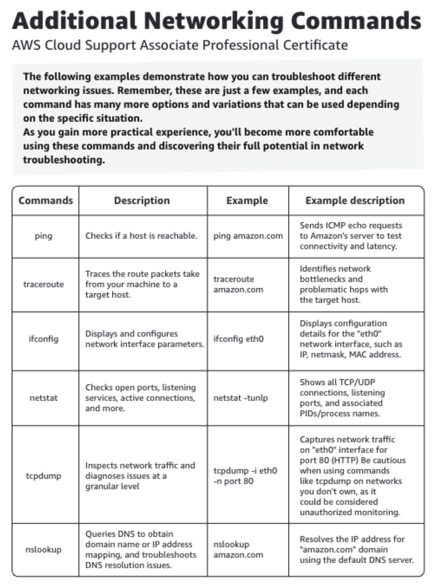
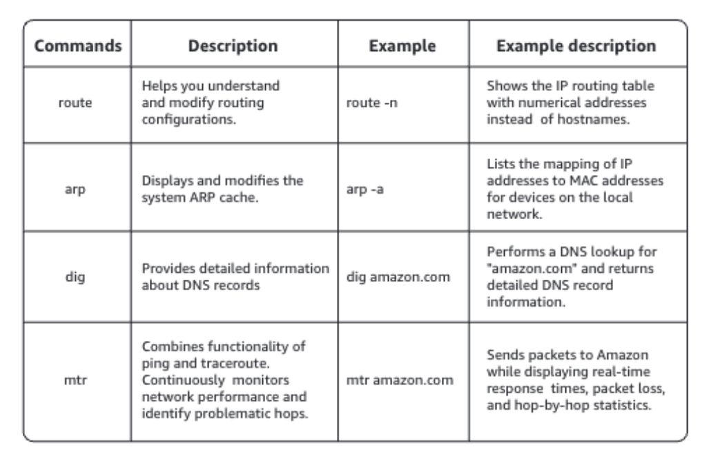

# Module 1: Linux Command Line
## CLI Basics
pwd: stands for "present working directory", will show us where we are on the computer. Now, this is called the Home Directory, and every user is gonna get one of these. And in general, it's only accessible by your specific user account. You can kind of think of this like your home base. It's where you're gonna wanna store your files, documents, pictures, applications, and really whatever else you wanna put on a computer. 

ls: stands for list, and that's gonna show us what's going on in this folder.

cd: stands for change directory, followed by the folder name, will change into that folder. So cd Desktop will open the desktop folder, just like I'd get if I opened up the GUI and clicked on that folder.

open filenamee
open ./Desktop/~

## File management commands:

mkdir: create directory

mv: move

cp: copy

rm: delete

## User Permissions
whoami

sudo useradd (username)

sudo su (username)

sudo visudo

id (username)

sudo groupadd sudoers

sudo usermod -a -G sudoers alex

## File Permissions

0: No permissions

1: Execute permissions

2: Write permissions

4: Read permissions

Ex)

4 (Read) + 2 (Write) = 6

4 (Read) + 1 (Execute) = 5

4 (Read) + 2 (Write) + 1 (Execute) = 7

ls -al

cat (filename)

if filename: Permission denied

sudo chmod 755 (filename)

then 

ls -al (filename)

**Owner change**

sudo chown demo:sudoers (filename)

## Vim and Nano

| Nano | Vim |
| -- | -- |
|Straightfoward and simpler | Powerful and complex |
|Single mode | Multiple modes |
|Limited customization | Extensive customization |
|Quick edits | Advanced features |

### Basic Nano commands 

Nano is a beginner-friendly text editor that’s great for quick and simple tasks. Its intuitive interface makes it easy to use Nano without needing to know a lot of commands.

### Installation commands

```nano --version``` Checks if you have Nano

```sudo apt-get install nano``` Installs Nano on Linux

### File handling

```nano filename``` Opens the file called filename

```Ctrl S``` Saves current file

```Ctrl O``` Offers to write file ("Save as")

```Ctrl X``` Closes buffer, exit from nano

### Moving around

```←``` One character backward

```→``` One character forward

```Ctrl ←``` One word backward

```Ctrl →``` One word forward

```Ctrl A``` To start of line

```Ctrl E``` To end of line

```Ctrl P``` One line up

```Ctrl N``` One line down

### Operations

```Ctrl T Ctrl S``` Runs a spell check

```Ctrl T Ctrl Y``` Runs a syntax check

### Information

```Ctrl C``` Reports cursor position

```Alt D``` Reports line/word/character counts

```Ctrl G``` Displays help text

For more information, see the Nano documentation.

### Basic Vim commands 

Vim is a highly configurable text editor that’s perfect for developer who want efficiency and control. It has different modes for complex text manipulations, offering a lot of flexibility and functionality for proficient users.

### Installation commands

```vim --version``` Checks if you have Vim

```sudo apt-get install vim``` Installs Vim on Linux

### File handling

```vim filename``` Opens the file called filename

```:w``` Saves the current file

```:wq``` Saves and quits the current file

```:q!``` Quits without saving

### Moving around

```H``` Moves the cursor left

```J``` Moves the cursor down

```K``` Moves the cursor up

```L``` Moves the cursor right

```0``` Moves the cursor to the beginning of the line

```$``` Moves the cursor to the end of the line

```gg``` Moves the cursor to the top of the line

### Operationsxx

```i``` Switches to insert mode

```Esc``` Switches back to normal mode

```:``` Switches to command mode

```U``` Undoes changes

### Information

```:help``` Opens a Help window

```:help``` modes Opens a Help window with details about modes
# Module 2: Command Line Troubleshooting
## Additional Networking Commands




## Diving Deeper with Cron
In this module, you learned about the cron jobs, including how to set them up and schedule simple tasks. Now, let’s explore more advanced Cron job examples that might help you with optimization and maintenance.

### Using shortcuts for common intervals

You can use the @ symbol in cron as a shortcut for scheduling common intervals.  

As an example, you can schedule a job to run the script on a monthly basis. The script will run once a month at midnight on the first day of the month.

```@monthly /path/to/your/script.sh```

The @ shortcut simplifies cron job definitions by avoiding the need to remember specific syntax. Similarly, you can schedule tasks on a @yearly, @weekly, @daily, and @hourly basis, or run the script when your system reboots with @reboot.

### Compressing files

Cron allows you to chain multiple commands together. For example, if you want to back up a database and then compress the backup file, you can do the following:

```0 2 * * * /path/to/backup_script.sh && /path/to/compress/script.sh```

The ```&&``` ensures that the second commands runs only if the first one succeeds.

### Efficiently managing large outputs

Large outputs can quickly fill up your disk space. To address this issue, you can redirect the output to a log file.

```0 3 * * * /path/to/your/script.sh >> /var/log/cron_job.log 2>&1```

In the example, >> appends the log file and 2>&1 sends both the standard output and standard error to the log file ```/var/log/cron_job.log```.

### Backing up a database daily at midnight

Suppose you have a MySQL database and you want to maintain a daily copy of all data. You can schedule a cron job to back up your database at midnight every day.

```0 0 * * * /usr/bin/mysqldump -u root -pYourPassword database_name > /path/to/backup/database_name.sql```

The ```mysqldump``` command creates the backup, ```-u root``` specifies the MySQL username, and ```-pYourPassword``` specifies the MySQL password. Note, there is no space between ```-p``` and the password. Lastly, you provide the name of your database and redirect the output of ```mysqldump``` to the specific file ```/path/to/backup/database_name.sql```.

# Module 3: Network Troubleshooting
## IPv4 vs. IPv6

There are two main types of IP addresses in use today: IPv4 and IPv6. 

### IPv4 addresses

IPv4 stands for Internet Protocol version 4. It’s the fourth version of the Internet Protocol and was the first version to be widely deployed.  

IPv4 is the older, commonly-used protocol with a 32-bit address space. IPv4 is typically represented in a decimal format, divided into four blocks, and separated by dots. Each part of the address (called an octet) ranges from 0 to 255.

192.168.1.1 is an example of an IPv4 address.  

Why is IPv4 still in use, you may wonder? IPv4 has been around since the early days of the Internet, and a lot of infrastructure is built around it. Many organizations have significant investments in IPv4. Upgrading their infrastructure can be costly and complex, requiring to replace or reconfigure hardware, update software, and retrain staff. 

However, IPv4 addresses have some limitations. The limitations include a restricted number of possible address combinations, manual setup, security through additional protocols (IPsec), larger routing tables due to non-hierarchical address allocation, and more. 

In total, there are around 4.3 billion IPv4 addresses. To extend usability of IPv4 addresses, you can use techniques, such as NAT (Network Address Translation), that allow multiple devices on a local network to share a single public IPv4 address.

### IPv6 addresses 

IPv6 is the newer protocol designed to address the limitations of IPv4, providing a more scalable and efficient network protocol.  

IPv6 stands for Internet Protocol version 6. This version was developed to address the shortage of IPv4 addresses and to add enhancements in areas such as routing and network configurations. 

IPv6 addresses are 128-bit numbers. They are represented in hexadecimal format, divided into eight groups of four hexadecimal digits, and separated by colons.

2001:0db8:85a3:0000:0000:8a2e:0370:7334 is an example of an IPv6 address. 

This format allows for a virtually unlimited number of unique addresses, effectively solving the shortage of IPv4 addresses. 

IPv6 also includes improvements in areas of security. To be more specific, IPv6 has a built-in support for IPsec (Internet Protocol Security). This ensures end-to-end communication, providing data integrity, authentication, and confidentiality. 

In addition to built-in security, IPv6 supports more efficient routing and automatic configuration. Because of these improvements, IPv6 is widely used for modern networking needs, such as IoT (Internet of Things), mobile networks, and large-scale deployments.

### Transition mechanisms 

IPv4 and IPv6 are not directly compatible. There are several transition mechanisms that allow you to use both protocols as you gradually transition from IPv4 to IPv6.

- Dual stack: With this method, each device has both an IPv4 and an IPv6 address. Devices can communicate using either protocol as needed.

- Tunneling: This method encapsulates IPv6 packets within IPv4 packets, allowing IPv6 traffic to be transmitted over existing IPv4 infrastructure. 

- Translation: This method enables communication between IPv4 and IPv6 by converting packets from one protocol to the other.

## Networking Take Away

21 (TCP, UDP) - FTP - File Transfer Protocol

22 (TCP, UDP) - SSH - Secure Shell

23 (TCP) - Telnet

25 (TCP) - SMTP - Simple Mail Transfer Protocol

53 (TCP, UDP) - DNS - Domain Name System

67, 68 (UDP) - DHCP - Dynamic Host Configuration Protocol

80 (TCP) - HTTP - Hypertext Transfer Protocol

110 (TCP) - POP3 - Post Office Protocol

111, 2049 (TCP, UDP) - NFS - Network File System

137 (TCP, UDP) - NetBIOS - Network Basic Input / Output System

143 (TCP, UDP) - IMAP - Internet Message Access Protocol

161, 162 (UDP) - SNMP - Simple Network Management Protocol

443 (TCP) - HTTPS - Hypertext Transfer Protocol Secure

587 (TCP) - SMTP - Simple Mail Transfer Protocol

993 (TCP) – IMAPS – Internet Message Access Protocol

3306 (TCP) - MySQL

3389 (RCP, UDP) – RDP – Remote Desktop Protocol

5432 (TCP) - PostgreSQL

5439 (TCP) - Redshift

## Amazon Route 53
- Register or transfer domain names
- Create public and private hosted zones
- Route internet traffic to the resources for your domain
- Check the health of your resources

## DNS record types
- An A record maps a domain name to an IPv4 address
- A CNAME record points your domain name to antoher domain or subdomain
- An alias record routes traffic to selected AWS resources

# Module 4: Troubleshooting Scenarios