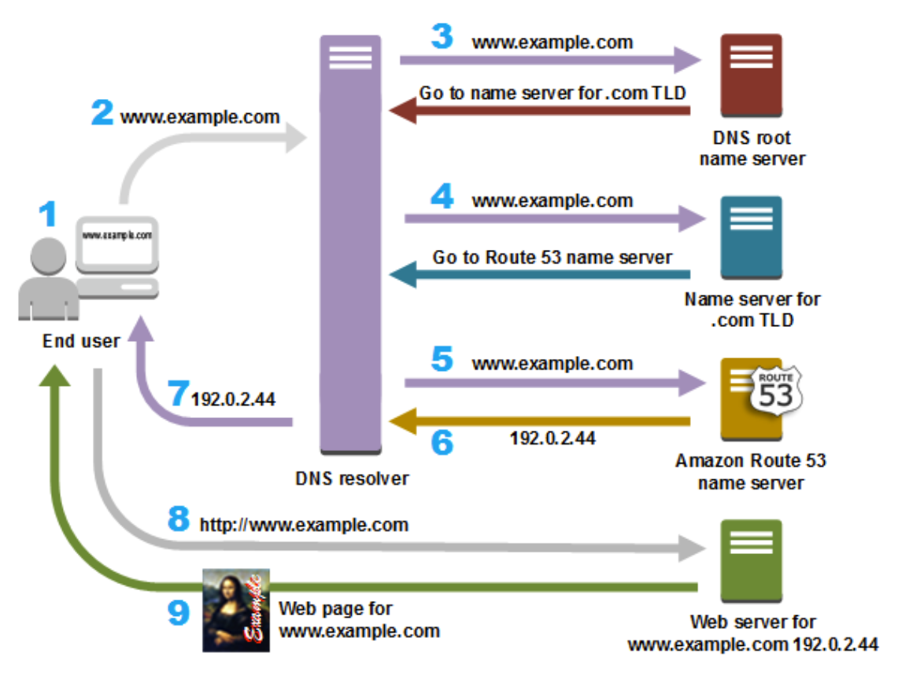
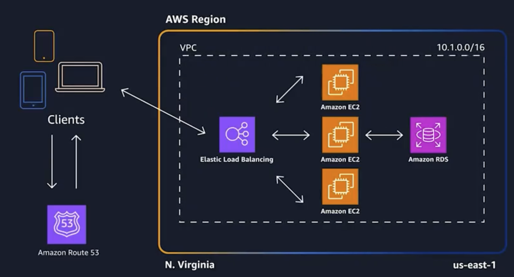

# Introduction to Information Technology and AWS Cloud

# Module 1: Foundational IT Knowledge

## Computer basics

### Central Processing Unit (CPU)

The CPU is commonly referred to as the brain of the computer. The CPU executes instructions and performs calculations for the computer to complete tasks. There are multiple types of CPUs that have different specifications—including clock speed, number of cores, and cache size—which all affect performance. The performance of the CPU has a major impact on how quickly programs load and how smoothly they run. Clock speed measures the number of cycles your CPU executes per second. Clock speed is measured in gigahertz, or GHz.Modern computers also have multicore CPUs. Multicore processors are a type of CPU that contain multiple independent processing units (also known as cores) on a single physical chip. Each core can execute instructions independently, which means that a multicore CPU can process multiple tasks in parallel (also known as parallel processing).

### Random access memory (RAM)

RAM is temporary memory where data and instructions are stored for quick access by the CPU. The amount of RAM in a computer directly affects the computer's multitasking capabilities and overall performance.The capacity of RAM is measured in gigabytes (GB). When you power off your computer, anything that was written to RAM will disappear. RAM is also known as volatile storage or ephemeral storage because of its temporary nature.

### Hard disk drive (HDD) and Solid-state drive (SSD)

HDDs are traditional storage devices that use spinning disks and mechanical read/write heads that move around the disk. These drives are usually less performant and more prone to failure than SSD drives.SSDs are newer, faster storage devices that use a technique called flash memory. SSDs have no moving parts, which makes them more durable and faster than HDDs. SSDs are preferred for most use cases. However, HDDs are preferred for mass storage because of their larger storage capacities and lower cost per gigabyte.

### Motherboard

The motherboard is the main circuit board of the computer, and it connects all the hardware components. It houses the CPU, RAM slots, expansion slots, and other essential connectors.When choosing components, it's important to ensure compatibility with the motherboard, such as socket type for the CPU, or the type and speed of the RAM.

### Networking hardware

Networking hardware includes devices such as routers, modems, and network interface cards (which are commonly called network cards). Network cards are inside a computer, and they make it possible for a computer to connect to a network. Network cards provide the physical interface between the computer and the network so that data can be transmitted over network connections.Routers are like the central hub or manager of a network, and they connect different devices to each other and to the internet. A router acts as a type of traffic controller, directing small pieces of information (also known as data packets) between these devices.A modem is a device that connects your computer or local network to the internet. It translates digital signals from your computer into a format that can be transmitted over a specific communication network, such as cable or telephone lines. The modem acts as a bridge between your local network and the wider internet.

### Graphics processing unit (GPU)

If you’ve worked around IT in general, you might have heard the term GPU when talking about computationally expensive tasks. GPUs are specialized processors. They are primarily used for rendering graphics, and accelerating tasks related to image and video processing.GPUs are crucial for gaming, graphics-intensive applications, and tasks such as video editing. Some CPUs have integrated graphics capabilities, but others require a dedicated GPU.

### Peripherals

Peripherals is the term used to refer for input/output devices, such as keyboards, mice, monitors, printers, and scanners.


## Network connections and VPN: The corporate connections

### Client-to-site VPN
The client-to-site VPN is also known as the remote access VPN.A client-to-site VPN allows individual users (clients) to securely connect to a company's private network (site) from anywhere on the internet. The user's device acts as the client, and it connects to the company's site through a VPN service or VPN server. With this type of VPN, remote workers or employees who need secure access to company resources can work from outside the office. The client-to-site VPN provides individual users with secure and encrypted access to the company's internal network.AWS offers a solution called AWS Client VPN. It is a fully managed remote access VPN solution that a remote workforce can use to securely access resources within both AWS and the company’s on-premises network. The AWS Client VPN is designed to be fully elastic. It can automatically scale up or down, based on demand. When a company migrates applications to AWS, their users can access these applications in the same way before, during, and after the move. AWS Client VPN, including the software client, supports the OpenVPN protocol.For more information, see [AWS Client VPN](https://aws.amazon.com/vpn/client-vpn/?nc1=h_ls).

### Site-to-site VPN

This modality is also known as the router-to-router VPN. A site-to-site VPN establishes a secure connection between two or more physical locations (sites) over the internet. The VPN connection is typically established between the routers or firewalls at each site, instead of between individual devices.A site-to-site VPN is designed to connect entire networks of different offices, data centers, or branches to create a unified and secure network. This type of VPN makes it possible to share resources and data between connected sites, like they were on the same local network.AWS offers a solution called AWS Site-to-Site VPN. It is is a fully managed service that’s designed to create a secure connection between a company’s data center (or branch office) and their AWS resources by using IP Security (IPSec) tunnels. When a company uses AWS Site-to-Site VPN, they can connect to both their virtual private clouds (VPCs) and AWS Transit Gateway. In addition, they can use two tunnels per connection for increased redundancy.For more information, see [AWS Site-to-Site VPN](https://aws.amazon.com/vpn/site-to-site-vpn/?nc1=h_ls).

### Summary

VPNs are an entire world in themselves!In summary, a client-to-site VPN connects individual users to a company's network. In contrast, a site-to-site VPN connects entire networks of different physical locations, and it allows the sites to communicate securely like they were part of the same network.In the corporate world, a VPN helps with environment isolation regardless of the type of VPN you choose. Companies use VPNs to create isolated virtual tunnels that link remote employees or third-party offices to the central network. This isolation is designed to confine data and communications within the designated network, and to minimize the risk of unauthorized access or data leaks.

## Operating systems and software

### Key components of an operating system
#### The kernel
An operating system is made up of multiple parts, and one major part is responsible for the essential functions of the OS: the kernel. The kernel interacts directly with the underlying hardware. It provides essential services and functionality that enable both software applications to run, and system resources to be managed efficiently.

The kernel is responsible for various essential functions that the operating system needs to work effectively. The kernel performs the following key functions:

- **Memory management**: The kernel manages system memory. It allocates and deallocates memory space for processes, and is designed to use memory efficiently.

- **Process scheduling**: The kernel handles the scheduling and execution of processes. It enables multiple processes to run concurrently on a single processor, or across multiple processors.

- **Device drivers**: The kernel provides the necessary drivers to facilitate communication between the operating system and hardware devices. The operating system uses these drivers to interact with peripherals, such as printers, network adapters, and storage devices.

- **Interrupt handling**: The kernel handles hardware interrupts, which are signals that devices send to get the attention of the operating system. It manages the response to interrupts and coordinates the execution of appropriate interrupt service routines.

#### File systems

An operating system helps store and manage files on your computer. Programs are made up of files, and you work with files of all types when you use your devices. A file system is a storage mechanism that an operating system uses to store, organize, and retrieve files and data. The type of file system that the operating system uses defines the structure and rules for naming, organizing, and accessing files in storage.

File management is a general term that covers various operations, including creating, opening, closing, reading, writing, and deleting files. The file system makes it possible to perform these operations efficiently. It also provides organization to make it easier to navigate and retrieve files.

File systems typically adopt a hierarchical structure, which means that it organizes files and directories in a tree-like arrangement. This structure helps users categorize and manage their data effectively.

The following key terms describe parts of a file system:
- Directories: Also known as folders, directories serve as containers for files and subdirectories. They make it possible to organize files into logical groups by providing a hierarchical structure to access and manage data. 

- Files: Files are containers for storing data, and files are saved within directories. They represent documents, programs, media files, or any other type of information. 

#### Processes and threads
In this course, you learned about processes and what they are. A process represents an instance of a running program. Though the videos didn’t cover the concept of threads, you should be aware of threads when you work in IT.

Threads are individual units of execution within a process. They share the same memory space and resources, and they enable concurrent execution. You can think of threads as lightweight processes that enable multitasking within a single program. You might come across the term multithreaded, which refers to a program where processes can run multiple threads at the same time.

With most types of computers, multiple programs and threads will run concurrently. This situation requires process scheduling, which is another core piece of operating systems. Process scheduling makes it possible to have capabilities for multiprogramming and multitasking. It facilitates the simultaneous coexistence of multiple processes in memory that execute concurrently. Scheduling determines the processes that get access to the CPU, which makes multitasking possible.

To learn more about processes and threads, see [Difference between Processes and Threads](https://www.tutorialspoint.com/difference-between-process-and-thread#:~:text=Both%20process%20and%20thread%20are,in%20the%20same%20memory%20space.)

#### The command line
You briefly learned about how to use a command line interface (CLI). The CLI provides a text-based way to interact with a computer. CLIs take in commands as input, and the commands are then run by the computer. You can do many different tasks by using the CLI, but the types of commands you construct depend on the operating system that you use. If you run an operating system like Linux, you could use Bash on the command line. In contrast, if you use Windows, it’s common to use PowerShell. 

To learn more about the command line in general, see [Command Line Crash Course.](https://developer.mozilla.org/en-US/docs/Learn_web_development/Getting_started/Environment_setup/Command_line)

#### Bash
Bash is one of the most common and popular command-line interfaces. It stands for Bourne Again SHell. It's essentially a program that you use to give instructions to your computer by entering text commands. Bash can perform various tasks based on those commands.

When you open the terminal, you see a blank screen with a symbol-based prompt, such as ```$``` or ```>```. When you see the prompt, Bash is waiting for you to tell it what to do and you can start entering Bash commands.

For example, if you want to see the file that are in a folder, you can enter ls (which stands for list) and press Enter. Then, Bash will show you a list of files in the current directory. If you want to change the directory, you can use cd (which stands for change directory), followed by the folder's name. For example, cd Documents will take you into the ```Documents``` folder

To back out of a directory and go one level up in the hierarchy, you can use the following command: ```cd ../```

Bash can do more than navigate your files. It can also help you create, copy, move, and delete files and directories. You can open and edit text files by using Bash, search for specific text in files, and perform other useful tasks.

Additionally, you can use Bash to run other programs and scripts by entering their names and passing any necessary arguments. For example, say that you have a program called my_program, and it needs some input to run. You can run it by entering the following command, and pressing Enter:

```./my_program argument1 argument2```

Bash can also be used for scripting tasks. Scripting can become complex, and it’s out of scope for this course. However, it’s good to know the use cases for bash.

To learn more about Bash, see the [Bash Reference Manual.](https://www.gnu.org/software/bash/manual/html_node/index.html)

#### PowerShell
PowerShell is also a command-line interface that you can use to interact with your computer. However, PowerShell is specifically designed for Windows operating systems.

When you open PowerShell, you see a window with a command prompt, which looks like the following example: 

```PS C:\Users\YourUsername>```

The PS stands for PowerShell. The text after PS shows your current location in the file system, which is typically the user's home directory.

PowerShell commands are called cmdlets (which is pronounced like “command-lets”). These cmdlets are designed to work together and perform various tasks, and can function like building blocks. They use a consistent verb-noun naming convention to make them easier to remember. Consider the following examples:

- To list the files in a directory, you can use the Get-ChildItem cmdlet.

- To change the directory, you can use the Set-Location cmdlet. 

PowerShell can perform many tasks, such as creating, copying, moving, and deleting files and folders. You can also use it to interact with the Windows Registry and manage processes, services, and network configurations.

PowerShell also supports scripting, which means that you can write and save sequences of commands into scripts that have the .ps1 extension. This way, you can automate tasks and run complex operations with a single command.

To learn more about PowerShell, see [Windows PowerShell Reference.](https://learn.microsoft.com/en-us/powershell/scripting/developer/windows-powershell-reference?view=powershell-7.5&viewFallbackFrom=powershell-7.3)

#### AWS Command Line Interface (AWS CLI)
Beyond CLIs such as Bash and PowerShell, you can also use specialized CLIs that are designed to interact with various services and platforms on the internet. The AWS Command Line Interface (AWS) is one such example.

The AWS CLI is a tool that AWS provides so you can manage and interact with AWS services directly from your command line. With the AWS CLI, you don’t need to use the AWS Management Console, which is a browser-based interface.

To learn more about the AWS CLI, see [AWS Command Line Interface.](https://aws.amazon.com/cli/?nc1=h_ls)

## Different types of virtualization

### What are the different types of virtualization?

You can use virtualization technology to get the functions of many different types of physical infrastructure with all the benefits of a virtualized environment. You can go beyond virtual machines to create a collection of virtual resources in your virtual environment.

#### Server virtualization

Server virtualization is a process that partitions a physical server into multiple virtual servers. It’s an efficient and cost-effective way to use server resources and deploy IT services in an organization. Without server virtualization, physical servers use only a small amount of their processing capacities, which leaves devices idle.

#### How is server virtualization different from containerization?

Containerization is a way to deploy application code to run on any physical or virtual environment without changes. Developers bundle application code with related libraries, configuration files, and other dependencies that the code needs to run. This single package of the software, called a container, can run independently on any platform. Containerization is a type of application virtualization.You can think of server virtualization like building a road to connect two places. You need to re-create an entire virtual environment and then run your application on it. By comparison, containerization is like building a helicopter that can fly to either of those places. Your application is inside a container and can run on all types of physical or virtual environments.

#### Storage virtualization

Storage virtualization combines the functions of physical storage devices, such as network-attached storage (NAS) and storage area network (SAN). A company can pool the storage hardware in their data center, even if it comes from different vendors or they are of different types. Storage virtualization uses all the physical data storage and creates a large unit of virtual storage that can be assigned and controledl by using management software. IT administrators can streamline storage activities (such as archiving, backup, and recovery) because they can combine multiple network storage devices virtually into a single storage device.

#### Network virtualization

Any computer network has hardware elements, such as switches, routers, and firewalls. An organization with offices in multiple geographic locations can have several different network technologies working together to create its enterprise network. Network virtualization is a process that combines all of these network resources to centralize administrative tasks. Administrators can adjust and control these elements virtually, without touching the physical components, which simplifies network management.Network virtualization includes the following two approaches:

- Software-defined networking: Software-defined networking (SDN) controls traffic routing by taking over routing management from data routing in the physical environment. As an example, consider a company that wants to provide consistent call quality in all online meetings. The company can program their system to prioritize video-call traffic over application traffic.

- Network function virtualization: Network function virtualization technology is designed to improve network performance by combining the functions of network appliances—such as firewalls, load balancers, and traffic analyzers—that work together.

#### Data virtualization

Modern organizations collect data from several sources and store it in different formats. They might also store data in different places, such as in a cloud infrastructure and an on-premises data center. Data virtualization creates a software layer between this data and the applications that need it. Data virtualization tools process an application’s data request and return results in a suitable format. Thus, organizations use data virtualization solutions to increase flexibility for data integration and support cross-functional data analysis.

#### Application virtualization

Application virtualization pulls out the functions of applications to run on operating systems other than the operating systems that they were designed for. For example, users can run a Windows application on a Linux machine without changing the machine configuration.

#### Desktop virtualization
Most organizations have nontechnical staff that use desktop operating systems to run common business applications. For instance, consider the following scenarios:

- A customer service team requires a desktop computer with Windows 10 and customer-relationship management (CRM) software.

- A marketing team requires Windows 11 for sales applications.

A company can use desktop virtualization to run these different desktop operating systems on virtual machines, which their teams can then access remotely. This type of virtualization is designed to make desktop management efficient and secure, and to save money on desktop hardware.

# Module 2: IT and the Internet

## Web servers and components of a website

### Web Servers
Every website needs a web server. A web server is specialized software that’s designed to respond to incoming Hypertext Transfer Protocol (HTTP) requests from clients. Clients are typically web browsers, but they can also be other types of frontends. The primary function of a web server is to store, process, and deliver webpages and other resources to users on request. When you enter a website's URL into your browser, it sends a request to the web server that hosts that website.

The web server processes this request, retrieves the requested resources (such as HTML documents, images, CSS files, and JavaScript files), and sends them back to the client's browser to be rendered and displayed as a complete webpage. 

### Web Applications
Unlike web servers, web applications are dynamic and interactive programs that live on the server side and are accessed through a web browser. Web applications are responsible for processing user inputs, performing various operations, performing business logic, and generating dynamic content that is sent back to the user's browser for display.

One example of dynamic content is this: say that you’re visiting a social media website. When you load the homepage, it pulls up content posted by other users who you follow. If somebody else logs in, they will get different data because you are both follow different people. This is an example of dynamic content, and the dynamic nature of a website is handled by a backend web application.

Web applications use server-side programming languages like Python, Java, .NET, Ruby, PHP, or JavaScript (Node.js) to handle user requests and interact with databases or other data sources. These applications can be as simple as a contact form or as complex as a social media platform or online shopping portal. 

### HyperText Markup Language (HTML)
HTML forms the structural components of a website. It defines the layout and organization of content, such as headings, paragraphs, images, links, and other elements. HTML provides the essential structure so that web browsers can interpret and render webpages correctly.

HTML elements are defined by using tags. The following list includes examples of HTML tags and their uses:

- ```<html>```: Is the root element of an HTML document. All other elements are nested within this tag.

- ```<head>```: Contains meta-information about the document, such as the page title, links to CSS stylesheets, and other metadata.

- ```<title>```: Sets the title of the webpage, which appears in the browser's title bar or tab.

- ```<body>```: Encloses the visible content of the webpage, including text, images, multimedia, and other elements.

- ```<h1>, <h2>, <h3>, <h4>, <h5>, <h6>```: Format headings of varying levels, from the most important ```<h1>``` to the least important ```<h6>```. Use these tags to structure content hierarchically.

- ```<p>```: Represents a paragraph of text, and creates clear divisions between blocks of content.

- ```<a>```: Creates hyperlinks to other webpages, files, or specific sections within the same page.

- ``````: Embeds an image on the webpage, and makes it possible to include visual elements.

- ```<ul>``` and ```<ol>```: Create unordered and ordered lists, respectively. Items within the list are represented using ```<li>``` tags.

- ```<div>```: Is a generic container that’s used for grouping and styling content blocks.

- ```<span>```: Similar to ```<div>```, but is used for inline styling and grouping of text elements.

- ```<br>```: Inserts a line break, causing text to move to the next line without creating a new paragraph.

- ```<form>```: Defines a form that collects user input. It can contain various form elements, such as text inputs, check boxes, radio buttons, and buttons.

- ```<input>```: Creates an input field within a form, allowing users to enter data.

- ```<textarea>```: Creates a multi-line text input area within a form.

- ```<button>```: Generates a clickable button, often used to submit forms or initiate actions.

- ```<label>```: Associates a text label with a form element, which makes the form more accessible and user-friendly.

- ```<table>```: Defines a data table. It contains rows ```(<tr>)```, table headers ```(<th>)```, and table data cells ```(<td>)```.

- ```<iframe>```: Embeds another webpage or external content within the current page.

This list includes only a subset of HTML tags as examples so you can gain a deeper understanding of how web development works on a theoretical level. If you choose to dive deeper into web development, you'll encounter many more tags and elements that you can use to create complicated and interactive webpages.

For more information about HTML and the various tags, see [HTML reference.](https://www.w3schools.com/TAGS/default.asp)

### Cascading Style Sheets (CSS)
CSS brings aesthetics to the web by providing style and layout instructions to HTML elements. It controls the presentation and visual appearance of webpages, including fonts, colors, margins, and positioning. CSS styles websites so that they look visually appealing and consistent across different devices.

Exploring CSS is beyond the scope of this course. For now, you should understand what CSS is, and be able to explain its use case. 

For more information about CSS, see this [CSS Tutorial.](https://www.w3schools.com/css/default.asp)

### JavaScript (JS)
JavaScript, or JS, is a client-side scripting language that adds interactivity and dynamic behavior to webpages. Developers use JS to create interactive elements, handle user events, validate forms, and perform actions without requiring a page reload. It's a crucial component for building responsive and interactive web applications, and most webpages you interact with use JavaScript and JavaScript frameworks.

For more information about JS, see this [JavaScript Tutorial.](https://www.w3schools.com/js/default.asp)

### Backend Programming Languages
Web applications rely on server-side programming languages to handle requests, process data, perform business logic, and interact with databases. Popular backend languages include Python, Ruby, PHP, and JavaScript (Node.js), among others. Web applications are written by using backend programming languages.

### Databases
Databases store and manage the website's data, such as user information, product catalogs, and content. Common databases used in web development include MySQL, PostgreSQL, MongoDB, and Microsoft SQL Server. AWS offers many different database services to host database in the cloud, such as Amazon Relational Database Service (Amazon RDS).

For more information about databases on AWS, see [AWS Cloud Databases.](https://aws.amazon.com/products/databases/)

### Web Frameworks
Web frameworks provide a structured and organized way to build web applications. They offer prebuilt components, libraries, and tools that simplify development tasks when building web applications. Examples of web frameworks include Django (Python), Ruby on Rails, and Express.js (Node.js).

## Web application architectures
### Layered architectures
Layered architectures are also known as N-tier architectures. They are usually found in monolithic applications. (Monolithic applications are described later in this reading.) The monolithic approach to designing software systems is commonly used for web applications. The concept involves dividing the application into distinct layers. Each layer is responsible for specific functionalities, and each layer promotes a clear separation of tasks. This architectural style is simpler to begin with, and can suit a variety of workloads, from blogs to ecommerce.

1. Frontend layer 
The frontend layer is also known as the presentation layer. It’s responsible for user interfaces and interactions. The frontend handles user inputs, displays data, and communicates with the underlying layers. AWS offers several services that facilitate the presentation layer, including the following:

   - Amazon Elastic Compute Cloud (Amazon EC2): Can run many different kinds of resources, including your application frontend

   - Amazon Simple Storage Service (Amazon S3): Is primarily a storage service, but offers a feature to host highly scalable static HTML websites

   - Elastic Load Balancing: Automatically distributes incoming application traffic across multiple targets and virtual appliances in one or more Availability Zones

   - Amazon CloudFront: Is a content delivery network (CDN) service that’s designed to deliver web content (including static and dynamic components) with low latency and high transfer speeds

   - Amazon API Gateway: Helps build and manage APIs to expose backend services to frontend applications

2. Application layer 
The application layer is also known as the middle tier. It contains the core business logic of the web application. This layer processes user requests from the frontend layer, orchestrates data flow, and manages application-specific rules. AWS services that you can use for the application layer include the following:

   - Amazon EC2:  Can run many different kinds of resources, including your application logic

   - AWS Lambda: Is a serverless computing service you can use to run code without managing servers; works well for executing discrete application logic

   - AWS Step Functions: Enables the coordination and sequencing of Lambda functions to build scalable and robust workflows

3. Database layer
The database layer manages data storage and retrieval. It stores and retrieves information from data that belongs to users, applications, caches, or other data sources. AWS provides various services for the data layer, including the following:

   - Amazon EC2: Can run many different kinds of resources, including your application database

   - Amazon Relational Database Service (Amazon RDS): Offers managed database services for popular relational databases such as MySQL, PostgreSQL, and Oracle.

   - Amazon DynamoDB: Is a fully managed NoSQL database service that’s designed to provide scalability and low-latency access for large-scale applications

### Amazon EC2 and its role
Did you notice that Amazon EC2 is included in every layer? Depending on how you architect your application, you might need to run an operating system that you can control. Though managing the operating system gives you more control, it provides less convenience. (Again, no one solution is better than another because what matters is meeting your needs.) However, more control over the operating systems means more responsibility. When you manage the operating system, you also need to configure the operating system (including security patches) for every step. 

You can think of Amazon EC2 as a cloud wildcard because it has many uses, and you can use it as a component in different layers. Understanding how to use Amazon EC2 for the basic stack of compute, network, and storage is a powerful tool for cloud consultants and technologists in the industry.

### Microservices
Microservices are an architectural and organizational approach to software development where software is composed of small independent services that communicate over well-defined APIs. These services are owned by small, self-contained teams.

Microservices architectures can make applications easier to scale and faster to develop, which in turn can foster innovation and accelerate time-to-market for new features.

### Monolithic architectures compared to microservices architectures
With monolithic architectures, all processes are tightly coupled and run as a single service. If one process of the application experiences a spike in demand, the entire architecture must be scaled. Adding or improving a monolithic application’s features becomes more complex as the code base grows. This complexity can limit experimentation and make it difficult to implement new ideas. Monolithic architectures add risk for application availability because many dependent and tightly coupled processes increase the impact of a single process failure.

With a microservices architecture, an application is built as independent components that run each application process as a service. These services communicate through a well-defined interface by using lightweight APIs. Services are built for business capabilities, and each service performs a single function. Because they run independently, each service can be updated, deployed, and scaled to meet demand for specific functions of an application.


### Characteristics of microservices
Microservices often have the following characteristics.

#### Autonomous
Each component service in a microservices architecture can be developed, deployed, operated, and scaled without affecting the functioning of other services. Services don’t need to share any of their code or implementation with other services. Any communication between individual components happens through well-defined APIs.

#### Specialized
Each service is designed for a set of capabilities and focuses on solving a specific problem. If developers contribute more code to a service over time, and the service becomes complex, it can be broken out into smaller services.

#### Agile
Microservices foster an organization of small, independent teams that take ownership of their services. Teams act within a small and well-understood context, and they are empowered to work more independently and more quickly. This model shortens development cycle times. You can benefit significantly from the aggregate throughput of the organization.

#### Flexible scaling
With microservices, each service can be independently scaled to meet demand for the application feature that it supports. Teams can thus right-size infrastructure needs, accurately measure the cost of a feature, and maintain availability if a service experiences a spike in demand.

#### Easy deployment
Microservices enable continuous integration and continuous delivery (CI/CD), which can make it easier to try out new ideas or roll back if something doesn’t work. The low cost of failure facilitates experimentation, makes it easier to update code, and accelerates time-to-market for new features.

#### Technological freedom
Microservices architectures don’t follow a one-size-fits-all approach. Teams have the freedom to choose the best tool to solve their specific problems. As a consequence, teams that build microservices can choose the best tool for each job.

#### Reusable code
By dividing software into small, well-defined modules, teams can use functions for multiple purposes. A service that’s written for a certain function can also be used as a building block for another feature. This structure means that an application can bootstrap off itself because developers can create new capabilities without writing code from scratch.

#### Resilient
Service independence increases an application’s resistance to failure. In a monolithic architecture, the entire application can fail if a single component fails. With microservices, applications handle total service failure by degrading functionality but not crashing the entire application.

### AWS services and microservices
You can use the following AWS services in microservices architectures.

#### Compute
- Amazon Elastic Compute Cloud (Amazon EC2): Can run many different kinds of resources, including your application computing

- Amazon Elastic Container Service (Amazon ECS): Is a highly scalable, high-performance container management service that supports Docker containers; runs applications on a managed cluster of EC2 instances

- AWS Lambda: Is a serverless computing service that you can use to run code without managing servers; works well for microservices components

#### Storage and Databases
- Amazon EC2:  Can run many different kinds of resources, including your application database

- Amazon Relational Database Service (Amazon RDS): Offers managed database services for popular relational databases, such as MySQL, PostgreSQL, and Oracle

- Amazon DynamoDB: Is a fully managed NoSQL database service that provides scalability and low-latency access for large-scale applications

#### Networking
- Application Load Balancer: Load-balances HTTP and HTTPS traffic at the application layer (level 7); provides advanced request routing that’s targeted at the delivery of modern application architectures (including microservices and containers)

- Amazon API Gateway: Can process hundreds of thousands of concurrent API calls; handles traffic management, authorization and access control, monitoring, and API version management

- Amazon Route 53: Provides internal Domain Name System (DNS) names for APIs

#### Messaging
- Amazon SNS: Is a fully managed publish/subscribe (pub/sub) messaging service that you can use to decouple and scale microservices, distributed systems, and serverless applications

- Amazon SQS: Is a fully managed message-queuing service that you can use to decouple and scale microservices, distributed systems, and serverless applications

#### Logging and monitoring
- Amazon CloudWatch: Collects and tracks metrics, collects and monitors log files, sets alarms, and can automatically react to changes across your running services and AWS resources

- AWS X-Ray: Provides an end-to-end view of requests as they travel through your application through a map of your application’s underlying components; can also provide a centralized view of logs so you can monitor and troubleshoot complex interactions as microservices work together to handle a request

## Internet and DNS concepts
All computers on the internet—from your smart phone or laptop to the servers that serve content for massive retail websites—find and communicate with one another by using numbers. These numbers are known as IP addresses. When you open a web browser and go to a website, you don't need to remember and enter a long number. Instead, you can enter a domain name, such as example.com, and still end up in the right place.

The Domain Name System (DNS) translates human-readable domain names (for example, www.amazon.com) into the machine-readable, numeric IP addresses (for example, 192.0.2.44) that computers use to connect to each other.

The internet’s DNS system works much like a phone book by managing the mapping between names and numbers. DNS servers translate requests for domain names into IP addresses. They control which server an end user will reach when the user enters a domain name into their web browser. These requests are called queries.

A DNS service, such as Amazon Route 53, is a globally distributed service for translating domain names (such as www.example.com) into IP addresses (such as 192.0.2.1). For more information, see [Amazon Route 53.](https://aws.amazon.com/route53/)

The following diagram gives an overview of how recursive and authoritative DNS services work together to route an end user to a website or application. This process is usually done in milliseconds!


1. A user opens a web browser, enters www.example.com in the address bar, and presses Enter.

2. The request for www.example.com is routed to a DNS resolver, which is typically managed by the user's internet service provider (ISP). Examples of ISPs include cable internet providers, DSL broadband providers, or corporate networks.

3. The DNS resolver for the ISP forwards the request for www.example.com to a DNS root name server.

4. The DNS resolver for the ISP forwards the request for www.example.com again, this time to one of the top-level domain (TLD) name servers for .com domains. The name server for .com domains responds to the request with the names of the four Amazon Route 53 name servers that are associated with the example.com domain.

5. The DNS resolver for the ISP chooses an Amazon Route 53 name server and forwards the request for www.example.com to that name server.

6. The Amazon Route 53 name server looks in the example.com hosted zone for the www.example.com record and gets the associated value (for example, the IP address for a web server, such as 192.0.2.44). The Amazon Route 53 name server then returns the IP address to the DNS resolver.

7. The DNS resolver for the ISP finally has the IP address that the user’s web browser needs. The resolver returns that value to the web browser. The DNS resolver also caches (stores) the IP address for example.com for an amount of time that you specify so that it can respond more quickly the next time someone browses to example.com.

8. The web browser sends a request for www.example.com to the IP address that it got from the DNS resolver. The requested webpage content can be reached through this IP address. For example, the content could be on a web server that runs on an Amazon Elastic Compute Cloud (Amazon EC2) instance or an Amazon Simple Storage Service (Amazon S3) bucket that's configured as a website endpoint.

9. The web server (or other resource at 192.0.2.44) returns the webpage content for www.example.com to the web browser, and the web browser displays the page.

## Internet basics

### DNS caching
Consider what happens when your computer makes a call to the Domain Name System (DNS). The first request for a domain goes to DNS, and DNS returns the IP address or data that’s associated with the record. However, if you make a second request on the same domain, it will check something called the DNS cache. 

A cache is a temporary storage location that stores frequently accessed data or information closer to the point of use. If you need to find information from a database or service somewhere, you can first check to see if the data you need is in the cache instead of traveling the entire way back to the source. 

The cache speeds things up because you can access that data quickly without going all the way back to the original source each time you need something. 

However, data in caches can become stale, which means that the source has changed, but the copy in the cache still has the old value. This situation is where a concept called time to live (TTL) comes in. When you use a cache, you typically give each piece of data a time to live, or a configurable amount of time that the data’s valid in the cache before it’s deleted.Caches are used in many places in IT, and DNS is one of those places. 

Think about this scenario: say that you go to amazon.com in your browser, and you accidentally close the window. You open another window and enter amazon.com in the browser again. When you attempt to access the website again, does the browser need to send a new request to the DNS server?

Most of the time, operating systems store things like IP addresses and other DNS records in a local cache, which results in the faster retrieval of future requests. This cache, known as the DNS cache, reduces the need for browsers to make new requests for redundant data. The DNS cache essentially eliminates a network call that would otherwise be made to DNS, which helps the page load faster. 

In general, caching is used to reduce latency when data is retrieved. You will see caches used with databases and other data storage systems as you begin your work in IT. 

A cache is one example of how the components that you are learning become more complex up as you take a closer look at them and see their details. For now, don’t worry too much about completely grasping these details. This course is focused on getting you to a place where you can begin to work hands-on and expand your knowledge of the details for each component you learn about. As an entry-level IT employee, it’s more important for you to understand the concepts and use cases; you will build your knowledge of the details as you work with these systems. 

### TCP/IP
Transmission Control Protocol/Internet Protocol (TCP/IP) is a set of communication protocols that internet-connected devices use to communicate with each other. 

As covered earlier in the course, data that’s sent between two networked devices is broken down into small units called packets. Packets contain data and information about where they came from and where they need to go. These packets travel separately, and can take different paths to reach their destination. TCP/IP requires that packets contain information so that the message can be put back together in order. After all the packets arrive at the destination, they are put back together to form the complete message.

When requests are made between computers, this process happens extremely fast under the hood. If you explore this topic further, you’ll see that TCP/IP has a whole process and a world of concepts. It’s another example of how you can define something from a high level, but if you take a closer look, it can have complex details that make it work. Again, you should focus on gaining concept-level understanding at this point.

### HTTP and HTTPS
Both Hypertext Transfer Protocol (HTTP) and Hypertext Transfer Protocol Secure (HTTPS) are topics that include a lot of information that this course hasn’t covered. The difference between the two involves security. When you see HTTPS in the web address, it means that the connection between your browser and the website is encrypted, which means that it’s more difficult for someone to gain unauthorized access to your data. In contrast, HTTP doesn't have that additional layer of security.

Under the hood, many things happen that make it possible to have a secure HTTPS connection. 

HTTPS works by using an extra layer of security called Secure Sockets Layer/Transport Layer Security (SSL/TLS). This layer encrypts the data that’s exchanged between your browser and the website's server, which makes it more difficult for anyone to intercept and understand that data. It's similar to putting your message in a secret code that only the intended recipient can decipher.

The following list describes a simplified breakdown of how HTTPS works:

1. When you connect to a website with HTTPS, your browser requests a secure connection.

2. The website's server responds by sending its SSL/TLS certificate, which contains a public key.

3. Your browser checks if the certificate is valid and trustworthy, and that the website is what it claims to be.

4. If the certificate is valid, your browser generates a random encryption key and encrypts it by using the server's public key. Only the server can decrypt this by using its private key.

5. At this point, your browser and the server share a secret encryption key, which is known as a session key. All the data that’s exchanged between your browser and the server is encrypted by using this session key.

6. Encrypted data is sent back and forth securely, which protects your information from being intercepted or tampered with. Encrypted data is not human readable, and only someone with the session key can decrypt the data to read it.

7. The browser receives the encrypted data and uses the session key to decrypt it, so that the website's content can be rendered and be made human readable.

Now, you take a closer look at HTTP in general. For the following section, remember that these concepts apply to both HTTP and HTTPS.Before you learn more detailed information about HTTP, it’s helpful to know some common terms that people use when they discuss HTTP. 

For example, HTTP methods is one term that you’ll hear. HTTP methods are the defined ways that your browser can talk to a web server. That is, you have a set of actions that you can take, and these actions are defined through these HTTP methods.Methods refer to the actions that can be performed on a resource. They indicate what the browser or client wants to do with a particular web page or resource.

A resource refers to information that can be accessed through a Uniform Resource Locator (URL). A resource in this context can be a webpage, an image, a document, or any other digital content that can be requested or manipulated through HTTP.

The most common HTTP methods are GET and POST. When you choose a link or enter a web address, your browser uses the GET method to ask the website for a specific page or resource. It's similar to saying, "Hi, I want to see this resource!" The POST method is used when you submit a form on a website, such as when you fill out a registration form. POST sends the information that you entered in the form to the website's server. Thus, GET is for retrieving resources, and POST is for sending resources.

The following table lists HTTP methods and their use cases:
|HTTP Method|Use Case|
|-|-|
|GET|Retrieve information on resources|
|POST|Send data to the server for processing|
|PUT|Update or replace an existing resource|
|DELETE|Remove or delete a resource|
|PATCH|partially modify or update a resource|
|HEAD|Retrieve only the headers of a resource|
|OPTIONS|Check the available methods for a resource|

Headers is another HTTP-related vocabulary word that you should know.Headers are additional pieces of information that accompany an HTTP request or response. They provide details about the request or response, such as the type of content that’s being sent, the length of the content, the encoding, caching instructions, authentication credentials, and more. Headers make it possible for browsers and servers to understand and process requests and responses properly.

You will hear about headers more as you use HTTP and work with web solutions. However, for now, you only need to understand that headers define certain aspects of your request, and that systems use them to interpret how to handle requests or pass data.

### Ports
When a connection is established between two hosts, the connection uses a port on both network devices. Ports are usually identified with a number that’s been assigned to it. The port number uniquely identifies a connection endpoint with a specific service. For example, in the Internet Protocol (IP), each IP address can handle 65,535 ports, but not all of them are used. 

Web connections have a list of commonly used ports. By default, HTTP uses port 80, and HTTPS uses port 443. Most (not to say all) browsers can use the default ports by observing the protocol that’s being used.

Port numbers are defined with a colon (:). For example, if you enter ```https://amazon.com:443``` in your browser, you’re indicating that you want to access that endpoint by using HTTPS. If you test this process and access the previous URL in your browser, you will notice that the browser removes the ```:443``` from the request because HTTPS is the default port for that protocol. However, if you configure your own web servers, you can use a custom port number to differentiate one website from another.

Say that you point your browser to ```https://amazon.com:444```. If you test whether you can access this URL, you will see an error called ```ERR_CONNECTION_REFUSED```. This message means that the server is not listening to the HTTPS protocol in the port 444 (which is what you should expect!).Because of this, it’s good to become familiar with the following phrase: “server listening on a port.”

Both ```8080``` or ```8000``` are common port numbers for development environments. 

### High and low port numbers
Most operating system kernels protect the usage of low ports and restrict them to power users. This practice provides an extra layer of protection on the server side because only authorized OS users should be allowed to use ports that are default ports for services. Well-known ports (also called system ports) are ports in the range of ```0-1023```. The following list of ports includes several well-known examples of port numbers and their protocols:

- 21: File Transfer Protocol (FTP)

- 22: Secure Shell (SSH); used for remote connections through the Linux command line

- 53: Domain Name System (DNS)

- 80: Hypertext Transfer Protocol (HTTP)

- 443: Hypertext Transfer Protocol (HTTPS)

Most experienced cloud consultants and technologists know some low ports that map to services, and they have memorized this information by working with networks in practice. You will develop this knowledge after you start working with networks, and the information will become automatic to you as you gain more experience.

### Firewalls
A firewall is a network security component that can filter incoming and outgoing requests. It can be a hardware appliance, software, or a cloud service.

It’s important to understand the concept of ports because firewalls use ports when they make a decision to allow or block a request. As a network administrator, you should be able to determine which ports you want to open or close, given a service or an endpoint. For example, when you configure a web server in the AWS Cloud, you should perform additional configuration to open port 80.

# Module 3: The AWS Cloud

## AWS Public Cloud Components
### Amazon virtual Private Cloud (Amazon VPC)
- Is a private networking space in AWS to host resources
- Defines the range of private IP addresses for your VPC



## AWS Cloud basics
What is cloud computing?
Cloud computing is the on-demand delivery of compute power, database, storage, applications, and other IT resources from a cloud services provider, through the internet, with pay-as-you-go pricing. Whether you are running applications that share photos to millions of mobile users or you’re supporting the critical operations of your business, a cloud services provider can offer rapid access to flexible and low-cost IT resources. 

With cloud computing, you don’t need to make large, upfront investments in hardware and spend a lot of time managing that hardware. Instead, you can provision the right type and size of computing resources you need to power your newest idea or operate your IT department. You can access as many resources as you need, almost instantly, and only pay for what you use.

Cloud computing provides a way to access servers, storage, databases and a broad set of application services over the internet. A cloud services platform, such as Amazon Web Services (AWS), owns and maintains the network-connected hardware required for these application services. You provision and use what you need through a web application.

For more general information about AWS, see [Overview of Amazon Web Services.](https://docs.aws.amazon.com/whitepapers/latest/aws-overview/introduction.html)

## History of AWS
In 2006, AWS began offering IT infrastructure services to businesses as web services—these services are now commonly known as cloud computing. One of the key benefits of cloud computing is the opportunity to replace upfront capital infrastructure expenses with low variable costs that scale with your business. With the cloud, businesses don’t need to plan for and procure servers and other IT infrastructure weeks or months in advance. Instead, they can instantly spin up hundreds or thousands of servers in minutes, and deliver results faster.

Today, AWS provides a highly reliable, scalable, low-cost infrastructure platform in the cloud that powers hundreds of thousands of businesses in 190 countries around the world.

## Six advantages of cloud computing

Cloud computing offers the following advantages:

- **Trade fixed expense for variable expense:** With cloud computing, you don’t need to invest heavily in data centers and servers before you know how you’ll use them. Instead, you can pay only when you consume computing resources, and pay only for how much you consume.

- **Benefit from massive economies of scale:** By using cloud computing, you can achieve a lower variable cost than you can get on your own. Because usage from hundreds of thousands of customers is aggregated in the cloud, providers such as AWS can achieve higher economies of scale, which translates into lower pay as-you-go prices.

- **Stop guessing capacity:** You can eliminate guessing on your infrastructure capacity needs. When you make a capacity decision before you deploy an application, you can end up with either expensive idle resources or dealing with limited capacity. With cloud computing, you can access as much or as little capacity as you need, and scale up and down as required with only a few minutes’ notice.

- **Increase speed and agility:** In a cloud computing environment, new IT resources are a click away, which means that you reduce the time you can make those resources available to developers from weeks to minutes. This can result in a dramatic increase in agility for the organization, because the cost and time it takes to experiment and develop is significantly lower.

- **Stop spending money running and maintaining data centers:** With the cloud, you can focus on projects that differentiate your business—not on infrastructure. By using cloud computing, you can focus on your own customers, instead of focusing on the heavy lifting of racking, stacking, and powering servers.

- **Go global in minutes:** With cloud computing, you can deploy your application in multiple regions around the world with a few clicks. This means you can provide lower latency and a better experience for your customers at minimal cost.

## Types of cloud computing
Cloud computing provides developers and IT departments with the ability to focus on what matters most and avoid undifferentiated work, such as procurement, maintenance, and capacity planning. As cloud computing has grown in popularity, several different models and deployment strategies have emerged to help meet the specific needs of different users. Each type of cloud service and deployment method provides you with different levels of control, flexibility, and management. Understanding the differences between infrastructure as a service (IaaS), platform as a service (PaaS), and software as a service (SaaS)—in addition to the deployment strategies you can use—can help you decide what set of services is right for your needs.

### Cloud computing models
#### Infrastructure as a service (IaaS)
IaaS contains the basic building blocks for cloud IT, and typically provides access to networking features, computers (either virtual or on dedicated hardware), and data storage space. IaaS provides you with the highest level of flexibility and management control over your IT resources. It’s also the most similar model to existing IT resources that many IT departments and developers are familiar with today.

#### Platform as a service (PaaS)
PaaS reduces the need for your organization to manage the underlying infrastructure (usually hardware and operating systems). With PaaS, you can focus on the deployment and management of your applications. PaaS can help you be more efficient because you don’t need to worry about resource procurement, capacity planning, software maintenance, patching, or any of the other undifferentiated heavy lifting involved in running your application.

#### Software as a service (SaaS)
SaaS provides you with a completed product that is run and managed by the service provider. In most cases, people who refer to SaaS are referring to end-user applications. With a SaaS offering, you don’t need to think about how the service is maintained or how the underlying infrastructure is managed. Instead, you need to think about only how you will use that particular piece of software. A common example of a SaaS application is a web-based email client. You can use a web-based email client to send and receive email without managing feature additions to the email product, or maintaining the servers and operating systems that the email program runs on.

## Cloud computing deployment models
#### Cloud
A cloud-based application is fully deployed in the cloud and all parts of the application run in the cloud. Applications in the cloud have either been created in the cloud or have been migrated from an existing infrastructure to take advantage of the benefits of cloud computing. Cloud-based applications can be built on low-level infrastructure pieces, or they can use higher-level services that provide abstraction from the management, architecting, and scaling requirements of core infrastructure.

#### Hybrid
A hybrid deployment is a way to connect infrastructure and applications between cloud-based resources and existing resources that are not located in the cloud. The most common method of hybrid deployment is between the cloud and existing on-premises infrastructure. This type of hybrid deployment means that the organization can extend and grow their infrastructure into the cloud while also connecting cloud resources to their internal system. 

#### On-premises
The deployment of resources on premises—using virtualization and resource management tools—is sometimes called the private cloud. On-premises deployment doesn’t provide many of the benefits of cloud computing, but it’s sometimes used for its ability to provide dedicated resources. In most cases, this deployment model is the same as using legacy IT infrastructure while also using application management and virtualization technologies to try and increase resource utilization.

## Global infrastructure
The AWS Cloud infrastructure is built around AWS Regions and Availability Zones. An AWS Region is a physical location in the world that includes multiple Availability Zones. Availability Zones consist of one or more discrete data centers. Each data center is housed in separate facilities with redundant power, networking, and connectivity. You can use different Availability Zones to operate production applications and databases that are more highly available, fault tolerant, and scalable than would be possible from a single data center. 

For the latest information about the Availability Zones and AWS Regions in the AWS Cloud, see [AWS Global Infrastructure.](https://docs.aws.amazon.com/whitepapers/latest/aws-overview/global-infrastructure.html)

For more information about AWS topics in general, see the [AWS Documentation.](https://docs.aws.amazon.com/)
 

## Links for the Cloud Consulting Ideas and How to Get Involved

- AWS Well-Architected Framework

  - AWS Well-Architected helps cloud architects build secure, high-performing, resilient, and efficient infrastructure for a variety of applications and workloads. Built around six pillars—operational excellence, security, reliability, performance efficiency, cost optimization, and sustainability—AWS Well-Architected provides a consistent approach for customers and AWS Partners to evaluate architectures and implement scalable designs.

- AWS Well-Architected Tool
  - The AWS Well-Architected Tool is designed to help cloud architects review the state of applications and workloads against architectural best practices, identify opportunities for improvement, and track progress over time.

- AWS Partner Network
  - The AWS Partner Network (APN) is a global community of partners that offers programs, expertise, and resources to build, market, and sell customer offerings. The APN features 100,000 partners from more than 150 countries. AWS Partners help customers make full use of AWS offerings and accelerate their journey to the cloud. Together, partners and AWS can provide innovative solutions, solve technical challenges, win deals, and deliver value to their mutual customers.

- AWS Events
  - AWS hosts events, both online and in-person, to bring the cloud computing community together. At these events, participants can connect, collaborate, and learn from AWS experts.

- AWS Heroes
  - The AWS Heroes program recognizes a worldwide group of AWS experts whose enthusiasm for knowledge-sharing has a real impact within the community. Heroes go above and beyond to share knowledge in various ways, both online and in person. Examples of online methods for knowledge sharing include such social media, blog posts, open source projects, videos, and forums; and examples of in-person methods include conferences, workshops, and user-group events.

## AWS Cloud in action
- Objects are stored in buckets
- Unlimited object storage per bucket
- Object size can be up to 5TB per object
- Objects can be any file type
- Objects are accessible through HTTP

## Glossary of Terms
### Application prograaming interface (API)
A set of rules and protocols that define how different software applications can communicate and interact with each other. APIs make it possible to exchange and integrate data between systems.

### Guest OS
The operating system (OS) of a virtual machine (VM)

### Hypervisor
Software that gives an operating system the ability to run virtual machines on a single host.

### Operating system (OS)
A software program that manages and controls the resources and operations of a computer. The OS provides a user interface and facilitates the running of other software applications.

### Process
An instance of a program or application that is currently running on a computer;.

### Thread
A single sequence of instructions within a process that can be executed independently. Threads make it possible to execute multiple tasks in a program concurrently, improving efficiency and responsiveness in multithreaded applications.

### Virtual machine (VM)
A virtual simulation of a physical computer that makes it possible for multiple operating systems or applications to run on a single physical machine. A VM provides isolation and flexibility in computing environments.
